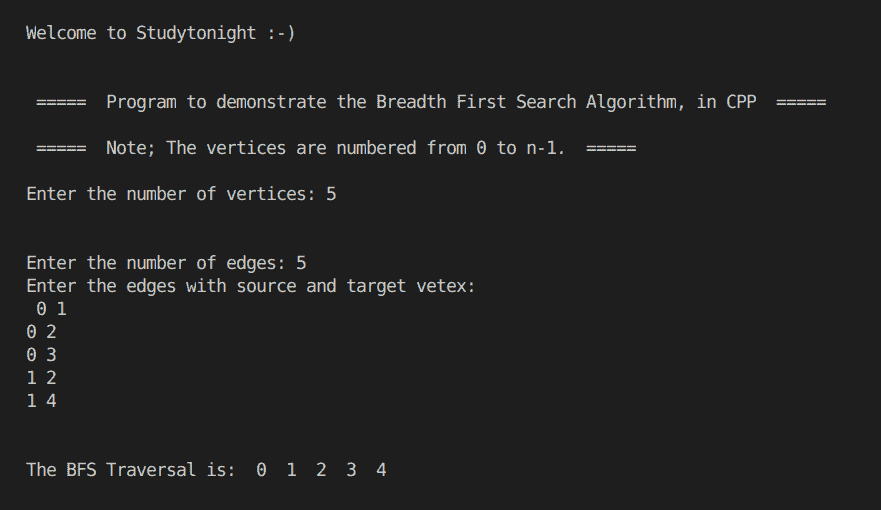

# BFS 遍历的 C++程序

> 原文：<https://www.studytonight.com/cpp-programs/cpp-program-for-bfs-traversal>

大家好！

在本教程中，我们将学习如何用 C++编程语言在图形上实现**BFS 遍历。**

## 什么是 BFS 遍历？

顾名思义，广度优先搜索(DFS)算法从起始节点开始，然后遍历图的每个分支，直到我们所有的节点都被探索至少一次。

该算法在移动到下一深度级别的节点之前，探索当前深度的所有**相邻节点**。

BFS 使用的数据结构是**队列**。要了解更多关于队列数据结构的信息，我们建议您访问[队列数据结构](http://www.studytonight.com/data-structures/queue-data-structure)，在这里我们已经详细解释了这些概念。

为了更好地理解，请参考下面给出的注释良好的 C++代码。

<u>**代号:**</u>

```cpp
#include <iostream>
#include <bits/stdc++.h>

using namespace std;

vector<bool> v;
vector<vector<int>> g;

void bfsTraversal(int b)
{
    //Declare a queue to store all the nodes connected to b
    queue<int> q;

    //Insert b to queue
    q.push(b);

    //mark b as visited
    v[b] = true;

    cout << "\n\nThe BFS Traversal is:  ";

    while (!q.empty())
    {
        int a = q.front();
        q.pop(); //delete the first element form queue

        for (auto j = g[a].begin(); j != g[a].end(); j++)
        {
            if (!v[*j])
            {
                v[*j] = true;
                q.push(*j);
            }
        }
        cout << a << "  ";
    }
}

void makeEdge(int a, int b)
{
    g[a].push_back(b); //an edge from a to b (directed graph)
}

int main()
{
    cout << "\n\nWelcome to Studytonight :-)\n\n\n";
    cout << " =====  Program to demonstrate the Breadth First Search Algorithm, in CPP  ===== \n\n";

    cout << " =====  Note; The vertices are numbered from 0 to n-1\.  ===== \n\n";

    int n, e;

    cout << "Enter the number of vertices: ";

    cin >> n;

    cout << "\n\nEnter the number of edges: ";

    cin >> e;

    v.assign(n, false);
    g.assign(n, vector<int>());

    int a, b, i;

    cout << "Enter the edges with source and target vetex: \n ";

    for (i = 0; i < e; i++)
    {
        cin >> a >> b;
        makeEdge(a, b);
    }

    for (i = 0; i < n; i++)
    {
        //if the node i is unvisited
        if (!v[i])
        {
            bfsTraversal(i);
        }
    }

    cout << "\n\n\n";

    return 0;
} 
```

<u>**输出:**</u>



我们希望这篇文章能帮助你更好地理解 BFS 遍历的概念及其在 CPP 中的实现。如有任何疑问，请随时通过下面的评论区联系我们。

**继续学习:**

* * *

* * *