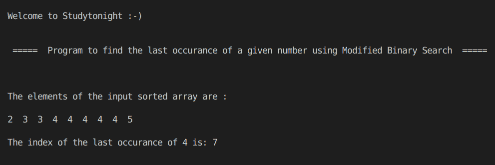

> 原文:[https://www . study south . com/CPP-programs/CPP-find-最后出现的给定数字-使用-修改-二进制-搜索](https://www.studytonight.com/cpp-programs/cpp-find-last-occurrence-of-the-given-number-using-modified-binary-search)

# C++使用修改的二分搜索法查找给定数字的最后一次出现

大家好！

在本教程中，我们将学习如何用 C++编程语言**在排序数组**中找到给定数字的最后一次出现。

为了详细了解二分搜索法的概念，我们将推荐您访问[https://www . study south . com/data-structures/binary-search-algorithm](https://www.studytonight.com/data-structures/binary-search-algorithm)，我们已经在这里详细解释了这些概念。

为了更好地理解，请参考下面给出的评论良好的 CPP 代码。

<u>**代号:**</u>

```cpp
#include <iostream>
#include <bits/stdc++.h>

using namespace std;

//Program to return the last occurance of b in the vector a
int last(int a[], int l, int h, int b)
{
    int res = -1;
    while (l <= h)
    {
        int m = (l + h) / 2;

        if (a[m] == b)
        {
            res = m;
            l = m + 1;
        }
        else if (a[m] > b)
        {
            h = m - 1;
        }
        else
        {
            l = m + 1;
        }
    }

    return res;
}

int main()
{
    cout << "\n\nWelcome to Studytonight :-)\n\n\n";
    cout << " =====  Program to find the last occurance of a given number using Modified Binary Search  ===== \n\n";

    int i, n;

    int a[] = {2, 3, 3, 4, 4, 4, 4, 4, 5};

    n = sizeof(a) / sizeof(a[0]);

    cout << "\n\nThe elements of the input sorted array are :\n\n";

    for (i = 0; i < n; i++)
    {
        cout << a[i] << "  ";
    }

    int k = 4; //the element to find the last occurance index of

    //Calling first method to return the index of the last occurance of element k
    int l = last(a, 0, n - 1, k);

    cout << "\n\nThe index of the last occurance of " << k << " is: " << l;

    cout << "\n\n\n";

    return 0;
} 
```

<u>**输出:**</u>



我们希望这篇文章能帮助您更好地理解二分搜索法算法的概念，并使用它来查找给定数字的最后一次出现及其在 CPP 中的实现。如有任何疑问，请随时通过下面的评论区联系我们。

**继续学习:**

* * *

* * *