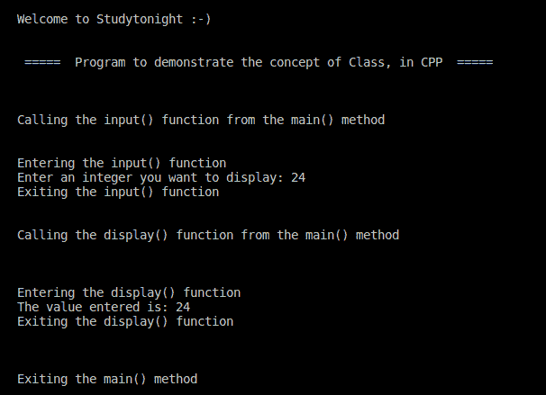

# 带有面向对象类示例的 C++ 程序

> 原文：<https://www.studytonight.com/cpp-programs/cpp-program-with-oop-class-example>

大家好！

在本教程中，我们将学习如何用 C++ 编程语言**实现类及其成员**的概念。

要了解类及其成员的概念，我们将推荐您访问这里:[c++ 类的概念](https://www.studytonight.com/cpp/defining-class-and-object.php)，我们已经从头开始解释了。

<u>**代号:**</u>

```cpp
#include <iostream>
#include <vector>

using namespace std;

class studyTonight {

    //variable declaration- can be used only within the class as it's declared private
    private:
        int value;

    //Public methods can be called from anywhere- inside as well as outside the class
    public:
        void input() {
            cout << "Entering the input() function\n";
            cout << "Enter an integer you want to display: ";
            cin >> value;
            cout << "Exiting the input() function\n\n";
        }

    void display() {

        cout << "\nEntering the display() function\n";
        cout << "The value entered is: ";
        cout << value;
        cout << "\nExiting the display() function\n\n";
    }
};

int main() {
    cout << "\n\nWelcome to Studytonight :-)\n\n\n";
    cout << " =====  Program to demonstrate the concept of Class, in CPP  ===== \n\n";

    //Declaring class object to access class members from outside the class
    studyTonight object;

    cout << "\n\nCalling the input() function from the main() method\n\n\n";
    object.input();

    cout << "\nCalling the display() function from the main() method\n\n\n";

    object.display();

    cout << "\n\nExiting the main() method\n\n\n";

    //object.value- This will produce an error because variable is declared to be private and hence cannot be accessed from outside the class

    return 0;
}
```

<u>**输出:**</u>



我们希望这篇文章能帮助你更好地理解 C++ 中类及其成员的概念。如有任何疑问，请随时通过下面的评论区联系我们。

**继续学习:**

* * *

* * *