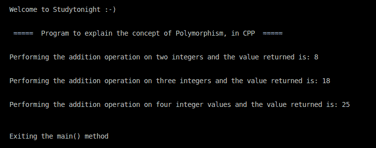

# C++ 多态示例程序

> 原文：<https://www.studytonight.com/cpp-programs/cpp-polymorphism-example-program>

大家好！

在本教程中，我们将学习如何在 C++ 编程语言中**实现多态**的概念。

为了理解 CPP 中多态的概念，我们将推荐您访问这里:[函数覆盖](https://www.studytonight.com/cpp/function-overriding.php)，我们已经从头开始解释了。

<u>**代号:**</u>

```cpp
#include <iostream>

using namespace std;

//defining the class Addition to overload the method sumOf() to explain the concept of Polymorphism
class Addition {

    public:
        int sumOf(int n1, int n2) {
            cout << "\nPerforming the addition operation on two integers and the value returned is: ";
            return n1 + n2;
        }
    int sumOf(int n1, int n2, int n3) {
        cout << "\nPerforming the addition operation on three integers and the value returned is: ";
        return n1 + n2 + n3;
    }
    int sumOf(int n1, int n2, int n3, int n4) {
        cout << "\nPerforming the addition operation on four integer values and the value returned is: ";
        return n1 + n2 + n3 + n4;
    }
};

//Defining the main method to access the members of the class
int main() {

    cout << "\n\nWelcome to Studytonight :-)\n\n\n";
    cout << " =====  Program to explain the concept of Polymorphism, in CPP  ===== \n\n";

    Addition add; //Default constructor is called- which is not required to be written explicitly

    cout << add.sumOf(3, 5) << "\n\n";
    cout << add.sumOf(3, 5, 10) << "\n\n";
    cout << add.sumOf(3, 5, 7, 10) << "\n\n";

    cout << "\n\nExiting the main() method\n\n\n";

    return 0;
}
```

<u>**输出:**</u>



我们希望这篇文章能帮助你更好地理解 C++ 中多态的概念。如有任何疑问，请随时通过下面的评论区联系我们。

**继续学习:**

* * *

* * *