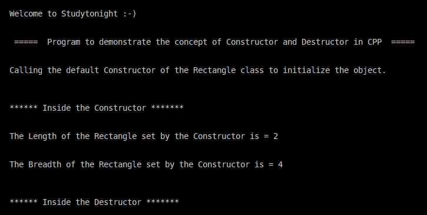

# C++构造函数和析构函数示例程序

> 原文：<https://www.studytonight.com/cpp-programs/cpp-constructor-and-destructor-example-program>

大家好！

在本教程中，我们将学习如何用 C++编程语言**演示构造函数和析构函数**的概念。

为了理解 CPP 中构造函数和析构函数的概念，我们将推荐您访问这里: [C++构造函数和析构函数](https://www.studytonight.com/cpp/constructors-and-destructors-in-cpp.php)，我们已经从头开始解释了。

<u>**代号:**</u>

```cpp
#include <iostream>

using namespace std;

//Rectangle class to demonstrate the working of Constructor and Destructor in CPP
class Rectangle {
    public:
        float length, breadth;

    //Declaration of the default Constructor of the Rectangle Class
    public:
        Rectangle() {
            cout << "\n\n****** Inside the Constructor ******* \n\n";
            length = 2;
            breadth = 4;
        }

    //Declaration of the Destructor of the Rectangle Class
    public:
        ~Rectangle() {
            cout << "\n\n****** Inside the Destructor ******* \n\n";
        }
};

//Defining the main method to access the members of the class
int main() {

    cout << "\n\nWelcome to Studytonight :-)\n\n\n";
    cout << " =====  Program to demonstrate the concept of Constructor and Destructor in CPP  ===== \n\n";

    cout << "\nCalling the default Constructor of the Rectangle class to initialize the object.\n\n";

    //Declaring the Class object to access the class members
    Rectangle rect;

    cout << "\nThe Length of the Rectangle set by the Constructor is = " << rect.length << "\n\n";

    cout << "\nThe Breadth of the Rectangle set by the Constructor is = " << rect.breadth << "\n\n";

    return 0;
}
```

<u>**输出:**</u>



我们希望这篇文章能帮助你更好地理解 C++中构造函数和析构函数的概念。如有任何疑问，请随时通过下面的评论区联系我们。

**继续学习:**

* * *

* * *