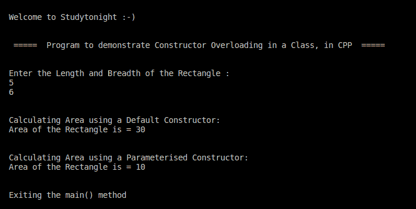

# C++ 构造函数重载程序

> 原文：<https://www.studytonight.com/cpp-programs/cpp-constructor-overloading-program>

大家好！

在本教程中，我们将学习如何用 C++ 编程语言**演示构造函数重载**的概念。

为了理解 CPP 中构造函数重载的概念，我们将推荐您访问这里:https://www . study south . com/CPP/constructors-and-destructors-in-CPP . PHP，我们已经从头开始解释了。

<u>**代号:**</u>

```cpp
#include <iostream>
#include <vector>
using namespace std;

//defining the class shape to overload the method area() on the basis of number of parameters.
class Area
{

    //declaring member variables
private:
    int length, breadth;

public:
    // Constructor without argument
    Area() : length(5), breadth(2)
    {
    }

    // Defining a Constructor with two arguments: length and breadth
    Area(int l, int b) : length(l), breadth(b)
    {
    }

    void GetLength()
    {
        cout << "\nEnter the Length and Breadth of the Rectangle : \n";
        cin >> length >> breadth;
    }

    int AreaCalculation()
    {
        return (length * breadth);
    }

    void DisplayArea(int a)
    {
        cout << "Area of the Rectangle is = " << a << endl;
    }
};

//Defining the main method to access the members of the class
int main()
{

    cout << "\n\nWelcome to Studytonight :-)\n\n\n";
    cout << " =====  Program to demonstrate Constructor Overloading in a Class, in CPP  ===== \n\n";

    Area a1; //Default constructor is called

    Area a2(5, 2); //Parameterised constructor is called

    int area1, area2;

    a1.GetLength();

    cout << "\n\nCalculating Area using a Default Constructor:" << endl;

    area1 = a1.AreaCalculation();
    a1.DisplayArea(area1);

    cout << "\n\nCalculating Area using a Parameterised Constructor:" << endl;

    area2 = a2.AreaCalculation();
    a2.DisplayArea(area2);

    cout << "\n\nExiting the main() method\n\n\n";

    return 0;
} 
```

<u>**输出:**</u>



我们希望这篇文章能帮助你更好地理解 C++ 中构造函数重载的概念。如有任何疑问，请随时通过下面的评论区联系我们。

**继续学习:**

* * *

* * *