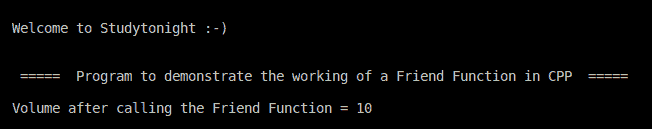

# C++ 友元函数程序

> 原文：<https://www.studytonight.com/cpp-programs/cpp-friend-function-program>

大家好！

在本教程中，我们将学习如何用 C++ 编程语言**演示友元函数**的概念。

要了解 CPP 中**友元函数**的概念和其他各种类型的**类成员函数**，我们将推荐您访问这里: [C++ 类型的成员函数](https://www.studytonight.com/cpp/types-of-member-function.php)，我们已经从头解释过了。

**代号:**

```cpp
#include <iostream>

using namespace std;

//Class Volume to demonstrate the concept of Friend Function in CPP
class Volume {
    //Member variables are declared as private and hence cannot be simply accessed from outside the class
    private:
        int liter;

    //Initializing the value of variable liter to 2 using the default constructor
    public:
        Volume(): liter(2) {}

    //Declaring the Friend Function for the class Volume
    friend int mulFive(Volume);
};

// Defining the Friend Function to be used by the Volume Class
int mulFive(Volume v) {
    //Friend function enables accessing private data from non-member function
    v.liter *= 5;
    return v.liter;
}

//Defining the main method to access the members of the class
int main() {

    cout << "\n\nWelcome to Studytonight :-)\n\n\n";
    cout << " =====  Program to demonstrate the working of a Friend Function in CPP  ===== \n\n";

    //Declaring the Class objects to access the class members
    Volume vol;

    cout << "Volume after calling the Friend Function = " << mulFive(vol);

    cout << "\n\n\n";

    return 0;
}
```

**输出:**



我们希望这篇文章能帮助你更好地理解 C++ 中友元函数的概念。如有任何疑问，请随时通过下面的评论区联系我们。

**继续学习:**

* * *

* * *