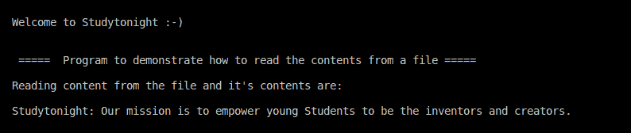

> 原文:[https://www . study south . com/CPP-programs/CPP-从文件中读取程序](https://www.studytonight.com/cpp-programs/cpp-reading-from-a-file-program)

# C++从文件中读取程序

大家好！

在本教程中，我们将学习如何用 C++编程语言**打开并读取文件**的内容。

为了从基础上理解这个概念，我们强烈建议您参考这个: [C++文件流](https://www.studytonight.com/cpp/file-streams-in-cpp.php)，在这里我们详细讨论了这个概念以及其中涉及的各种术语。

分步注释代码如下所示:

<u>**代号:**</u>

```cpp
#include<iostream>
#include<fstream>  //to make use of system defined functions for file handling

using namespace std;

int main()
{
    cout << "\n\nWelcome to Studytonight :-)\n\n\n";
    cout << " =====  Program to demonstrate how to read the contents from a file ===== \n\n";

    //declaration of a string variable
    string str;

    // creating a variable of type ifstream to make use of file handling commands and open a file in read mode.
    ifstream in;

    //open is a system defined method to open and read from the mentioned file
    in.open("studytonight.txt");

    //Make sure that the file is within the same folder as that of this program otherwise, will have to provide the entire path to the file to read from

    cout << "Reading content from the file and it's contents are: \n\n";

    // printing the data word by word
    while(in>>str)
        cout << str << " ";

    cout << "\n\n\n";

    // close the file opened before.
    in.close();

    return 0;
}
```

**study south . txt**文件的内容是:

```cpp
Studytonight: Our mission is to empower young Students to be the inventors and creators.
```

<u>**输出:**</u>



我们希望这篇文章能帮助你更好地理解用 C++从文件中读取内容的概念。如有任何疑问，请随时通过下面的评论区联系我们。

**继续学习:**

* * *

* * *