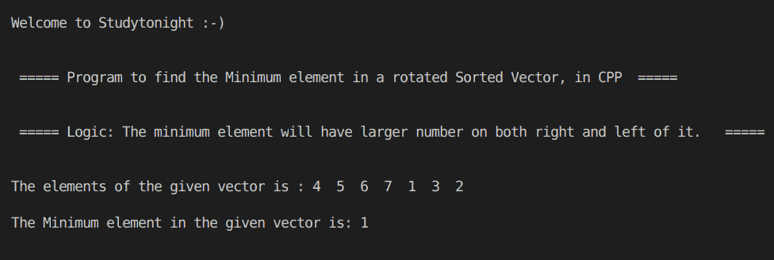

# C++ 程序：在旋转排序向量中寻找最小元素

> 原文：<https://www.studytonight.com/cpp-programs/cpp-find-minimum-element-in-a-rotated-sorted-vector-program>

大家好！

在本教程中，我们将演示 C++ 编程语言中**在旋转排序向量**中寻找最小元素的逻辑。

## 什么是旋转排序向量？

旋转排序向量是一个排序向量，它在你事先不知道的某个轴元素上旋转。

示例: **[4，5，6，7，0，1，2]** 是排序向量[0，1，2，4，5，6，7]的旋转排序向量之一。

为了更好地理解它的实现，请参考下面给出的评论很好的 CPP 代码。

**代号:**

```cpp
#include <iostream>
#include <bits/stdc++.h>

using namespace std;

int findMin(vector<int> &m)
{
    int i;
    int n = m.size();
    for (i = 0; i < n; i++)
    {
        if (i == 0)
        {
            if (m[i] < m[n - 1] && m[i] < m[1])
                break;
        }
        else
        {
            if (m[i] < m[i - 1] && m[i] < m[(i + 1) % n])
                break;
        }
    }

    return m[i % n];
}

int main()
{
    cout << "\n\nWelcome to Studytonight :-)\n\n\n";
    cout << " ===== Program to find the Minimum element in a rotated Sorted Vector, in CPP  ===== \n\n\n";

    cout << " ===== Logic: The minimum element will have larger number on both right and left of it.   ===== \n\n\n";

    //initializing vector with the following elements
    vector<int> v = {4, 5, 6, 7, 1, 3, 2};

    int n = v.size();

    int mini = 0;

    cout << "The elements of the given vector is : ";

    for (int i = 0; i < n; i++)
    {
        cout << v[i] << "  ";
    }

    mini = findMin(v);

    cout << "\n\nThe Minimum element in the given vector is: " << mini;

    cout << "\n\n\n";

    return 0;
} 
```

**输出:**



我们希望这篇文章能帮助你更好地理解在旋转排序向量中寻找最小元素的概念及其在 CPP 中的实现。如有任何疑问，请通过下面的评论部分与我们联系。

**继续学习:**

* * *

* * *