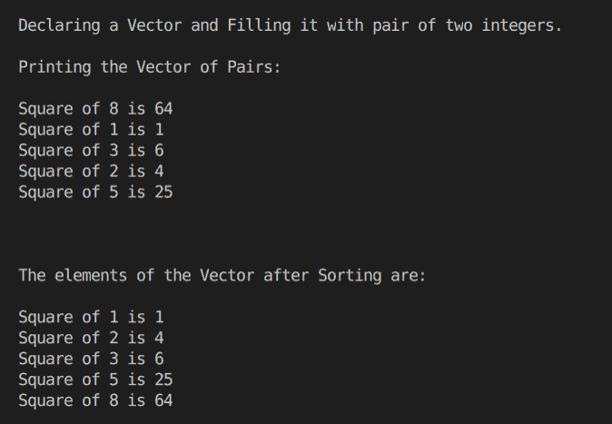

# STL 程序中的 C++配对模板

> 原文：<https://www.studytonight.com/cpp-programs/cpp-pair-template-in-stl-program>

大家好！

在本教程中，我们将学习使用 C++编程语言中的向量来处理配对模板及其实现。

要了解配对模板的基本功能，我们建议您访问 [C++ STL 配对模板](https://www.studytonight.com/cpp/stl/stl-pair-template)，在这里我们从头开始详细解释了这个概念。

为了更好地理解它的实现，请参考下面给出的注释良好的 C++代码。

<u>**代号:**</u>

```cpp
#include <iostream>
#include <bits/stdc++.h>

using namespace std;

int main()
{
    cout << "\n\nWelcome to Studytonight :-)\n\n\n";
    cout << " =====  Program to demonstrate the working of a Pair Template in STL, in CPP  ===== \n\n";

    cout << "\n\nDeclaring a Vector and Filling it with pair of two integers.\n\n";

    //create an empty vector of pair
    vector<pair<int, int>> v;

    //insert elements into the vector
    v.push_back(make_pair(8, 64));
    v.push_back(make_pair(1, 1));
    v.push_back(make_pair(3, 6));
    v.push_back(make_pair(2, 4));
    v.push_back(make_pair(5, 25));

    //prining the vector of pairs
    cout << "Printing the Vector of Pairs: \n";

    int n = v.size();

    //Printing the vector
    for (int i = 0; i < n; i++)
    {
        cout << "\nSquare of " << v[i].first << " is " << v[i].second; //accessing the pair elements
    }

    //Sorting the vector in ascending order - by default on the basis of first element of the pair
    sort(v.begin(), v.end());

    cout << "\n\n\n\nThe elements of the Vector after Sorting are:\n ";

    //prining the Sorted vector
    for (int i = 0; i < n; i++)
    {
        cout << "\nSquare of " << v[i].first << " is " << v[i].second; //accessing the pair elements
    }

    cout << "\n\n\n";

    return 0;
} 
```

<u>**输出:**</u>



我们希望这篇文章能帮助您更好地理解配对模板的概念及其在 CPP 中的实现。如有任何疑问，请随时通过下面的评论区联系我们。

**继续学习:**

* * *

* * *