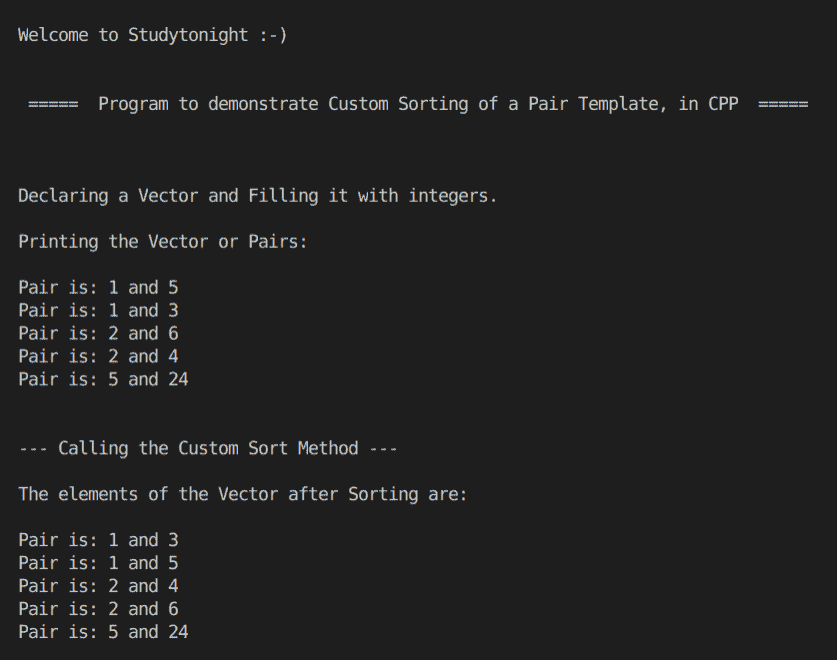

# STL 偶对模板的自定义排序方法的 C++ 程序

> 原文：<https://www.studytonight.com/cpp-programs/cpp-custom-sort-method-for-stl-pair-template-program>

大家好！

在本教程中，我们将学习**创建自定义排序方法来排序偶对模板，并使用 C++ 编程语言中的向量**来实现它。

要了解偶对模板的基本功能，我们建议您访问， [C++ STL 偶对模板](https://www.studytonight.com/cpp/stl/stl-pair-template)，在这里我们从头开始详细解释了这个概念。

为了更好地理解它的实现，请参考下面给出的注释良好的 C++ 代码。

**代号:**

```cpp
#include <iostream>
#include <bits/stdc++.h>

using namespace std;

//Returns true if x is smaller than y
bool cmp(pair<int, int> x, pair<int, int> y)
{
    if (x.first != y.first)
        return x.first < y.first; //return the one with smaller first element
    else
        return x.second < y.second; //if first element is equal then return the one with smaller second element
}

int main()
{
    cout << "\n\nWelcome to Studytonight :-)\n\n\n";
    cout << " =====  Program to demonstrate Custom Sorting of a Pair Template, in CPP  ===== \n\n";

    cout << "\n\nDeclaring a Vector and Filling it with integers.\n\n";

    //create an empty vector of pair
    vector<pair<int, int>> v;

    //insert elements into the vector
    v.push_back(make_pair(1, 5));
    v.push_back(make_pair(1, 3));
    v.push_back(make_pair(2, 6));
    v.push_back(make_pair(2, 4));
    v.push_back(make_pair(5, 24));

    //prining the vector of pairs
    cout << "Printing the Vector or Pairs: \n";

    int n = v.size();

    //Printing the vector
    for (int i = 0; i < n; i++)
    {
        cout << "\nPair is: " << v[i].first << " and " << v[i].second; //accessing the pair elements
    }

    cout << "\n\n\n--- Calling the Custom Sort Method ---";
    //Sorting the vector in ascending order of the pair
    sort(v.begin(), v.end(), cmp);

    cout << "\n\nThe elements of the Vector after Sorting are:\n ";

    //prining the Sorted vector
    for (int i = 0; i < n; i++)
    {
        cout << "\nPair is: " << v[i].first << " and " << v[i].second; //accessing the pair elements
    }

    cout << "\n\n\n";

    return 0;
}
```

**输出:**



我们希望这篇文章能帮助您更好地理解偶对模板的概念及其在 CPP 中的实现。如有任何疑问，请随时通过下面的评论区联系我们。

**继续学习:**

* * *

* * *