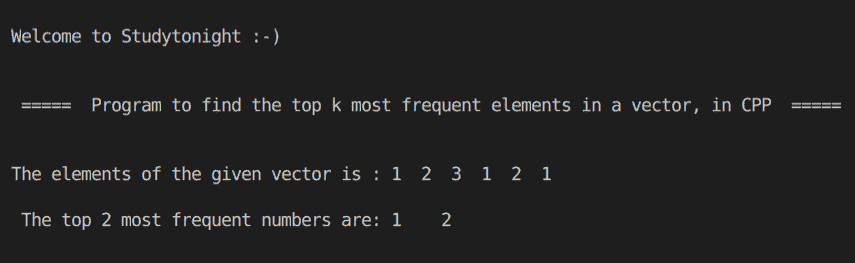

# C++ 使用对模板查找排序向量中最常出现的前 K 个元素

> 原文：<https://www.studytonight.com/cpp-programs/c-find-top-k-most-frequent-elements-in-sorted-vector-using-pair-template>

大家好！

在本教程中，我们将学习如何在 C++ 编程语言的排序向量、**和**中找到最常见的 k 个元素。

要了解配对模板的基本功能，我们建议您访问， [C++ STL 配对模板](https://www.studytonight.com/cpp/stl/stl-pair-template)，在这里我们从头开始详细解释了这个概念。

为了更好地理解它的实现，请参考下面给出的注释良好的 C++ 代码。

<u>**代号:**</u>

```cpp
#include <iostream>
#include <bits/stdc++.h>

using namespace std;

vector<int> topKFrequent(vector<int> &a, int k)
{
    unordered_map<int, int> u;

    int n = a.size();
    int i;

    for (i = 0; i < n; i++)
    {
        u[a[i]]++;
    }

    vector<pair<int, int>> v(u.begin(), u.end());

    sort(v.begin(), v.end(), [](pair<int, int> x, pair<int, int> y) {
        if (x.second == y.second)
            return x.first < y.first;
        else
            return x.second > y.second;
    });

    vector<int> r;
    for (i = 0; i < k; i++)
    {
        r.push_back(v[i].first);
    }

    return r;
}

int main()
{
    cout << "\n\nWelcome to Studytonight :-)\n\n\n";
    cout << " =====  Program to find the top k most frequent elements in a vector, in CPP  ===== \n\n\n";

    //initializing vector with the following elements
    vector<int> v = {1, 2, 3, 1, 2, 1};

    vector<int> f;

    int k = 2; //to find the 2 most frequent numbers

    int n = v.size();

    cout << "The elements of the given vector is : ";

    for (int i = 0; i < n; i++)
    {
        cout << v[i] << "  ";
    }

    f = topKFrequent(v, k);

    n = f.size();

    cout << "\n\n The top " << k << " most frequent numbers are: ";

    for (int i = 0; i < n; i++)
    {
        cout << f[i] << "    ";
    }

    cout << "\n\n\n";

    return 0;
}
```

<u>**输出:**</u>



我们希望这篇文章能帮助你更好地理解配对模板的应用概念及其在 C++ 中的实现。如有任何疑问，请随时通过下面的评论区联系我们。

**继续学习:**

* * *

* * *