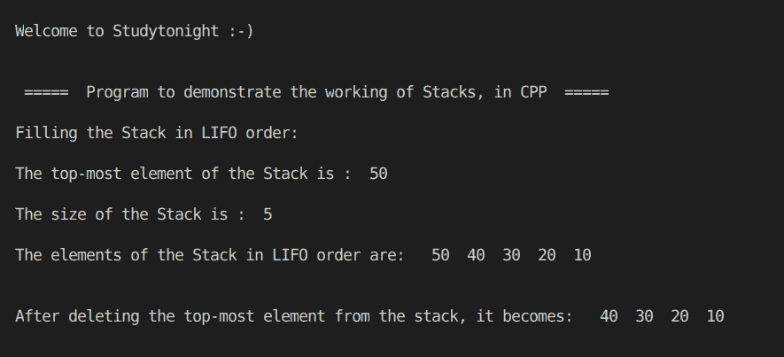

# C++ STL 栈程序

> 原文：<https://www.studytonight.com/cpp-programs/cpp-stl-stack-program>

大家好！

在本教程中，我们将学习 C++ 编程语言中栈的**工作及其实现**。

为了了解栈的基本功能，我们将推荐您访问[栈数据结构](https://www.studytonight.com/data-structures/stack-data-structure)，在这里我们从头开始详细解释了这个概念。

为了更好地理解它的实现，请参考下面给出的注释良好的 C++ 代码。

**代号:**

```cpp
#include <iostream>
#include <bits/stdc++.h>

using namespace std;

//Function to print the elements of the stack
void show(stack<int> s)
{
    while (!s.empty())
    {
        cout << "  " << s.top(); //printing the topmost element
        s.pop();                 //removing the topmost element to bring next element at the top
    }

    cout << endl;
}

int main()
{
    cout << "\n\nWelcome to Studytonight :-)\n\n\n";
    cout << " =====  Program to demonstrate the working of Stacks, in CPP  ===== \n\n";

    int i;

    //Stack declaration (stack of integers)
    stack<int> s;

    //Filling the elements by using the push() method.
    cout << "Filling the Stack in LIFO order:"; //LIFO= Last In First Out
    for (i = 1; i <= 5; i++)
    {
        s.push(i * 10); //inserting elements to the top
    }

    cout << "\n\nThe top-most element of the Stack is :  " << s.top();

    cout << "\n\nThe size of the Stack is :  " << s.size();

    cout << "\n\nThe elements of the Stack in LIFO order are: ";
    show(s);

    cout << "\n\nAfter deleting the top-most element from the stack, it becomes: ";
    s.pop();
    show(s);

    cout << "\n\n\n";

    return 0;
} 
```

**输出:**



我们希望这篇文章能帮助你更好地理解栈的概念及其在 C++ 中的实现。如有任何疑问，请随时通过下面的评论区联系我们。

**继续学习:**

* * *

* * *