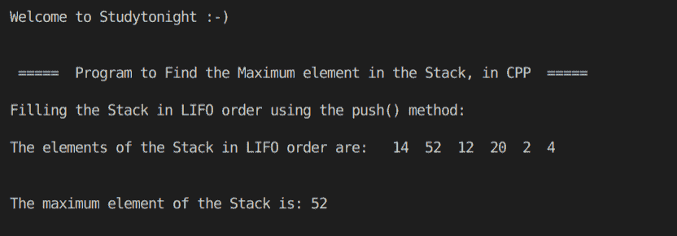

# C++ 查找堆栈程序中最大的元素

> 原文：<https://www.studytonight.com/cpp-programs/cpp-find-the-largest-element-of-the-stack-program>

大家好！

在本教程中，我们将学习 C++ 编程语言中堆栈的**工作和找到它的最大元素**。

为了了解堆栈的基本功能，我们将推荐您访问[堆栈数据结构](https://www.studytonight.com/data-structures/stack-data-structure)，在这里我们从头开始详细解释了这个概念。

为了更好地理解它的实现，请参考下面给出的注释良好的 C++ 代码。

<u>**代号:**</u>

```cpp
#include <iostream>
#include <bits/stdc++.h>

using namespace std;

//Function to print the Maximum element in the stack
void findMax(stack<int> s)
{
    int m = s.top(); //initialization

    int a;

    while (!s.empty())
    {
        a = s.top();

        if (m < a)
            m = a; //Storing the maximum element in m

        s.pop(); //removing the topmost element to bring next element at the top
    }

    cout << "\n\nThe maximum element of the Stack is: " << m << endl;
}

//Function to print the elements of the stack
void show(stack<int> s)
{
    while (!s.empty())
    {
        cout << "  " << s.top(); //printing the topmost element
        s.pop();                 //removing the topmost element to bring next element at the top
    }

    cout << endl;
}

int main()
{
    cout << "\n\nWelcome to Studytonight :-)\n\n\n";
    cout << " =====  Program to Find the Maximum element in the Stack, in CPP  ===== \n\n";

    int i;

    //Stack declaration (stack of integers)
    stack<int> s;

    //Filling the elements by using the push() method.
    cout << "Filling the Stack in LIFO order using the push() method:"; //LIFO= Last In First Out

    s.push(4);
    s.push(2);
    s.push(20);
    s.push(12);
    s.push(52);
    s.push(14);

    cout << "\n\nThe elements of the Stack in LIFO order are: ";
    show(s);

    findMax(s); //to find the max element

    cout << "\n\n\n";

    return 0;
} 
```

<u>**输出:**</u>



我们希望这篇文章能帮助你更好地理解堆栈的概念及其在 C++ 中的实现。如有任何疑问，请随时通过下面的评论区联系我们。

**继续学习:**

* * *

* * *