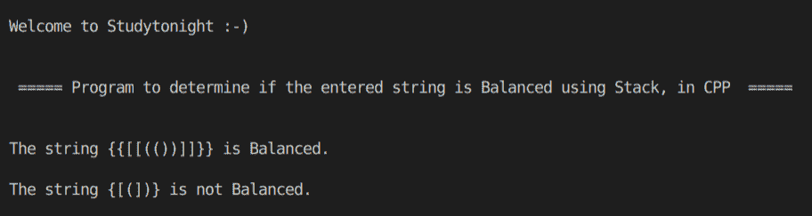

> 原文:[https://www . study south . com/CPP-programs/CPP-program-to-check-for-balanced-括号-string-use-stack](https://www.studytonight.com/cpp-programs/cpp-program-to-check-for-balanced-bracket-string-using-stack)

# 使用堆栈检查平衡括号字符串的 C++程序

大家好！

在本教程中，我们将学习**概念，即使用 C++编程语言中的 Stack、**来确定括号的输入字符串是否平衡。

为了了解堆栈的基本功能，我们将推荐您访问[堆栈数据结构](https://www.studytonight.com/data-structures/stack-data-structure)，在这里我们从头开始详细解释了这个概念。

为了更好地理解它的实现，请参考下面给出的注释良好的 C++代码。

<u>**代号:**</u>

```cpp
#include <iostream>
#include <bits/stdc++.h>

using namespace std;

// Returns true is the string is balanced
bool isBalanced(string s)
{
    int i;
    char c;
    int n = s.length();

    stack<char> t;

    for (i = 0; i < n; i++)
    {
        c = s.at(i);

        if (t.empty())
        {
            t.push(c);
        }
        else if (t.top() == '(' && c == ')' || t.top() == '{' && c == '}' || t.top() == '[' && c == ']')
        {
            t.pop();
        }
        else
            t.push(c);
    }

    if (t.empty())
        return true;
    else
        return false;
}

int main()
{
    cout << "\n\nWelcome to Studytonight :-)\n\n\n";
    cout << " ===== Program to determine if the entered string is Balanced using Stack, in CPP  ===== \n\n\n";

    //initializing string to be checked for
    string s1 = "{{[[(())]]}}";
    string s2 = "{[(])}";

    bool b1 = isBalanced(s1);
    bool b2 = isBalanced(s2);

    if (b1)
    {
        cout << "The string " << s1 << " is Balanced.\n\n";
    }
    else
    {
        cout << "The string " << s1 << " is not Balanced.\n\n";
    }

    if (b2)
    {
        cout << "The string " << s2 << " is Balanced.\n\n";
    }
    else
    {
        cout << "The string " << s2 << " is not Balanced.\n\n";
    }

    return 0;
}
```

<u>**输出:**</u>



我们希望这篇文章能帮助您更好地理解堆栈的概念及其实现，以检查 CPP 中的平衡括号字符串。如有任何疑问，请随时通过下面的评论区联系我们。

**继续学习:**

* * *

* * *