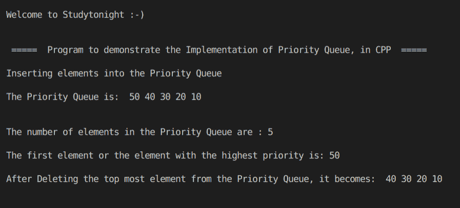

# C++ STL 优先级队列程序

> 原文：<https://www.studytonight.com/cpp-programs/cpp-stl-priority-queue-program>

大家好！

在本教程中，我们将学习 C++ 编程语言中优先级队列的**工作方式。**

要了解 CPP 中优先级队列的基本功能，我们将推荐您访问 [C++ STL 优先级队列](https://www.studytonight.com/cpp/stl/stl-container-priority-queue)，我们已经从头开始详细解释了这个概念。

为了更好地理解它的实现，请参考下面给出的注释良好的 C++ 代码。

**代号:**

```cpp
#include <iostream>
#include <bits/stdc++.h>

using namespace std;

//Function to print the elements of the Priority Queue
void show(priority_queue<int> q)
{
    //Copying the Priority Queue into another to maintain the original Priority Queue
    priority_queue<int> pq = q;

    while (!pq.empty())
    {
        cout << "\t" << pq.top(); //printing the top most element
        pq.pop();                 //deleting the top most element to move to the next
    }

    cout << endl;
}

int main()
{
    cout << "\n\nWelcome to Studytonight :-)\n\n\n";
    cout << " =====  Program to demonstrate the Implementation of Priority Queue, in CPP  ===== \n\n";

    int i;

    //Declaring a Priority Queue of integers
    //Note: by default the priority queue is Max heap in c++
    priority_queue<int> q;

    //Filling the elements
    cout << "Inserting elements into the Priority Queue\n\n";
    for (i = 1; i < 6; i++)
    {
        q.push(i * 10);
    }

    cout << "The Priority Queue is: ";
    show(q);

    cout << "\n\nThe number of elements in the Priority Queue are : " << q.size();
    ;

    cout << "\n\nThe first element or the element with the highest priority is: " << q.top();
    ;

    cout << "\n\nAfter Deleting the top most element or the highest priority element from the Priority Queue, it becomes: ";
    q.pop();
    show(q);

    cout << "\n\n\n";

    return 0;
} 
```

**输出:**



我们希望这篇文章能帮助您更好地理解优先级队列的概念及其在 CPP 中的实现。如有任何疑问，请随时通过下面的评论区联系我们。

**继续学习:**

* * *

* * *