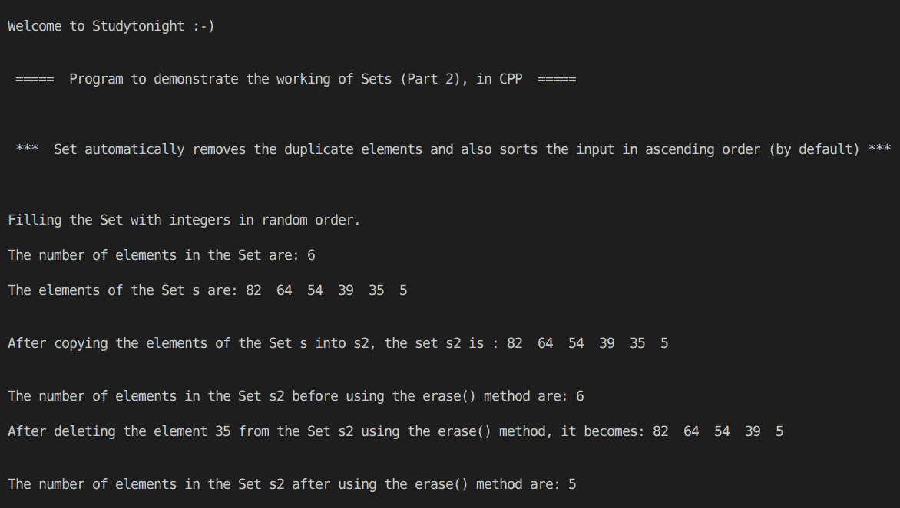

# C++ 程序：STL 集合（第二部分）

> 原文：<https://www.studytonight.com/cpp-programs/cpp-stl-sets-program-part-2>

大家好！

在本教程中，我们将学习 C++ 编程语言中集合的**工作及其实现**。我们还将讨论如何以降序存储元素，以及如何在不使用迭代器的情况下将一个集合的元素复制到另一个集合中。

## 什么是集合？

在编程中，集合用于存储列表的唯一值，并自动为其元素提供排序。默认情况下，顺序是升序。

使用`insert()`方法插入元素。如果同一个值被插入多次，集合会自动删除重复项，并且只存储该元素的单个副本。

使用`erase()`方法删除集合的元素。

为了更好地理解它的实现，请参考下面给出的注释良好的 C++ 代码。

**代号:**

```cpp
#include <iostream>
#include <bits/stdc++.h>

using namespace std;

//Function to print the elements of the set using an iterator
void show(set<int, greater<int>> s)
{
    //declaring an iterator to iterate through the set
    set<int>::iterator i;

    for (i = s.begin(); i != s.end(); i++)
    {
        cout << *i << "  "; //accessing the elements of the set using * as i stores the address to each element
    }

    cout << endl;
}

int main()
{
    cout << "\n\nWelcome to Studytonight :-)\n\n\n";
    cout << " =====  Program to demonstrate the working of Sets (Part 2), in CPP  ===== \n\n\n\n";

    cout << " ***  Set automatically removes the duplicate elements and also sorts the input in ascending order (by default) *** \n\n";

    /* Set declaration (Set of integers)
        Note: By default, the declaration set<int> s stores the elements in ascending order
        But the below declaration stores them in decreasing order
    */
    set<int, greater<int>> s;

    //Filling the elements by using the insert() method.
    cout << "\n\nFilling the Set with integers in random order."; //Set automatically stores them in order

    s.insert(5);
    s.insert(39);
    s.insert(64);
    s.insert(64); //as 64 is added twice, but it will be stored only once in the set
    s.insert(82);
    s.insert(35);
    s.insert(54);

    cout << "\n\nThe number of elements in the Set are: " << s.size();

    cout << "\n\nThe elements of the Set s are: ";
    show(s);

    //Creating and initializing the set s2 with the elements of the set s
    set<int, greater<int>> s2(s.begin(), s.end());

    cout << "\n\nAfter copying the elements of the Set s into s2, the set s2 is : ";
    show(s2);

    cout << "\n\nThe number of elements in the Set s2 before using the erase() method are: " << s2.size();

    cout << "\n\nAfter deleting the element 35 from the Set s2 using the erase() method, it becomes: ";
    s2.erase(35);
    show(s2);

    cout << "\n\nThe number of elements in the Set s2 after using the erase() method are: " << s2.size();

    cout << "\n\n\n";

    return 0;
} 
```

**输出:**



我们希望这篇文章能帮助你更好地理解 Set 的概念及其在 C++ 中的实现。如有任何疑问，请随时通过下面的评论区联系我们。

**继续学习:**

* * *

* * *