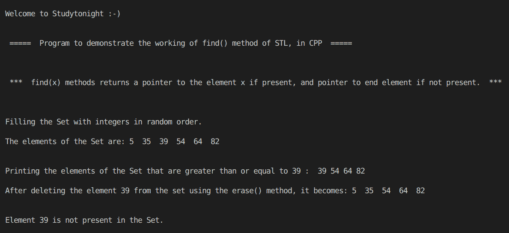

# STL 集合查找()方法程序的 C++ 实现

> 原文：<https://www.studytonight.com/cpp-programs/cpp-working-of-stl-set-find-method-program>

大家好！

在本教程中，我们将学习 STL 中 `find()` **方法的**工作原理，以及使用 C++ 编程语言中的 Set** 实现** **。**

## 什么是集合？

在编程中，集合用于存储列表的唯一值，并自动为其元素提供排序。默认情况下，顺序是升序。

使用`insert()`方法插入元素。如果同一个值被插入多次，集合会自动删除重复项，并且只存储该元素的单个副本。

使用`erase()`方法删除集合的元素。

`find(x)`方法返回一个迭代器到集合容器中搜索到的元素(这里是`x`)。如果没有找到该元素，则迭代器指向集合中最后一个元素之后的位置。

为了更好地理解它的实现，请参考下面给出的注释良好的 C++ 代码。

<u>**代号:**</u>

```cpp
#include <iostream>
#include <bits/stdc++.h>

using namespace std;

//Function to print the elements of the set using an iterator
void show(set<int> s)
{
    //declaring an iterator to iterate through the set
    set<int>::iterator i;

    for (i = s.begin(); i != s.end(); i++)
    {
        cout << *i << "  "; //accessing the elements of the set using * as i stores the address to each element
    }

    cout << endl;
}

int main()
{
    cout << "\n\nWelcome to Studytonight :-)\n\n\n";
    cout << " =====  Program to demonstrate the working of find() method of STL, in CPP  ===== \n\n\n\n";

    cout << " ***  find(x) methods returns a pointer to the element x if present, and pointer to end element if not present.  *** \n\n";

    //Set declaration (Set of integers)
    set<int> s;

    //Filling the elements by using the insert() method.
    cout << "\n\nFilling the Set with integers in random order."; //Set automatically stores them in order

    s.insert(5);
    s.insert(39);
    s.insert(64);
    s.insert(82);
    s.insert(35);
    s.insert(54);

    cout << "\n\nThe elements of the Set are: ";
    show(s);

    set<int>::iterator it;

    //An iterator pointing to the element 39
    it = s.find(39);

    cout << "\n\nPrinting the elements of the Set that are greater than or equal to 39 : ";

    for (; it != s.end(); it++)
    {
        cout << " " << *it;
    }

    cout << "\n\nAfter deleting the element 39 from the set using the erase() method, it becomes: ";
    s.erase(39);
    show(s);

    //An iterator pointing to the element 39
    it = s.find(39);

    if (it == s.end())
        cout << "\n\nElement 39 is not present in the Set.";

    cout << "\n\n\n";

    return 0;
} 
```

<u>**输出:**</u>



我们希望这篇文章能帮助你更好地理解 Set 中 find()方法的概念及其在 C++ 中的实现。如有任何疑问，请随时通过下面的评论区联系我们。

**继续学习:**

* * *

* * *