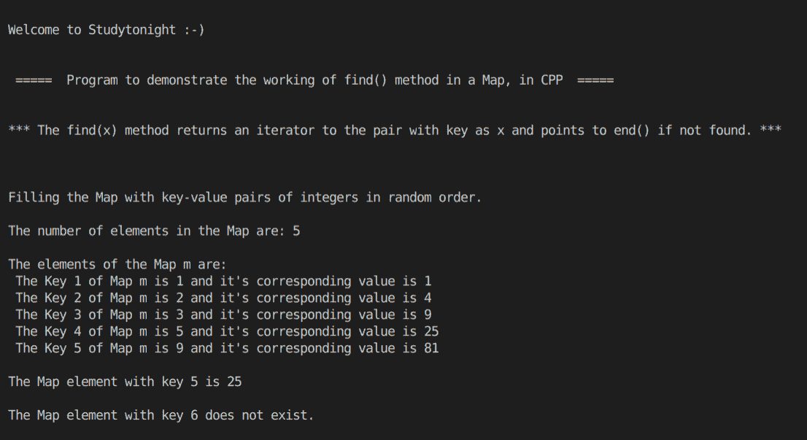

# C++在 STL 映射程序中使用 find()方法

> 原文：<https://www.studytonight.com/cpp-programs/cpp-using-find-method-in-stl-map-program>

大家好！

在本教程中，我们将在 C++编程语言的地图中了解 `find()` **方法的**工作方式。****

要了解 STL 中**地图容器**的基本功能，我们将推荐您访问 [C++ STL 地图容器](https://www.studytonight.com/cpp/stl/stl-container-map)，我们已经从头开始详细解释了这个概念。

`find(x)`方法返回一个迭代器给键为`x`的对，如果没有找到则指向`end()`。

为了更好地理解它的实现，请参考下面给出的注释良好的 C++代码。

<u>**代号:**</u>

```cpp
#include <iostream>
#include <bits/stdc++.h>

using namespace std;

int main()
{
    cout << "\n\nWelcome to Studytonight :-)\n\n\n";
    cout << " =====  Program to demonstrate the working of find() method in a Map, in CPP  ===== \n\n\n";

    cout << "*** The find(x) method returns an iterator to the pair with key as x and points to end() if not found. *** \n\n";

    //Map declaration (Map with key and value both as integers)
    map<int, int> m;

    //Filling the elements by using the insert() method.
    cout << "\n\nFilling the Map with key-value pairs of integers in random order."; //Map automatically stores them in increasing order of keys

    //make_pair() is used to insert a key value pair into the map
    m.insert(make_pair(3, 9));
    m.insert(make_pair(2, 4));
    m.insert(make_pair(5, 25));
    m.insert(make_pair(9, 81));
    m.insert(make_pair(1, 1));

    cout << "\n\nThe number of elements in the Map are: " << m.size();

    cout << "\n\nThe elements of the Map m are: ";

    map<int, int>::iterator i;
    int j = 0;

    for (i = m.begin(); i != m.end(); i++)
    {
        cout << "\n The Key " << ++j << " of Map m is " << i->first << " and it's corresponding value is " << i->second;
    }

    //Finding the map element with key 5

    i = m.find(5);

    if (i != m.end())
    {
        cout << "\n\nThe Map element with key 5 is " << i->second;
    }

    else
    {
        cout << "\n\nThe Map element with key 5 does not exist.";
    }

    i = m.find(6);

    if (i != m.end())
    {
        cout << "\n\nThe Map element with key 6 is " << i->second;
    }

    else
    {
        cout << "\n\nThe Map element with key 6 does not exist.";
    }

    cout << "\n\n\n";

    return 0;
} 
```

<u>**输出:**</u>



我们希望这篇文章能帮助您更好地理解 Map 中 find()方法的概念及其在 C++中的实现。如有任何疑问，请随时通过下面的评论区联系我们。

**继续学习:**

* * *

* * *