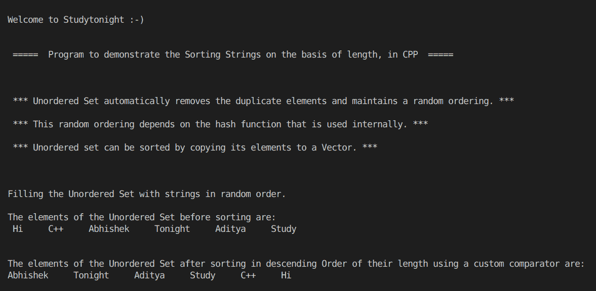

> 原文:[https://www . study south . com/CPP-programs/CPP-sorting-strings-by-writing-a-custom-sort-method](https://www.studytonight.com/cpp-programs/cpp-sorting-strings-by-writing-a-custom-sort-method)

# 通过编写自定义排序方法对字符串进行排序

大家好！

在本教程中，我们将学习如何使用 C++编程语言中的自定义排序方法及其实现根据长度对字符串进行**排序。**

## 什么是集合？

在编程中，集合用于存储列表的唯一值，并自动为其元素提供排序。默认情况下，顺序是升序。

使用`insert()`方法插入元素。如果同一个值被插入多次，集合会自动删除重复项，并且只存储该元素的单个副本。

使用`erase()`方法删除集合的元素。

## 什么是无序集？

无序集还通过删除重复项来仅存储元素的单个副本，但不会像集中那样自动对元素进行排序。

无序集在内部使用哈希表，因此排序是随机的，取决于内部使用的哈希函数。

## 自定义排序方法:

每当我们需要明确确定排序的条件时，我们需要创建这个方法来定义逻辑。

为了更好地理解它的实现，请参考下面给出的评论很好的 CPP 代码。

<u>**代号:**</u>

```cpp
#include <iostream>
#include <bits/stdc++.h>

using namespace std;

//Returns true if first string is of longer length than second
bool cmp(string x, string y)
{
    int n = x.length();
    int m = y.length();

    if (n > m)
        return true;
    else
        return false;
}

//Function to print the elements of the unordered set using an iterator
void show(unordered_set<string> s)
{
    //declaring an iterator to iterate through the unordered set
    unordered_set<string>::iterator i;

    for (i = s.begin(); i != s.end(); i++)
    {
        cout << *i << "     "; //accessing the elements of the unordered set using * as i stores the address to each element
    }

    cout << endl;
}

int main()
{
    cout << "\n\nWelcome to Studytonight :-)\n\n\n";
    cout << " =====  Program to demonstrate the Sorting Strings on the basis of length, in CPP  ===== \n\n\n\n";

    cout << " *** Unordered Set automatically removes the duplicate elements and maintains a random ordering. *** \n\n";

    cout << " *** This random ordering depends on the hash function that is used internally. *** \n\n";

    cout << " *** Unordered set can be sorted by copying its elements to a Vector. *** \n\n";

    //Unordered Set declaration (Unordered Set of strings)
    unordered_set<string> s;

    //Filling the elements by using the insert() method.
    cout << "\n\nFilling the Unordered Set with strings in random order."; //Unlike Set, this is not automatically sorted

    s.insert("Study");
    s.insert("Tonight");
    s.insert("Aditya");
    s.insert("Abhishek");
    s.insert("C++");
    s.insert("Hi");

    cout << "\n\nThe elements of the Unordered Set before sorting are:\n ";
    show(s);

    //Declaring a vector and initializing it with the elements of the unordered set
    vector<string> v(s.begin(), s.end());

    //Sorting the vector elements in descending order of their length using a custom comparator
    sort(v.begin(), v.end(), cmp);

    cout << "\n\nThe elements of the Unordered Set after sorting in descending Order of their length using a custom comparator are: \n";

    //declaring an iterator to iterate through the vector
    vector<string>::iterator it;

    for (it = v.begin(); it != v.end(); it++)
    {
        cout << *it << "     "; //accessing the elements of the vector using * as i stores the address to each element
    }

    cout << "\n\n\n";

    return 0;
} 
```

<u>**输出:**</u>



我们希望这篇文章能帮助你更好地理解编写自定义排序方法来排序无序集的概念及其在 CPP 中的实现。如有任何疑问，请随时通过下面的评论区联系我们。

**继续学习:**

* * *

* * *