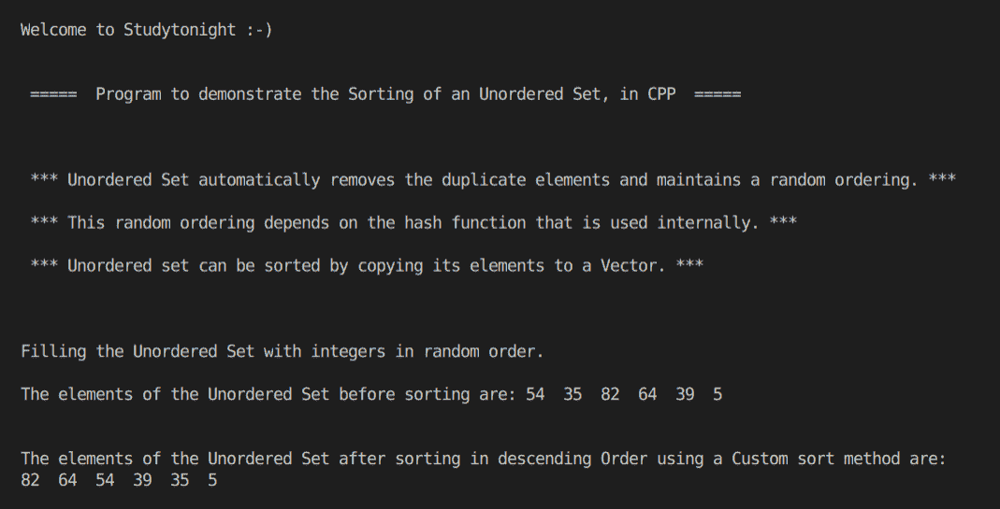

# 用 C++ 程序对 STL 中的无序集进行排序

> 原文：<https://www.studytonight.com/cpp-programs/cpp-program-to-sort-an-unordered-set-in-stl>

大家好！

在本教程中，我们将学习 C++ 编程语言中无序集的**工作及其实现**。

## 什么是无序集？

无序集还通过删除重复项来仅存储元素的单个副本，但不会像集中那样自动对元素进行排序。

无序集在内部使用哈希表，因此排序是随机的，取决于内部使用的哈希函数。

### 对无序集进行排序:

无序集可以通过将其元素复制到向量中，然后使用 STL 的`sort()`方法进行排序。

为了更好地理解它的实现，请参考下面给出的注释良好的 C++ 代码。

**代号:**

```cpp
#include <iostream>
#include <bits/stdc++.h>

using namespace std;

bool cmp(int x, int y)
{
    if (x > y)
        return true;
    else
        return false;
}

//Function to print the elements of the unordered set using an iterator
void show(unordered_set<int> s)
{
    //declaring an iterator to iterate through the unordered set
    unordered_set<int>::iterator i;

    for (i = s.begin(); i != s.end(); i++)
    {
        cout << *i << "  "; //accessing the elements of the unordered set using * as i stores the address to each element
    }

    cout << endl;
}

int main()
{
    cout << "\n\nWelcome to Studytonight :-)\n\n\n";
    cout << " =====  Program to demonstrate the Sorting of an Unordered Set, in CPP  ===== \n\n\n\n";

    cout << " *** Unordered Set automatically removes the duplicate elements and maintains a random ordering. *** \n\n";

    cout << " *** This random ordering depends on the hash function that is used internally. *** \n\n";

    cout << " *** Unordered set can be sorted by copying its elements to a Vector. *** \n\n";

    //Unordered Set declaration (Unordered Set of integers)
    unordered_set<int> s;

    //Filling the elements by using the insert() method.
    cout << "\n\nFilling the Unordered Set with integers in random order."; //Unlike Set, this is not automatically sorted

    s.insert(5);
    s.insert(39);
    s.insert(64);
    s.insert(82);
    s.insert(35);
    s.insert(54);

    cout << "\n\nThe elements of the Unordered Set before sorting are: ";
    show(s);

    //Declaring a vector and initializing it with the elements of the unordered set
    vector<int> v(s.begin(), s.end());

    //Sorting the vector elements in descending order using a custom comparator
    sort(v.begin(), v.end(), cmp);

    cout << "\n\nThe elements of the Unordered Set after sorting in descending Order using a Custom sort method are: \n";

    //declaring an iterator to iterate through the unordered set
    vector<int>::iterator it;

    for (it = v.begin(); it != v.end(); it++)
    {
        cout << *it << "  "; //accessing the elements of the vector using * as i stores the address to each element
    }

    cout << "\n\n\n";

    return 0;
} 
```

**输出:**



我们希望这篇文章能帮助你更好地理解排序无序集的概念及其在 CPP 中的实现。如有任何疑问，请随时通过下面的评论区联系我们。

**继续学习:**

* * *

* * *