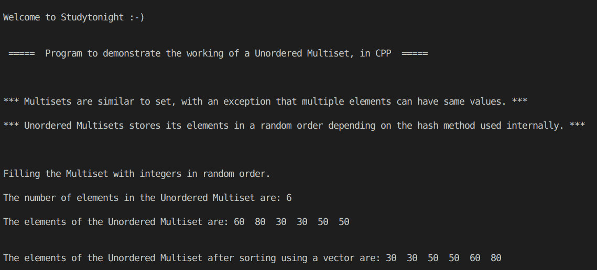

# C++ 使用 STL 无序多集程序

> 原文：<https://www.studytonight.com/cpp-programs/cpp-using-stl-unordered-multiset-program>

大家好！

在本教程中，我们将学习 STL 中多集的**工作方式及其在 C++ 编程语言中的实现**。

## 什么是多集？

多集合类似于集合，除了多个元素可以有相同的值(重复的被保留)。

### 什么是无序多集？

它与多集相同，但这里的元素不是排序的，而是随机存储的。

为了更好地理解它的实现，请参考下面给出的注释良好的 C++ 代码。

<u>**代号:**</u>

```cpp
#include <iostream>
#include <bits/stdc++.h>

using namespace std;

//Function to print the elements of the vector using an iterator
void showVector(vector<int> v)
{
    //declaring an iterator to iterate through the vector elements
    vector<int>::iterator i;

    for (i = v.begin(); i != v.end(); i++)
    {
        cout << *i << "  "; //accessing the elements of the vector using * as i stores the address to each element
    }

    cout << endl;
}

//Function to print the elements of the unordered multiset using an iterator
void showMultiset(unordered_multiset<int> s)
{
    //declaring an iterator to iterate through the multiset
    unordered_multiset<int>::iterator i;

    for (i = s.begin(); i != s.end(); i++)
    {
        cout << *i << "  "; //accessing the elements of the unordered multiset using * as i stores the address to each element
    }

    cout << endl;
}

int main()
{
    cout << "\n\nWelcome to Studytonight :-)\n\n\n";
    cout << " =====  Program to demonstrate the working of a Unordered Multiset, in CPP  ===== \n\n\n\n";

    cout << "*** Multisets are similar to set, with an exception that multiple elements can have same values. *** \n\n";

    cout << "*** Unordered Multisets stores its elements in a random order depending on the hash method used internally. *** \n\n";

    //Unordered Multiset declaration (Set of integers where duplicates are allowed)
    unordered_multiset<int> s;

    //Filling the elements by using the insert() method.
    cout << "\n\nFilling the Multiset with integers in random order."; //Unordered Multiset stores them in a random order

    s.insert(50);
    s.insert(30);
    s.insert(50);
    s.insert(80);
    s.insert(30);
    s.insert(60);

    cout << "\n\nThe number of elements in the Unordered Multiset are: " << s.size();

    cout << "\n\nThe elements of the Unordered Multiset are: ";
    showMultiset(s);

    //Sorting the unordered multiset by copying its elements to a vector
    vector<int> v(s.begin(), s.end());

    vector<int>::iterator it;

    cout << "\n\nThe elements of the Unordered Multiset after sorting using a vector are: ";

    //sorting the vector elements in ascending order
    sort(v.begin(), v.end());

    showVector(v);

    cout << "\n\n\n";

    return 0;
} 
```

<u>**输出:**</u>



我们希望这篇文章能帮助你更好地理解 STL 中无序多集的概念及其在 C++ 中的实现。如有任何疑问，请随时通过下面的评论区联系我们。

**继续学习:**

* * *

* * *