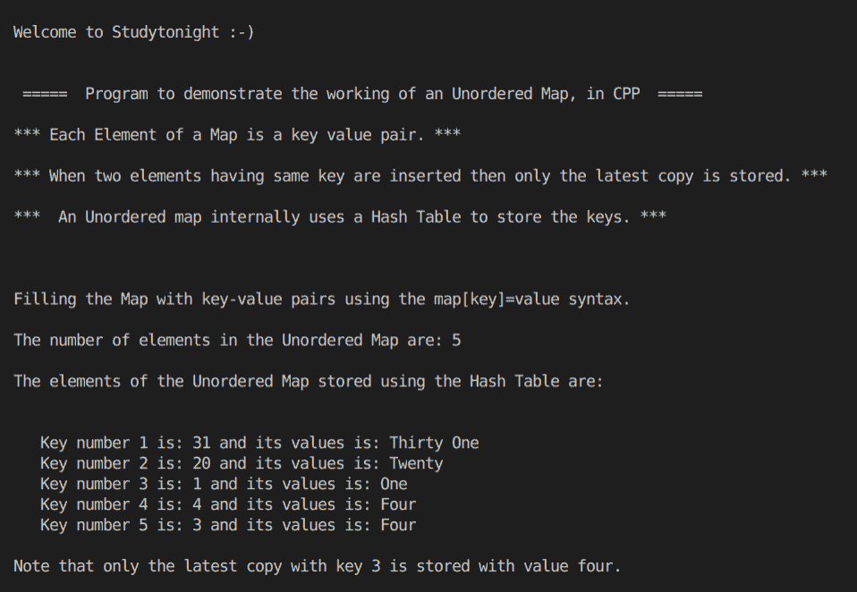

> 原文:[https://www . study south . com/CPP-programs/CPP-using-STL-unordered-map-program](https://www.studytonight.com/cpp-programs/cpp-using-stl-unordered-map-program)

# C++使用 STL 无序映射程序

大家好！

在本教程中，我们将学习 C++编程语言中 STL 中无序映射的**概念。**

要了解 STL 中地图容器的基本功能，我们将推荐您访问[https://www.studytonight.com/cpp/stl/stl-container-map](https://www.studytonight.com/cpp/stl/stl-container-map)，在这里我们从头开始详细解释了这个概念。

### 什么是无序地图？

它与映射相同，只是它不按键的排序顺序存储键值对，而是按随机顺序存储它们。

为了更好地理解它的实现，请参考下面给出的注释良好的 C++代码。

<u>**代号:**</u>

```cpp
#include <iostream>
#include <bits/stdc++.h>

using namespace std;

int main()
{
    cout << "\n\nWelcome to Studytonight :-)\n\n\n";

    cout << " =====  Program to demonstrate the working of an Unordered Map, in CPP  ===== \n\n";

    cout << "*** Each Element of a Map is a key value pair. *** \n\n";

    cout << "*** When two elements having same key are inserted then only the latest copy is stored. *** \n\n";

    cout << "***  An Unordered map internally uses a Hash Table to store the keys. *** \n\n";

    //Unordered Map declaration (Map with key as integer and value as string)
    unordered_map<int, string> m;

    //Filling the elements by using the m[key]=value format.
    cout << "\n\nFilling the Map with key-value pairs using the map[key]=value syntax."; //Unordered Map stores this in a random order

    m[3] = "Three";
    m[4] = "Four";
    m[1] = "One";
    m[20] = "Twenty";
    m[31] = "Thirty One";
    m[3] = "Four";

    cout << "\n\nThe number of elements in the Unordered Map are: " << m.size();

    cout << "\n\nThe elements of the Unordered Map stored using the Hash Table are: \n\n";

    unordered_map<int, string>::iterator i;

    int j = 0;

    for (i = m.begin(); i != m.end(); i++)
    {
        cout << "\n   Key number " << ++j << " is: " << i->first << " and its values is: " << i->second;
    }

    cout << "\n\nNote that only the latest copy with key 3 is stored with value four.";

    cout << "\n\n\n";

    return 0;
} 
```

<u>**输出:**</u>



我们希望这篇文章能帮助你更好地理解 STL 中无序映射容器的概念及其在 C++中的实现。如有任何疑问，请随时通过下面的评论区联系我们。

**继续学习:**

* * *

* * *