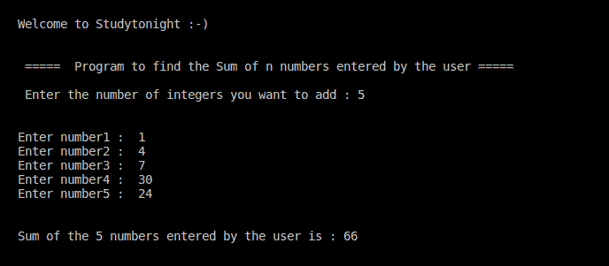

# C++程序查找 n 个用户输入数字的平均值

> 原文：<https://www.studytonight.com/cpp-programs/cpp-program-find-average-of-n-user-input-numbers>

大家好！

在本教程中，我们将学习如何在 C++编程语言中，在不使用数组的情况下，对用户输入的 n 个数字进行**平均。**

从这段代码中学到的一件事是，**当我们不必使用用户输入的单个元素时，没有必要创建和数组或任何这样的数据结构来存储它们，因为这只会导致空间浪费。**

下面给出的注释代码将帮助您详细理解这个概念。

<u>**代号:**</u>

```cpp
#include <iostream>
using namespace std;

int main()
{
    cout << "\n\nWelcome to Studytonight :-)\n\n\n";
    cout << " =====  Program to find the Average of n numbers entered by the user ===== \n\n";

    //variable declaration
    int n, i, temp;

    //As we are dealing with the sum, so initializing with 0.
    double sum = 0;

    //As the average of integers can be a fractional value.
    double average = 0;

    //taking input from the command line (user)
    cout << " Enter the number of integers you want to find the average of : ";
    cin >> n;
    cout << "\n\n";

    //taking n numbers as input from the user and adding them to find the final sum
    for (i = 0; i < n; i++)
    {
        cout << "Enter number" << i + 1 << " :  ";
        cin >> temp;

        //add each number to the sum of all the previous numbers to find the final sum
        sum += temp;
    }

    //Finding the average of the entered numbers (atleast one of the varialbe on the RHS has to be double for average to be double)
    average = sum / n;

    cout << "\n\n The Sum of the " << n << " numbers entered by the user is : " << sum << endl;

    cout << "\n\nThe Average of the " << n << " numbers entered by the user is : " << average << endl;

    cout << "\n\n\n";

    return 0;
} 
```

<u>**输出:**</u>



现在让我们看看我们在上面的程序中做了什么。

## 添加用户在 C++中输入的 n 个数字解释如下:

为了更好地理解，让我们分解代码的各个部分。

```cpp
 //taking n numbers as input from the user and adding them to find the final sum
    for(i=0;i<n;i++)
    {
        cout << "Enter number" << i+1 << " :  ";
        cin >> temp;

        //add each number to the sum of all the previous numbers to find the final sum
        sum += temp;
    }
```

在上面的代码中，由于我们需要找到**所有数字的总和**，我们将用户输入的每个数字放入同一个变量中，并将其添加到`sum`变量中，然后再次对下一个数字使用同一个变量，以此类推。

**继续学习:**

* * *

* * *