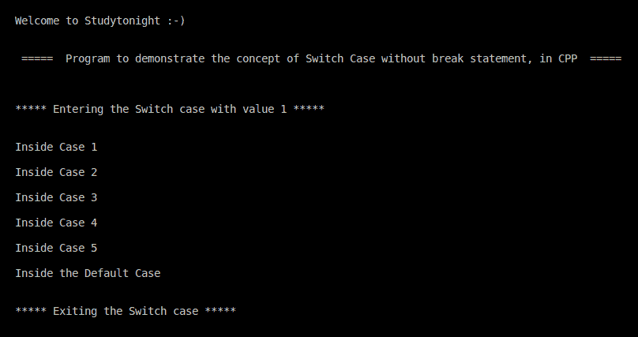

# C++ 程序：无`break`语句的`switch-case`

> 原文：<https://www.studytonight.com/cpp-programs/cpp-switch-case-without-break-statement-program>

大家好！

在本教程中，我们将学习如何用 C++ 编程语言**演示 Switch case 无`break`语句**的概念。

## C++ `switch-case`:

在编程中，[开关情况](https://www.studytonight.com/c/programs/basic/switch-case)只是多个 if-else 块的一个替代。它仅在满足特定条件时用于执行代码块。break 语句用于阻止代码流进入剩余的块，从而使其在满足单个条件时直接移出开关块。

如果没有`break`语句，代码将进入匹配案例之后的每个案例。下面代码中讨论的示例将帮助您理解 switch case 中 break 语句提供的功能。

**代号:**

```cpp
#include <iostream>
#include <vector>
using namespace std;

int main()
{
    cout << "\n\nWelcome to Studytonight :-)\n\n\n";
    cout << " =====  Program to demonstrate the concept of Switch Case without break statement, in CPP  ===== \n\n";

    //variable to run the Switch case with
    int sw = 1;

    cout << "\n\n***** Entering the Switch case with value 1 ***** \n\n";

    //Logic of Switch case with break statement
    switch (sw)
    {
    case 1:
        cout << "\nInside Case 1\n";
    case 2:
        cout << "\nInside Case 2\n";
    case 3:
        cout << "\nInside Case 3\n";
    case 4:
        cout << "\nInside Case 4\n";
    case 5:
        cout << "\nInside Case 5\n";
    default:
        cout << "\nInside the Default Case\n";
    }

    cout << "\n\n***** Exiting the Switch case ***** \n\n\n";
    return 0;
} 
```

**输出:**



我们希望这篇文章能帮助你更好地理解 C++ 中不带`break`语句的 Switch Case 的概念。如有任何疑问，请随时通过下面的评论区联系我们。

**继续学习:**

* * *

* * *