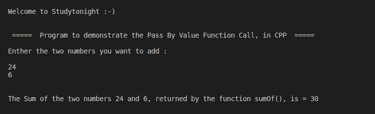

# C++按值传递程序

> 原文：<https://www.studytonight.com/cpp-programs/cpp-pass-by-value-program>

大家好！

在本教程中，我们将学习 C++编程语言中的**传递值函数调用**的工作原理。

## 传递值函数调用:

在这种类型的函数调用中，*仅将变量的实际值传递给已经被调用的函数*，而不是存储该值的地址。因此，对该变量所做的任何更改仅对已调用的方法是局部的，除非该变量被声明为全局变量。

要了解这个概念的更多信息，请访问[https://www . study south . com/CPP/call-by-value-and-reference . PHP](https://www.studytonight.com/cpp/call-by-value-and-reference.php)，我们已经解释了**按值调用**和**按引用调用**函数调用之间的区别。

为了更好地理解，请参考下面给出的注释良好的代码。

<u>**代号:**</u>

```cpp
#include <iostream>
#include<vector>
using namespace std;

//Function prototyping as defined after it is being called
int sumOf(int, int);

int main()
{
    cout << "\n\nWelcome to Studytonight :-)\n\n\n";
    cout << " =====  Program to demonstrate the Pass By Value Function Call, in CPP  ===== \n\n";

    //variable declaration
    int num1, num2, addition=0;

    cout << "Enther the two numbers you want to add : \n\n";
    cin >> num1;
    cin >> num2;

    /*
    Demonstrating Multi-line Commenting:
        Passing the values stored in the variables num1 and num2 as parameter to function sumOf().
        The value returned by the function is stored in the variable output
    */

    addition = sumOf(num1, num2);
    cout << "\n\nThe Sum of the two numbers " << num1 << " and " << num2 << ", returned by the function sumOf(), is = " << addition;

    cout << "\n\n\n";

    return 0;
}

// Defining the function sumOf(a,b) which is called by Passing Values and returns the sum of a and b
int sumOf(int n1, int n2)
{
    int sum;
    //Computing the addition of the two values the function is called with
    sum = n1 + n2;

    //Returning the addition to the point where this function is called from
    return sum;
}
```

<u>**输出:**</u>



我们希望这篇文章能帮助您更好地理解 CPP 中的价值召唤概念。如有任何疑问，请随时通过下面的评论区联系我们。

**继续学习:**

* * *

* * *