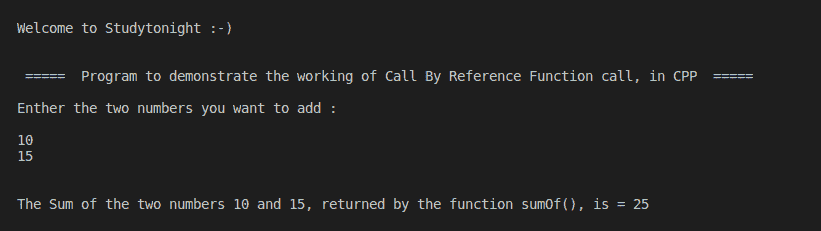

# C++ 程序：按引用调用

> 原文：<https://www.studytonight.com/cpp-programs/cpp-call-by-reference-program>

大家好！

在本教程中，我们将以 C++ 编程语言学习**通过引用调用函数调用**的工作原理。

## 按引用调用函数调用:

在这种类型的函数调用中，*位置或变量的地址被传递给*，而不是变量本身的值。

要了解这个概念的更多信息，请访问[https://www . study south . com/CPP/call-by-value-and-reference . PHP](https://www.studytonight.com/cpp/call-by-value-and-reference.php)，我们已经解释了**按值调用**和**按引用调用**函数调用之间的区别。

为了更好地理解，请参考下面给出的注释良好的代码。

**代号:**

```cpp
#include <iostream>
#include<vector>
using namespace std;

//Function prototyping as defined after it is being called.  
// It denotes that the method sumOf() takes two parameters which are pointer to an int and returns int
int sumOf(int *, int *);

int main()
{
    cout << "\n\nWelcome to Studytonight :-)\n\n\n";
    cout << " =====  Program to demonstrate the working of Pass By Reference Function call, in CPP  ===== \n\n";

    //variable declaration
    int num1 = 0, num2 = 0, addition=0;

    cout << "Enther the two numbers you want to add : \n\n";
    cin >> num1;
    cin >> num2;

    /*
    Demonstrating Multi-line Commenting:
        Passing the values stored in the variables num1 and num2 as a parameter to function sumOf().
        The value returned by the function is stored in the variable output
    */

   //It is not always necessary to store the returned value into a variable as it can be directly used as demonstrted below
    cout << "\n\nThe Sum of the two numbers " << num1 << " and " << num2 << ", returned by the function sumOf(), is = " << sumOf(&num1, &num2);

    cout << "\n\n\n";

    return 0;
}

// Defining the function sumOf(a,b) which is called by Passing Values and returns the sum of a and b
int sumOf(int *n1, int *n2)
{
    int sum;
    //Computing the addition of the two values the function is called with
    sum = *n1 + *n2;

    //Returning the addition to the point where this function is called from
    return sum;
}
```

**输出:**



我们希望这篇文章能帮助你更好地理解 C++ 中引用调用的概念。如有任何疑问，请随时通过下面的评论区联系我们。

**继续学习:**

* * *

* * *