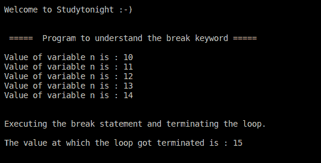

# 循环程序中的 C++ 中断语句

> 原文：<https://www.studytonight.com/cpp-programs/cpp-break-statement-in-loop-program>

大家好！

在本教程中，我们将学习如何用 C++ 编程语言**演示循环**中 break 语句的概念。

**代号:**

```cpp
#include <iostream>

using namespace std;

int main()
{
    cout << "\n\nWelcome to Studytonight :-)\n\n\n";
    cout << " =====  Program to understand the break keyword ===== \n\n";

    // Local variable declaration and initialization:
    int n = 10;

    // do loop execution
    do
    {
        cout << "Value of variable n is : " << n << endl;
        n = n + 1;
        if (n == 15)
        {
            // terminate the loop and execute the next statement following it.

            cout << "\n\nExecuting the break statement and terminating the loop.\n\n";
            break;
        }
    } while (n < 20);

    cout << "The value at which the loop got terminated is : " << n << "\n\n\n";

    return 0;
}
```

**输出:**



我们希望这篇文章能帮助你更好地理解 C++ 中循环中 break 语句的概念。如有任何疑问，请随时通过下面的评论区联系我们。

**继续学习:**

* * *

* * *