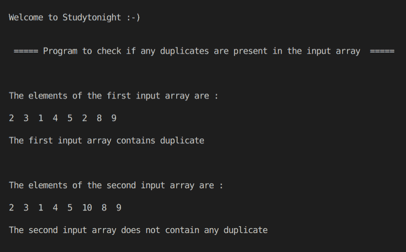

# C++检查数组是否包含重复项

> 原文：<https://www.studytonight.com/cpp-programs/cpp-check-if-the-array-contains-any-duplicates>

大家好！

在本教程中，我们将学习如何在 C++编程语言中**检查给定数组是否包含任何重复的**。

这是通过首先使用系统定义的`sort()`方法对数组进行排序来实现的，如下所示。

为了更好地理解，请参考下面给出的注释良好的 C++代码。

<u>**代号:**</u>

```cpp
#include <iostream>
#include <bits/stdc++.h>

using namespace std;

//Program to return true if duplicate is found
bool containsDuplicate(int n[], int m)
{

    //flag to indicate the presence of duplicate
    int f = 0;

    //Sorting the array to check for duplicates
    sort(n, n + m);

    for (int i = 0; i < m - 1; i++)
    {
        if (n[i] == n[i + 1])
        {
            //if duplicate is found then set the flag to 1 and exit the loop
            f = 1;
            break;
        }
    }

    if (f == 1)
        return true;
    else
        return false;
}

int main()
{
    cout << "\n\nWelcome to Studytonight :-)\n\n\n";
    cout << " ===== Program to check if any duplicates are present in the input array  ===== \n\n";

    int i, n1, n2;

    int a1[] = {2, 3, 1, 4, 5, 2, 8, 9};
    int a2[] = {2, 3, 1, 4, 5, 10, 8, 9};

    bool duplicate1 = false;

    bool duplicate2 = false;

    n1 = sizeof(a1) / sizeof(a1[0]);
    n2 = sizeof(a2) / sizeof(a2[0]);

    cout << "\n\nThe elements of the first input array are :\n\n";

    for (i = 0; i < n1; i++)
    {
        cout << a1[i] << "  ";
    }

    duplicate1 = containsDuplicate(a1, n1);

    if (duplicate1)
        cout << "\n\nThe first input array contains duplicate";
    else
        cout << "\n\nThe first input array does not contain any duplicate";

    cout << "\n\n\n\nThe elements of the second input array are :\n\n";

    for (i = 0; i < n2; i++)
    {
        cout << a2[i] << "  ";
    }

    duplicate2 = containsDuplicate(a2, n2);

    if (duplicate2)
        cout << "\n\nThe second input array contains duplicate";
    else
        cout << "\n\nThe second input array does not contain any duplicate";

    cout << "\n\n\n";

    return 0;
} 
```

<u>**输出:**</u>



我们希望这篇文章能帮助您更好地理解确定数组是否包含任何副本的概念及其在 C++中的实现。如有任何疑问，请随时通过下面的评论区联系我们。

**继续学习:**

* * *

* * *