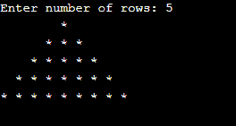

# C++ 程序：使用`*`打印全金字塔

> 原文：<https://www.studytonight.com/cpp-programs/program-to-print-full-pyramid-using-in-cpp>

以下是使用*打印全金字塔的程序。

```cpp
#include<iostream.h>

int main()
{
    int space, rows;

    cout <<"Enter number of rows: ";
    cin >> rows;

    for(int i = 1, k = 0; i <= rows; ++i, k = 0)
    {
        for(space = 1; space <= rows-i; ++space)
        {
            cout <<"  ";
        }

        while(k != 2*i-1)
        {
            cout << "* ";
            ++k;
        }
        cout << endl;
    }    
getch();
return 0 ;
}
```

## 输出



* * *

* * *