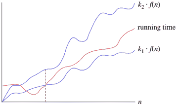

# 渐近符号

> 原文：<https://www.studytonight.com/data-structures/aysmptotic-notations>

当从时间和空间的角度分析任何算法的复杂性时，我们永远无法提供一个精确的数字来定义算法所需的时间和空间，而是使用一些标准符号来表示，也称为**渐近符号**。

当我们分析任何算法时，我们通常会得到一个公式来表示执行所需的时间量或计算机运行算法代码行所需的时间、内存访问次数、比较次数、占用内存空间的临时变量等。这个公式经常包含不重要的细节，这些细节并不能真正告诉我们任何关于运行时间的信息。

举个例子，如果某算法的时间复杂度为 T(n) = (n 2 + 3n + 4)，这是一个二次方程。对于较大的`n`值，`3n + 4`部分与`n2`部分相比将变得无关紧要。

n = 1000 时，`n2`为`1000000`，`3n + 4`为`3004`。

此外，当我们比较两种算法的执行时间时，高阶项的常量系数也被忽略。

对于任何大于`200`的`n`值，需要`200n2`时间的算法将比需要`n3`时间的其他算法更快。因为我们只对函数增长的渐近行为感兴趣，所以常量因子也可以忽略。

* * *

## 什么是渐近行为

单词**渐近**意味着任意接近一个值或曲线(即，当采取某种限制时)。

记得高中学习关于**极限**的内容，这个是一样的。

唯一的区别是，这里我们不需要找到任何表达式的值，其中`n`接近任何有限的数字或无穷大，但是在渐近符号的情况下，我们使用相同的模型来忽略常量因子和表达式的不重要部分，以在单个系数中设计更好的方法来表示算法的复杂性，从而可以容易地进行算法之间的比较。

让我们举个例子来理解这一点:

如果我们有两个算法，用下面的表达式表示它们执行所需的时间，那么:

**表达式 1** : (20n 2 + 3n - 4)

**表达式 2** : (n 3 + 100n - 2)

现在，根据渐近表示法，我们应该只关心函数将如何随着`n`(输入)值的增长而增长，这将完全取决于表达式 1 的`n2`和表达式 2 的`n3`。因此，我们可以清楚地说，运行时间由表达式 2 表示的算法将比另一个算法增长得更快，简单地通过分析最高功率系数并忽略其他常量(20n 中的 20 个 2 )和表达式的不重要部分(`3n - 4`和`100n - 2`)。

抛开不太重要的部分背后的主要思想是让事情**变得可管理**。

我们需要做的是，首先分析算法，找出一个表达式来定义它的时间要求，然后分析该表达式将如何随着输入(n)的增长而增长。

* * *

## 渐近符号的类型

随着输入的增加，我们使用三种渐近符号来表示任何算法的增长:

1.  大θ(θ)
2.  大哦(O)
3.  大ω(ω)

* * *

### 严格界限:θ

当我们说严格界限时，我们的意思是由大θ符号表示的时间复杂度就像算法的实际执行时间的平均值或范围。

例如，如果对于某些算法，时间复杂度由表达式 3n 2 + 5n 来表示，并且我们使用 Big-θ符号来表示，那么时间复杂度将是θ(n2，忽略常量系数并去除不重要的部分，即 5n。

这里，在上面的例子中，θ(n2)的复杂性意味着，任何输入`n`的平均时间将保持在，`k1 * n2`和`k2 * n2`之间，其中 k1、k2 是两个常量，因此紧密地绑定了表示算法增长的表达式。

* * *

### 上限:大 0

这种符号被称为算法的上限，或算法的最坏情况。

它告诉我们，对于任何输入值`n`，某个函数都不会超过指定的时间。

问题是，当我们已经有了大θ表示法时，为什么还需要这种表示法，大θ表示法表示任何算法的紧束缚运行时间。让我们举一个小例子来理解这一点。

考虑线性搜索算法，其中我们遍历一个数组元素，一个接一个地搜索给定的数字。

**最差情况**中，从数组的前面开始，我们在末尾找到要搜索的元素或个数，这将导致`n`的时间复杂度，其中`n`表示元素总数。

但有可能发生的是，我们搜索的元素是数组的第一个元素，这种情况下时间复杂度为`1`。

现在在这种情况下，说线性搜索的大θ或紧界时间复杂度是θ(n)，将意味着所需时间将总是与`n`相关，因为这是表示平均时间复杂度的正确方式，但是当我们使用大 O 符号时，我们的意思是说时间复杂度是 O(n)，这意味着时间复杂度永远不会超过`n`，定义了上限，因此说它可以小于或等于`n`，这是正确的表示。

这就是原因，大多数时候你会看到 Big-O 符号被用来表示任何算法的时间复杂度，因为它更有意义。

* * *

### 下限:欧米茄

大ω符号用于定义任何算法的**下界**或者我们可以说**是任何算法的最佳情况**。

这总是指示任何算法对于所有输入值所需的最短时间，因此是任何算法的最佳情况。

简而言之，当我们以大ω的形式表示任何算法的时间复杂度时，我们意味着该算法至少需要这么多时间来完成它的执行。肯定会比这花费更多的时间。

* * *

* * *