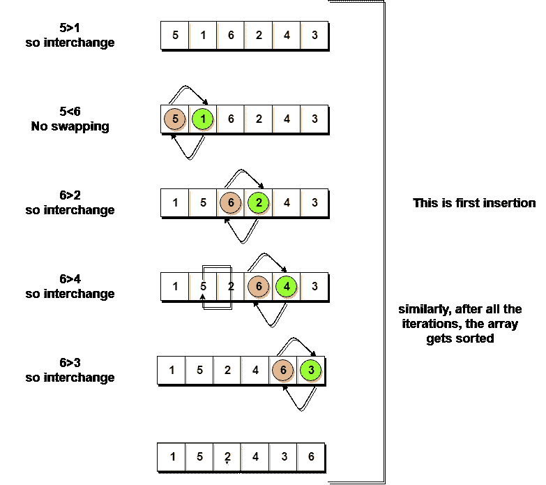
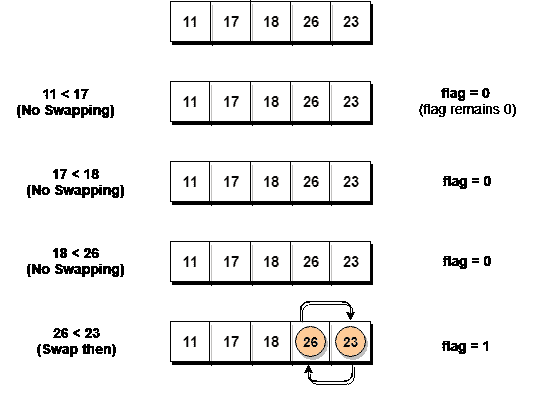

# 冒泡排序算法

> 原文：<https://www.studytonight.com/data-structures/bubble-sort>

**冒泡排序**是一种简单的算法，用于对一组给定的`n`元素进行排序，这些元素以数组的形式提供，具有`n`个元素。冒泡排序逐个比较所有元素，并根据它们的值对它们进行排序。

如果给定的数组必须按升序排序，那么冒泡排序将从比较数组的第一个元素和第二个元素开始，如果第一个元素大于第二个元素，它将**交换**两个元素，然后继续比较第二个和第三个元素，以此类推。

如果我们有总共`n`个元素，那么我们需要重复这个过程`n-1`次。

它被称为**气泡排序**，因为随着每一次完整的迭代，给定数组中最大的元素，向最后一个地方或最高的索引冒泡，就像一个水气泡上升到水面一样。

排序是通过逐个遍历所有元素，并将其与相邻元素进行比较，然后在需要时交换它们来进行的。

**注意:**如果不熟悉数据结构中的排序，首先要学习[什么是排序](introduction-to-sorting)了解排序的基础知识。

* * *

## 实现冒泡排序算法

以下是冒泡排序中涉及的步骤(用于按升序对给定数组进行排序):

1.  从第一个元素开始(index = 0)，将当前元素与数组的下一个元素进行比较。
2.  如果当前元素大于数组的下一个元素，则交换它们。
3.  如果当前元素小于下一个元素，则移动到下一个元素。**重复步骤 1** 。

让我们考虑一个有值的数组`{5, 1, 6, 2, 4, 3}`

下面，我们有一个泡泡排序如何排序给定数组的图示。



因此，正如我们在上面的表示中所看到的，在第一次迭代之后，`6`被放置在最后一个索引处，这是它的正确位置。

同样，第二次迭代后，`5`将位于第二个最后一个索引处，以此类推。

是时候为冒泡排序编写代码了:

```cpp
// below we have a simple C program for bubble sort
#include <stdio.h>

void bubbleSort(int arr[], int n)
{
    int i, j, temp;
    for(i = 0; i < n; i++)
    {
        for(j = 0; j < n-i-1; j++)
        {
            if( arr[j] > arr[j+1])
            {
                // swap the elements
                temp = arr[j];
                arr[j] = arr[j+1];
                arr[j+1] = temp;
            } 
        }
    }

    // print the sorted array
    printf("Sorted Array: ");
    for(i = 0; i < n; i++)
    {
        printf("%d  ", arr[i]);
    }
}

int main()
{
    int arr[100], i, n, step, temp;
    // ask user for number of elements to be sorted
    printf("Enter the number of elements to be sorted: ");
    scanf("%d", &n);
    // input elements if the array
    for(i = 0; i < n; i++)
    {
        printf("Enter element no. %d: ", i+1);
        scanf("%d", &arr[i]);
    }
    // call the function bubbleSort
    bubbleSort(arr, n);

    return 0;
}
```

虽然上面的逻辑将对未排序的数组进行排序，但是上面的算法仍然是无效的，因为根据上面的逻辑，即使数组在第二次迭代之后被排序，外部`for`循环也将继续执行 **6** 迭代。

所以，我们显然可以优化我们的算法。

* * *

## 优化冒泡排序算法

为了优化冒泡排序算法，我们可以引入一个`flag`来监控元素是否在内部`for`循环中被交换。

因此，在内部`for`循环中，我们每次都检查元素交换是否正在进行。

如果对于特定的迭代，没有发生交换，这意味着数组已经被排序，我们可以跳出`for`循环，而不是执行所有的迭代。

让我们考虑一个有值的数组`{11, 17, 18, 26, 23}`

下面，我们有一个优化气泡排序如何排序给定数组的图示。



如我们所见，在第一次迭代中，交换发生了，因此我们将`flag`值更新为`1`，结果，执行再次进入`for`循环。但是在第二次迭代中，不会发生交换，因此`flag`的值将保持`0`，并且执行将脱离循环。

```cpp
// below we have a simple C program for bubble sort
#include <stdio.h>

void bubbleSort(int arr[], int n)
{
    int i, j, temp, flag=0;
    for(i = 0; i < n; i++)
    {
        for(j = 0; j < n-i-1; j++)
        {
            // introducing a flag to monitor swapping
            if( arr[j] > arr[j+1])
            {
                // swap the elements
                temp = arr[j];
                arr[j] = arr[j+1];
                arr[j+1] = temp;
                // if swapping happens update flag to 1
                flag = 1;
            } 
        }
        // if value of flag is zero after all the iterations of inner loop
        // then break out
        if(flag==0)
        {
            break;
        }
    }

    // print the sorted array
    printf("Sorted Array: ");
    for(i = 0; i < n; i++)
    {
        printf("%d  ", arr[i]);
    }
}

int main()
{
    int arr[100], i, n, step, temp;
    // ask user for number of elements to be sorted
    printf("Enter the number of elements to be sorted: ");
    scanf("%d", &n);
    // input elements if the array
    for(i = 0; i < n; i++)
    {
        printf("Enter element no. %d: ", i+1);
        scanf("%d", &arr[i]);
    }
    // call the function bubbleSort
    bubbleSort(arr, n);

    return 0;
}
```


在上面的代码中，在函数`bubbleSort`中，如果对于`j`迭代的单个完整周期(内部`for`循环)，没有发生交换，那么`flag`将保留`0`，然后我们将脱离`for`循环，因为数组已经被排序了。

* * *

## 冒泡排序的复杂度分析

在冒泡排序中，`n-1`比较将在第一遍中进行，`n-2`在第二遍中进行，`n-3`在第三遍中进行，以此类推。所以比较的总数是，

(n-1) + (n-2) + (n-3) +.....+ 3 + 2 + 1 总和= n(n-1)/2 即 O(n <sup>2</sup> )

因此泡泡排序的**时间复杂度**为 **O(n <sup>2</sup> )** 。

冒泡排序的主要优点是算法简单。

气泡排序的**空间复杂度**是**0(1)**，因为只需要一个额外的内存空间，即`temp`变量。

此外，**最佳案例时间复杂度**将是 **O(n)** ，此时列表已经排序。

以下是气泡排序算法的时间和空间复杂度。

*   最坏情况时间复杂度【大 O】:**O(n<sup>2</sup>)**
*   最佳案例时间复杂度[大ω]:**O(n)**
*   平均时间复杂度【大θ】:**O(n<sup>2</sup>)**
*   空间复杂度: **O(1)**

既然我们已经学习了气泡排序算法，您也可以查看这些排序算法及其应用:

*   [插入输出](insertion-sorting)
*   [选择排序](selection-sorting)
*   [快速排序](quick-sort)
*   [归并排序](merge-sort)
*   [堆排序](heap-sort)
*   [计数排序](counting-sort)

* * *

* * *