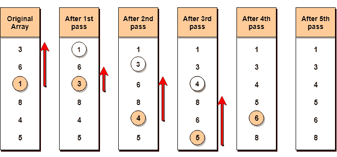

# 选择排序算法

> 原文:[https://www . study south . com/data-structures/selection-sorting](https://www.studytonight.com/data-structures/selection-sorting)

选择排序是概念上最简单的排序算法。该算法将首先找到数组中**最小的**元素，并将其与**第一**位置的元素交换，然后找到**第二最小的**元素，并将其与**第二**位置的元素交换，并继续这样做，直到整个数组被排序。

之所以称之为选择排序，是因为它反复地**选择**下一个最小的元素，并将其交换到正确的位置。

* * *

## 选择排序是如何工作的？

以下是选择排序中涉及的步骤(用于按升序对给定数组进行排序):

1.  从第一个元素开始，我们搜索数组中最小的元素，并用第一个位置的元素替换它。
2.  然后我们继续到第二个位置，从索引`1`开始，直到最后一个索引，寻找子阵列中存在的最小元素。
3.  我们用第二小元素替换原始数组中第**第二**位置的元素，或者我们可以说是子数组中第一个位置的元素。
4.  重复这一过程，直到数组完全排序。

让我们考虑一个有值的数组`{3, 6, 1, 8, 4, 5}`

下面，我们有一个图示来说明选择排序将如何对给定的数组进行排序。



在**第一个**通道中，最小的元素将是`1`，因此它将被放置在第一个位置。

然后离开第一个元素，从剩余的元素中搜索下一个最小的元素。我们将得到`3`作为最小的，所以它将被放置在第二个位置。

然后离开`1`和`3`(因为它们在正确的位置)，我们将从剩下的元素中搜索下一个最小的元素，并将其放在第三个位置，一直这样做，直到数组被排序。

* * *

### 寻找子阵列中的最小元素

在选择排序中，在第一步中，我们寻找数组中最小的元素，并用第一个位置的元素替换它。这似乎是可行的，不是吗？

假设您有一个具有以下值的数组`{3, 6, 1, 8, 4, 5}`。现在按照选择排序，我们将从第一个元素开始，寻找数组中最小的数字，这就是`1`，我们将在**索引** `2`中找到它。一旦找到最小的数字，它将与第一个位置的元素交换。

在下一次迭代中，我们将不得不寻找数组中第二小的数字。如何才能找到第二小的数？这个很棘手？

如果你仔细看，我们已经在第一个位置有了最小的数字/元素，这是它的正确位置，我们现在不必移动它到任何地方。所以我们可以说，第一个元素是排序的，但是右边的元素，从索引`1`开始就没有。

所以，我们现在将寻找子阵列中最小的元素，从索引`1`开始，到最后一个索引。

迷茫？给它时间去适应。

在我们找到第二个最小的元素并用索引`1`上的元素替换它之后(这是数组中的第二个位置)，我们将对数组的前两个位置进行排序。

然后我们再来研究子阵，从现在的索引`2`开始，再次寻找这个子阵中最小的元素。

* * *

## 实现选择排序算法

在下面的 C 程序中，我们试图把程序分成小函数，这样你就更容易理解哪个部分在做什么。

实现选择排序算法有很多不同的方法，下面是我们喜欢的一种:

```cpp
// C program implementing Selection Sort
# include <stdio.h>

// function to swap elements at the given index values
void swap(int arr[], int firstIndex, int secondIndex) 
{   
    int temp;
    temp = arr[firstIndex];
    arr[firstIndex] = arr[secondIndex];
    arr[secondIndex] = temp;
}

// function to look for smallest element in the given subarray
int indexOfMinimum(int arr[], int startIndex, int n) 
{
    int minValue = arr[startIndex];
    int minIndex = startIndex;

    for(int i = minIndex + 1; i < n; i++) {
        if(arr[i] < minValue) 
        {
            minIndex = i;
            minValue = arr[i];
        }
    } 
    return minIndex;
}

void selectionSort(int arr[], int n) 
{
    for(int i = 0; i < n; i++) 
    {
        int index = indexOfMinimum(arr, i, n);
        swap(arr, i, index);
    }

}

void printArray(int arr[], int size)
{
    int i;
    for(i = 0; i < size; i++)
    {
        printf("%d ", arr[i]);
    }
    printf("\n");
}

int main()
{
    int arr[] = {46, 52, 21, 22, 11};
    int n = sizeof(arr)/sizeof(arr[0]);
    selectionSort(arr, n);
    printf("Sorted array: \n");
    printArray(arr, n);
    return 0;
}
```

**注意:**选择排序是**不稳定排序**，即排序时可能会改变列表中两个相似元素的出现。但是当使用链表实现时，它也可以作为一个稳定的排序。

* * *

### 选择排序的复杂性分析

Selection Sort 需要两个嵌套的`for`循环来完成自身，一个`for`循环在函数`selectionSort`中，在第一个循环中，我们正在调用另一个函数`indexOfMinimum`，它有第二个(内部)`for`循环。

因此，对于给定的输入大小`n`，选择排序算法的时间和空间复杂度如下:

最坏情况时间复杂度【大 O】:**O(n<sup>2</sup>)**

最佳案例时间复杂度[大ω]:**O(n<sup>2</sup>)**

平均时间复杂度【大θ】:**O(n<sup>2</sup>)**

空间复杂度: **O(1)**

* * *

* * *