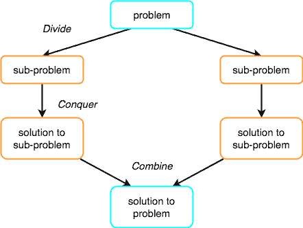
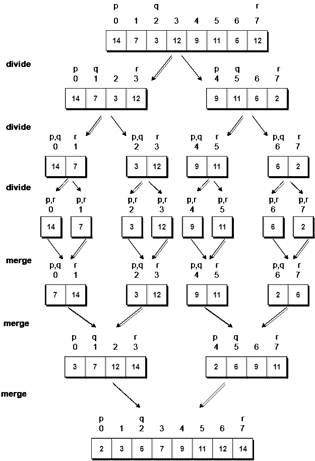

# 归并排序算法

> 原文：<https://www.studytonight.com/data-structures/merge-sort>

归并排序遵循**分而治之**的规则，递归地对给定的一组数字/元素进行排序，因此耗时更少。

在继续归并排序之前，请先检查以下主题:

*   [选择排序](selection-sorting)
*   [插入输出](insertion-sorting)
*   [算法的空间复杂度](space-complexity-of-algorithms)
*   [算法的时间复杂度](time-complexity-of-algorithms)

在前两个教程中，我们学习了选择排序和插入排序，这两种排序的最坏情况运行时间均为`O(n<sup>2</sup>)`。随着输入大小的增加，插入和选择排序可能需要很长时间才能运行。

另一方面，归并排序在所有情况下都在`O(n*log n)`时间内运行。

在继续之前，归并排序如何工作及其实现，首先让我们了解**分治**的规则是什么？

* * *

## 分治法

如果我们能把单个大问题分解成更小的子问题，解决更小的子问题，并结合它们的解决方案，找到原来大问题的解决方案，那么整个问题就变得更容易解决了。

举个例子**分而治之**。

当英国人来到印度时，他们看到了一个不同宗教和谐相处的国家，勤劳但天真的公民，多样性中的团结，他们发现很难建立自己的帝国。于是，他们采取了**分而治之**的政策。在印度人口对他们来说是一个大问题的地方，他们通过煽动当地国王之间的竞争，使他们相互对立，将问题分成更小的问题，这对他们来说非常有效。

嗯，那是历史，也是社会政治政策(**分而治之**)，但这里的想法是，如果我们能以某种方式将一个问题分成更小的子问题，最终解决整个问题就变得更容易了。

在**归并排序**中，给定的带有`n`元素的未排序数组被分成`n`子数组，每个子数组有**一个**元素，因为单个元素本身总是被排序的。然后，它重复合并这些子数组，以产生新的排序子数组，最后，产生一个完整的排序数组。

分治的概念包括三个步骤:

1.  **把**的问题分成多个小问题。
2.  **通过解决子问题来征服**。这个想法是将问题分解成原子子问题，在那里它们被实际解决。
3.  **结合**子问题的解找到实际问题的解。



* * *

## 归并排序是如何工作的？

正如我们已经讨论过的，归并排序利用分治规则将问题分解为子问题，在这种情况下的问题是，**排序给定的数组**。

在归并排序中，我们在中途分解给定的数组，例如，如果原始数组有`6`个元素，那么归并排序将把它分解成两个子数组，每个子数组有`3`个元素。

但是将原始数组分成两个更小的子数组并不能帮助我们对数组进行排序。

所以我们将这些子数组分解成更小的子数组，直到我们有多个子数组，其中有**单元素**。现在，这里的想法是，具有单个元素的数组已经被排序了，所以一旦我们将原始数组分解为只有单个元素的子数组，我们就成功地将问题分解为基本问题。

然后我们必须一步一步地合并所有这些排序的子数组，形成一个单一的排序数组。

让我们考虑一个有值的数组`{14, 7, 3, 12, 9, 11, 6, 12}`

下面，我们有一个图片表示归并排序将如何排序给定的数组。



在归并排序中，我们遵循以下步骤:

1.  我们取一个变量`p`并将数组的起始索引存储在这里。我们取另一个变量`r`并将数组的最后一个索引存储在其中。
2.  然后我们用公式`(p + r)/2`找到数组的中间，把中间的索引标记为`q`，把数组分成两个子数组，从`p`到`q`，从`q + 1`到`r`索引。
3.  然后我们再次划分这两个子数组，就像我们划分主数组一样，然后继续。
4.  一旦我们已经将主数组分成具有单个元素的子数组，那么我们就开始合并子数组。

* * *

## 实现归并排序算法

下面我们有一个实现归并排序算法的 C 程序。

```cpp
/*  
    a[] is the array, p is starting index, that is 0, 
    and r is the last index of array. 
*/

#include <stdio.h>

// lets take a[5] = {32, 45, 67, 2, 7} as the array to be sorted.

// merge sort function
void mergeSort(int a[], int p, int r)
{
    int q;
    if(p < r)
    {
        q = (p + r) / 2;
        mergeSort(a, p, q);
        mergeSort(a, q+1, r);
        merge(a, p, q, r);
    }
}

// function to merge the subarrays
void merge(int a[], int p, int q, int r)
{
    int b[5];   //same size of a[]
    int i, j, k;
    k = 0;
    i = p;
    j = q + 1;
    while(i <= q && j <= r)
    {
        if(a[i] < a[j])
        {
            b[k++] = a[i++];    // same as b[k]=a[i]; k++; i++;
        }
        else
        {
            b[k++] = a[j++];
        }
    }

    while(i <= q)
    {
        b[k++] = a[i++];
    }

    while(j <= r)
    {
        b[k++] = a[j++];
    }

    for(i=r; i >= p; i--)
    {
        a[i] = b[--k];  // copying back the sorted list to a[]
    } 
}

// function to print the array
void printArray(int a[], int size)
{
    int i;
    for (i=0; i < size; i++)
    {
        printf("%d ", a[i]);
    }
    printf("\n");
}

int main()
{
    int arr[] = {32, 45, 67, 2, 7};
    int len = sizeof(arr)/sizeof(arr[0]);

    printf("Given array: \n");
    printArray(arr, len);

    // calling merge sort
    mergeSort(arr, 0, len - 1);

    printf("\nSorted array: \n");
    printArray(arr, len);
    return 0;
}
```

给定数组:32 45 67 2 7 排序数组:2 7 32 45 67

* * *

### 归并排序的复杂性分析

归并排序相当快，时间复杂度为`O(n*log n)`。这也是一种稳定的排序，这意味着“相等”的元素在排序列表中以相同的顺序排序。

在本节中，我们将了解为什么归并排序的运行时间是`O(n*log n)`。

正如我们在[二分搜索](binary-search-algorithm)中已经了解到的，每当我们在每一步中把一个数分成两半时，都可以用对数函数来表示，这就是`log n`，步数可以用`log n + 1`来表示(最多)

此外，我们执行单步操作来找出任何子数组的中间，即`O(1)`。

而要**合并**子数组，通过分割`n`元素的原始数组而制成，将需要`O(n)`的运行时间。

因此`mergeSort`功能的总时间将变为`n(log n + 1)`，这给了我们一个`O(n*log n)`的时间复杂度。

最坏情况时间复杂度[大 O ]: **O(n*log n)**

最佳案例时间复杂度[大ω]:**O(n * log n)**

平均时间复杂度[大-θ]:**O(n * log n)**

空间复杂度: **O(n)**

*   归并排序的时间复杂度在所有 3 种情况下(最差、平均和最佳)都是`O(n*Log n)`，因为归并排序总是**将**数组分成两半，并且需要线性时间来**合并**两半。
*   它需要**与未排序数组相等的额外空间**。因此，它根本不推荐用于搜索大型未排序数组。
*   这是用于排序链表的最佳排序技术。

现在我们已经学习了插入排序算法，您也可以查看这些其他排序算法及其应用:

*   [气泡排序](bubble-sort)
*   [插入输出](insertion-sorting)
*   [快速排序](quick-sort)
*   [选择排序](selection-sorting)
*   [堆排序](heap-sort)
*   [计数排序](counting-sort)

* * *

* * *