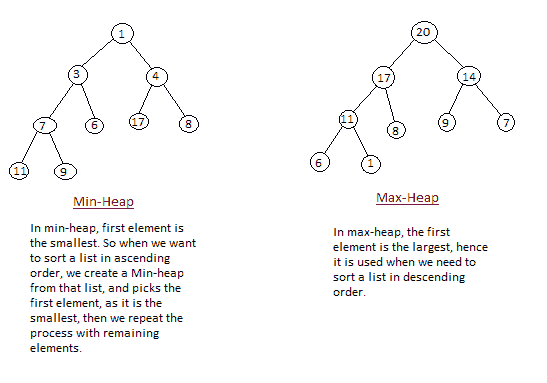

# 堆排序算法

> 原文:[https://www.studytonight.com/data-structures/heap-sort](https://www.studytonight.com/data-structures/heap-sort)

堆排序是最好的排序方法之一，并且没有二次最坏情况运行时间。堆排序包括从给定的数组构建一个**堆**数据结构，然后利用堆对数组进行排序。

您一定想知道，将数字数组转换为堆数据结构将如何帮助对数组进行排序。为了理解这一点，让我们从理解什么是堆开始。

**注意:**如果不熟悉数据结构中的排序，首先要学习[什么是排序](introduction-to-sorting)了解排序的基础知识。

* * *

## 什么是堆？

堆是一种特殊的基于树的数据结构，它满足以下特殊的堆属性:

1.  **Shape Property:** Heap data structure is always a Complete [Binary Tree](introduction-to-binary-trees), which means all levels of the tree are fully filled.

    

2.  **Heap Property:** All nodes are either **greater than or equal to** or **less than or equal to** each of its children. If the parent nodes are greater than their child nodes, heap is called a **Max-Heap**, and if the parent nodes are smaller than their child nodes, heap is called **Min-Heap**.

    

* * *

## 堆排序是如何工作的？

堆排序算法分为两个基本部分:

*   创建未排序列表/数组的堆。
*   然后，通过重复从堆中移除最大/最小的元素，并将其插入到数组中，来创建排序数组。每次移除后都会重建堆。

最初在收到未排序的列表时，堆排序的第一步是创建一个堆数据结构(最大堆或最小堆)。一旦构建了堆，堆的第一个元素要么是最大的，要么是最小的(取决于最大堆还是最小堆)，所以我们将堆的第一个元素放在数组中。然后我们再次使用剩余的元素创建堆，再次选择堆的第一个元素并将其放入数组。我们不断重复这样做，直到我们的数组中有完整的排序列表。

在下面的算法中，最初调用`heapsort()`函数，该函数调用`heapify()`来构建堆。

* * *

## 实现堆排序算法

下面我们有一个实现堆排序算法的简单 C++程序。

```cpp
/*  Below program is written in C++ language  */

#include <iostream>

using namespace std;

void heapify(int arr[], int n, int i)
{
    int largest = i;
    int l = 2*i + 1;
    int r = 2*i + 2;

    // if left child is larger than root
    if (l < n && arr[l] > arr[largest])
        largest = l;

    // if right child is larger than largest so far
    if (r < n && arr[r] > arr[largest])
        largest = r;

    // if largest is not root
    if (largest != i)
    {
        swap(arr[i], arr[largest]);

        // recursively heapify the affected sub-tree
        heapify(arr, n, largest);
    }
}

void heapSort(int arr[], int n)
{
    // build heap (rearrange array)
    for (int i = n / 2 - 1; i >= 0; i--)
        heapify(arr, n, i);

    // one by one extract an element from heap
    for (int i=n-1; i>=0; i--)
    {
        // move current root to end
        swap(arr[0], arr[i]);

        // call max heapify on the reduced heap
        heapify(arr, i, 0);
    }
}

/* function to print array of size n */
void printArray(int arr[], int n)
{
    for (int i = 0; i < n; i++)
    {
        cout << arr[i] << " ";
    }
    cout << "\n";
}

int main()
{
    int arr[] = {121, 10, 130, 57, 36, 17};
    int n = sizeof(arr)/sizeof(arr[0]);

    heapSort(arr, n);

    cout << "Sorted array is \n";
    printArray(arr, n);
}
```

* * *

### 堆排序的复杂性分析

最坏情况时间复杂度: **O(n*log n)**

最佳案例时间复杂度: **O(n*log n)**

平均时间复杂度: **O(n*log n)**

空间复杂度: **O(1)**

*   堆排序不是稳定排序，对列表排序需要恒定的空间。
*   堆排序非常快，被广泛用于排序。

现在我们已经学习了堆排序算法，您也可以查看这些排序算法及其应用:

*   [插入输出](insertion-sorting)
*   [选择排序](selection-sorting)
*   [气泡排序](bubble-sort)
*   [合并排序](merge-sort)
*   [堆排序](heap-sort)
*   [计数排序](counting-sort)

* * *

* * *