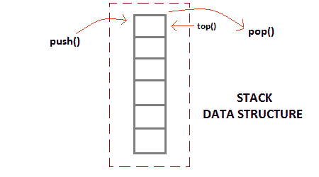
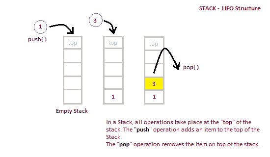

# 什么是堆栈数据结构？

> 原文：<https://www.studytonight.com/data-structures/stack-data-structure>

**堆栈**是一种抽象数据类型，容量有限(预定义)。这是一种简单的数据结构，允许以特定的顺序添加和移除元素。每次添加一个元素，它都会出现在堆栈的**顶部**，唯一可以移除的元素是堆栈顶部的元素，就像一堆对象一样。



* * *

## 栈的基本特征

1.  栈是**类似数据类型**的**有序列表**。
2.  堆栈是一个**后进先出**(后进先出)结构，或者我们可以说**后进先出**(先进先出)。
3.  `push()`函数用于向堆栈中插入新元素，`pop()`函数用于从堆栈中移除元素。只有称为**顶部**的堆叠一端允许插入和移除。
4.  当堆栈完全满时，称其处于**溢出**状态；如果堆栈完全空，称其处于**下溢**状态。

* * *

## 栈的应用

堆栈最简单的应用是反转一个单词。你把一个给定的单词一个字母一个字母地推进堆栈，然后从堆栈中弹出字母。

还有其他用途也像:

1.  从语法上分析
2.  表达式转换(中缀到后缀、后缀到前缀等)

* * *

## 栈数据结构的实现

堆栈可以使用数组或[链表](introduction-to-linked-list)轻松实现。数组很快，但大小有限，链表需要开销来分配、链接、取消链接和解除分配，但大小不受限制。这里我们将使用数组实现堆栈。



* * *

### PUSH 运算的算法

1.  检查堆栈是否已满。
2.  如果堆栈已满，则打印溢出错误并退出程序。
3.  如果堆栈未满，则递增顶部并添加元素。

### POP 操作的算法

1.  检查堆栈是否为空。
2.  如果堆栈为空，则打印下溢错误并退出程序。
3.  如果堆栈不为空，则在顶部打印元素并递减顶部。

下面我们有一个简单的 C++ 程序来实现堆栈数据结构，同时遵循面向对象的编程概念。

如果不熟悉 C++ 编程概念，可以从[这里](/cpp/)学习。

```cpp
/*  Below program is written in C++ language  */

# include<iostream>

using namespace std;

class Stack
{
    int top;
    public:
    int a[10];  //Maximum size of Stack
    Stack()
    {
        top = -1;
    }

    // declaring all the function
    void push(int x);
    int pop();
    void isEmpty();
};

// function to insert data into stack
void Stack::push(int x)
{
    if(top >= 10)
    {
        cout << "Stack Overflow \n";
    }
    else
    {
        a[++top] = x;
        cout << "Element Inserted \n";
    }
}

// function to remove data from the top of the stack
int Stack::pop()
{
    if(top < 0)
    {
        cout << "Stack Underflow \n";
        return 0;
    }
    else
    {
        int d = a[top--];
        return d;
    }
}

// function to check if stack is empty
void Stack::isEmpty()
{
    if(top < 0)
    {
        cout << "Stack is empty \n";
    }
    else
    {
        cout << "Stack is not empty \n";
    }
}

// main function
int main() {

    Stack s1;
    s1.push(10);
    s1.push(100);
    /*
        preform whatever operation you want on the stack
    */
}
```

| 顶部位置 | 堆栈状态 |
| `-1` | 堆栈为空 |
| `0` | 堆栈中只有一个元素 |
| `N-1` | 堆栈已满 |
| `N` | 堆栈溢出状态 |

* * *

### 堆栈操作分析

下面提到的是可以在堆栈数据结构上执行的各种操作的时间复杂性。

*   **按压操作**:0(1)
*   **弹出操作**:0(1)
*   **顶部操作**:0(1)
*   **搜索操作** : O(n)

`push()`和`pop()`函数的时间复杂度是`O(1)`，因为我们总是要从堆栈的**顶部**插入或移除数据，这是一个一步到位的过程。

既然我们已经了解了数据结构中的堆栈，您也可以查看以下主题:

*   [队列数据结构](queue-data-structure)
*   [使用堆栈排队](queue-using-stack)

* * *

* * *