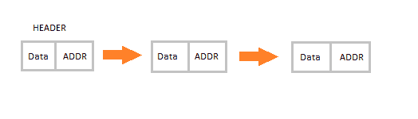
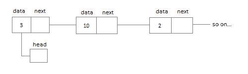
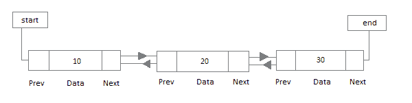
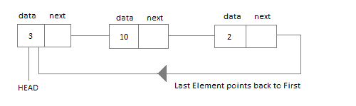

# 链表介绍

> 原文：<https://www.studytonight.com/data-structures/introduction-to-linked-list>

链表是一种非常常用的线性数据结构，由一组**节点**按顺序组成。

每个节点拥有自己的**数据**和下一个节点的**地址，因此形成了一个链状结构。**

链表用于创建树和图形。

* * *

## 链表的优点

*   它们本质上是动态的，在需要时分配内存。
*   插入和删除操作很容易实现。
*   栈和队列可以很容易地执行。
*   链表减少了访问时间。

* * *

## 链表的缺点

*   内存被浪费了，因为指针需要额外的内存来存储。
*   没有可以随机访问的元素；它必须顺序访问每个节点。
*   在链表中反向 t 遍历是困难的。

* * *

## 链表的应用

*   链表用于实现栈、队列、图形等。
*   链接列表允许您在列表的开头和结尾插入元素。
*   在链表中，我们不需要提前知道大小。

* * *

## 链接列表的类型

链表有三种不同的实现，它们是:

1.  单链表
2.  双向链表
3.  循环链表

让我们更多地了解它们，以及它们之间的不同之处。

* * *

### 单链表

单链表包含具有**数据**部分和**地址部分**即`next`的节点，该部分指向节点序列中的下一个节点。

我们可以对单链表执行的操作有**插入**、**删除**和**遍历**。

* * *

### 双向链表

在双向链表中，每个节点包含一个**数据**部分和两个地址，一个用于**上一个**节点，一个用于**下一个**节点。

* * *

### 循环链表

在循环链表中，链表的最后一个节点保存第一个节点的地址，从而形成循环链。

在接下来的教程中，我们将逐一了解所有 3 种类型的链表。所以点击**下一步**按钮，让我们了解更多的链表。

* * *

* * *