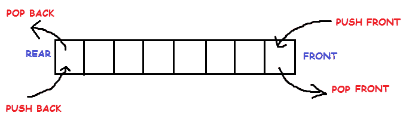
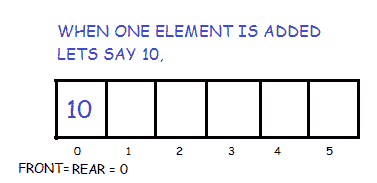
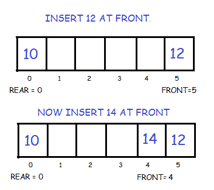
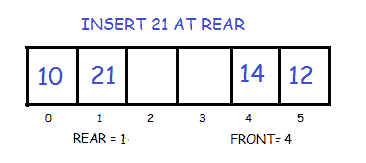
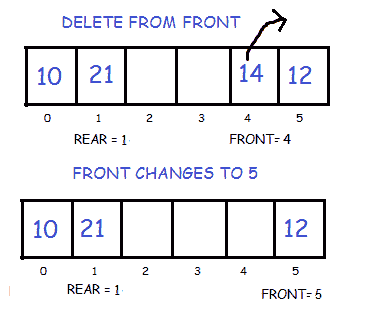
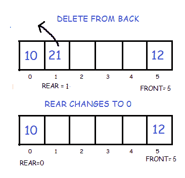

# 双端队列

> 原文：<https://www.studytonight.com/data-structures/double-ended-queue>

双端队列是一种更通用的队列数据结构形式，它允许从两端(即前端和后端)插入和移除元素。



* * *

## 双端队列的实现

这里我们将使用循环数组实现一个双端队列。它将有以下方法:

*   **推回:**在后面插入元素
*   **向前推:**在前面插入元素
*   **弹回:**移除最后一个元素
*   **pop_front :** 移除第一个元素
*   **get_back :** 返回最后一个元素
*   **get_front :** 返回第一个元素
*   **空:如果队列为空，则**返回真
*   **已满:**如果队列已满，则返回真

```cpp
// Maximum size of array or Dequeue

#define SIZE 5

class Dequeue
{
    //front and rear to store the head and tail pointers
    int  *arr;
    int front, rear;  

    public :

    Dequeue()
    {
    	//Create the array
        arr = new int[SIZE];

        //Initialize front and rear with -1
        front = -1;
        rear = -1;
    }

    // Operations on Deque
    void  push_front(int );
    void  push_back(int );
    void  pop_front();
    void  pop_back();
    int  get_front();
    int  get_back();
    bool  full();
    bool  empty();   
};
```

* * *

### 在前面插入元素

首先，我们检查队列是否已满。如果没有满，我们按照给定的条件在前端插入一个元素:

*   如果队列是空的，那么将前面和后面初始化为 0。两者都指向第一个元素。



*   否则，我们减少前端并插入元素。因为我们使用的是圆形数组，所以我们必须记住，如果 front 等于 0，那么我们不是将它减 1，而是使它等于 SIZE-1。



```cpp
void Dequeue :: push_front(int key)
{
    if(full())
    {
        cout << "OVERFLOW\n";
    }
    else
    {
    	//If queue is empty
    	if(front == -1)
    		front = rear = 0;

    	//If front points to the first position element 
        else if(front == 0)
            front = SIZE-1;

        else
        	--front;

        arr[front] = key;
    }
}
```

* * *

### 在后面插入元素

我们再次检查队列是否已满。如果它不是满的，我们按照给定的条件在后面插入一个元素:

*   如果队列是空的，那么将前面和后面初始化为 0。两者都指向第一个元素。
*   否则我们增加后部并插入元素。因为我们使用的是圆形数组，所以我们必须记住，如果 rear 等于 SIZE-1，那么我们将使它等于 0，而不是增加 1。



```cpp
void Dequeue :: push_back(int key)
{
    if(full())
    {
        cout << "OVERFLOW\n";
    }
    else
    {
        //If queue is empty
    	   if(front == -1)
    		  front = rear = 0;

    	   //If rear points to the last element
        else if(rear == SIZE-1)
            rear = 0;

        else
        	++rear;

        arr[rear] = key;
    }    
}
```

* * *

### 删除第一个元素

为此，我们首先检查队列是否为空。如果不是，则按照给定的条件删除前面的元素:

*   如果只有一个元素存在，我们再一次使前后等于-1。
*   否则我们增加战线。但是我们必须记住，如果 front 等于 SIZE-1，那么我们不是将它增加 1，而是使它等于 0。



```cpp
void Dequeue :: pop_front()
{
    if(empty())
    {
        cout << "UNDERFLOW\n";
    }
    else
    {
    	//If only one element is present
        if(front == rear)
        	front = rear = -1;

        //If front points to the last element 
        else if(front == SIZE-1)
        	front = 0;

        else
        	++front;		
    }
}
```

* * *

### 删除最后一个元素

为了做到这一点，我们再次首先检查队列是否为空。如果不是，那么我们按照给定的条件删除最后一个元素:

*   如果只有一个元素存在，我们就使前后等于-1。
*   否则我们减少后方。但是我们必须记住，如果后方等于 0，那么我们不是将其减少 1，而是使其等于大小-1。



```cpp
void Dequeue :: pop_back()
{
    if(empty())
    {
        cout << "UNDERFLOW\n";
    }
    else
    {
    	//If only one element is present
        if(front == rear)
        	front = rear = -1;

        //If rear points to the first position element 
        else if(rear == 0)
        	rear = SIZE-1;

        else
        	--rear;		
    }
}
```

* * *

### 检查队列是否为空

它可以简单地通过查看前面指向的位置来检查。如果 front 仍以-1 开头，则队列为空。

```cpp
bool Dequeue :: empty()
{
    if(front == -1)
    	return true;
    else
    	return false;
}
```

* * *

### 检查队列是否已满

因为我们使用的是循环数组，所以我们检查以下条件，如代码所示，以检查队列是否已满。

```cpp
bool Dequeue :: full()
{
    if((front == 0 && rear == SIZE-1)  ||
    	(front == rear + 1))
        return true;
    else
        return false;
}
```

* * *

### 返回第一个元素

如果队列不是空的，那么我们只需返回存储在前面指向的位置的值。

```cpp
int Dequeue :: get_front()
{
    if(empty())
    {	cout << "f=" <<front << endl;
        cout << "UNDERFLOW\n";
        return -1;
    }
    else
    {
        return arr[front];
    }
}
```

* * *

### 返回最后一个元素

如果队列不是空的，那么我们只需返回存储在后点位置的值。

```cpp
int Dequeue :: get_back()
{
    if(empty())
    {
        cout << "UNDERFLOW\n";
        return -1;
    }
    else
    {
        return arr[rear];
    }
}
```

* * *

* * *