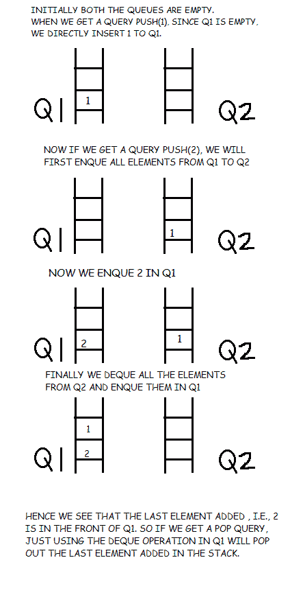

# 使用队列堆叠

> 原文：<https://www.studytonight.com/data-structures/stack-using-queue>

栈是**后进先出(LIFO)** 结构，即栈中最后添加的元素先取出。我们的目标是实现一个使用队列的栈，该栈将使用两个队列，并以这样的方式设计它们:**弹出**操作与出列相同，但是**推送**操作将有点复杂并且更昂贵。

* * *

## 使用队列实现栈

假设我们已经为 Queue 实现了一个类，我们首先为 Stack 设计这个类。它将有方法`push()`和`pop()`以及两个队列。

```cpp
class Stack
{
	public:
	// two queue
	Queue Q1, Q2;
	// push method to add data element
	void push(int);
	// pop method to remove data element
	void pop();
};
```

* * *

### 在栈中插入数据

由于我们使用的队列是**先进先出(FIFO)** 结构，即先添加的元素先取出，所以我们将执行**推送**操作，这样每当有**弹出**操作时，栈总是弹出最后添加的元素。

为此，我们需要两个队列，`Q1`和`Q2`。每当调用**推**操作时，我们将把`Q1`的所有元素入队(在这种情况下是移动)到`Q2`，然后把新元素入队到`Q1`。在此之后，我们将所有元素从`Q2`排队(在这种情况下移动)回到`Q1`。



让我们在代码中实现它，

```cpp
void Stack :: push(int x)
{
	// move all elements in Q1 to Q2
	while(!Q1.isEmpty())
	{
		int temp = Q1.deque();
		Q2.enque(temp);
	}

	// add the element which is pushed into Stack
	Q1.enque(x);

	// move back all elements back to Q1 from Q2
	while(!Q2.isEmpty())
	{
		int temp = Q2.deque();
		Q1.enque(temp);
	}
}
```

你现在一定很清楚，为什么我们使用两个队列。实际上队列`Q2`只是为了在执行操作时暂时保存数据。

这样我们就可以保证每当调用 **pop** 操作时，栈总是会弹出`Q1`队列中添加的最后一个元素。

* * *

### 从栈中删除数据

就像我们上面讨论的，我们只需要对我们的队列`Q1`使用出列操作。这将为我们提供栈中添加的最后一个元素。

```cpp
int Stack :: pop()
{
	return Q1.deque();
}
```

* * *

### 时间复杂性分析

当我们使用队列实现栈时，**推**操作变得昂贵。

*   推送操作:0(n)
*   弹出操作:0(1)

* * *

### 结论

当我们说“使用队列实现栈”时，我们指的是如何让队列表现得像一个栈，毕竟它们都是逻辑实体。所以任何数据结构作为一个 Stack，都应该有`push()`方法在顶部添加数据，有`pop()`方法从顶部移除数据。这正是我们所做的，并因此实现了让一个队列(在本例中是两个队列)表现为一个栈。

* * *

* * *