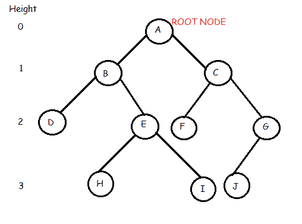
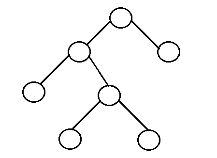
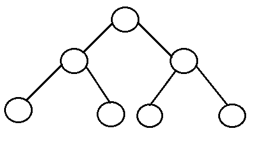
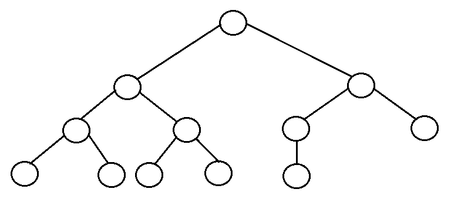
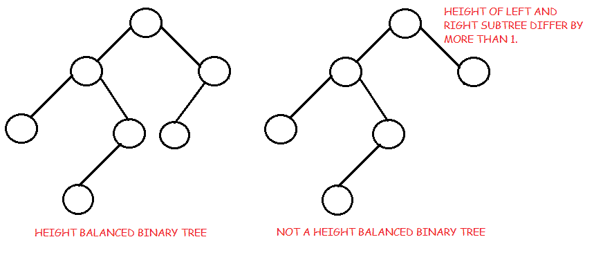

# 二叉树介绍

> 原文：<https://www.studytonight.com/data-structures/introduction-to-binary-trees>

二叉树是一种分层数据结构，其中每个节点最多有两个子节点，通常称为左子节点和右子节点。

每个节点包含三个组件:

1.  指向左子树的指针
2.  指向右子树的指针
3.  数据元素

树中最顶端的节点称为根。空树由**空**指针表示。

二叉树的表示如下所示:

* * *

### 二叉树:常用术语

*   **根:**树中最顶端的节点。
*   **父节点:**树中的每个节点(不包括根)都由恰好来自另一个节点的有向边连接。这个节点称为父节点。
*   **子节点:**当远离根节点时，直接连接到另一个节点的节点。
*   **叶/外部节点:**没有子节点的节点。
*   **内部节点:**至少有一个子节点的节点。
*   **节点深度:**从根到节点的边数。
*   **节点高度:**从节点到最深叶的边数。树的高度就是根的高度。

在上面的二叉树中我们看到根节点是 **A** 。该树有 10 个节点，5 个内部节点，即 **A、B、C、E、G** ，5 个外部节点，即 **D、F、H、I、J** 。这棵树的高度是 3。 **B** 是 **D** 和 **E** 的父母，而 **D** 和 **E** 是 **B** 的子女。

* * *

### 树木的优势

树木之所以如此有用和频繁使用，是因为它们有一些非常重要的优势:

*   树反映了数据中的结构关系。
*   树用于表示层次结构。
*   树提供了有效的插入和搜索。
*   树是非常灵活的数据，允许以最小的努力移动子树。

* * *

### 二叉树的类型(基于结构)

*   **有根二叉树:**它有一个根节点，每个节点有两个子节点。
*   **Full binary tree:** It is a tree in which every node in the tree has either 0 or 2 children.

    

    *   完整二叉树中的节点数 *n* 至少为 n = 2h–1，atmat*n = 2h+1–1*，其中 *h* 为树的高度。
    *   全二叉树中叶节点 *l* 的个数为内部节点+ 1 的 *L* ，即 *l = L+1* 。
*   **Perfect binary tree:** It is a binary tree in which all interior nodes have two children and all leaves have the same depth or same level.

    

    *   有 *l* 叶子的完美二叉树有 *n = 2l-1* 个节点。
    *   在完全二叉树中， *l = 2h* 和 *n = 2h+1 - 1* ，其中， *n* 为节点数， *h* 为树高， *l* 为叶节点数
*   **Complete binary tree:** It is a binary tree in which every level, except possibly the last, is completely filled, and all nodes are as far left as possible.

    

    *   n 个节点的完全二叉树内部节点数为*层(n/2)* 。
*   **Balanced binary tree:** A binary tree is height balanced if it satisfies the following constraints:
    1.  左右子树的高度最多相差一，与
    2.  左边的子树是平衡的，与
    3.  右边的子树是平衡的

    一棵空树是高度平衡的。

    

    *   平衡二叉树的高度为 0(*Log n*)，其中 *n* 为节点数。
*   **Degenarate tree:** It is a tree is where each parent node has only one child node. It behaves like a linked list.

    

* * *

* * *