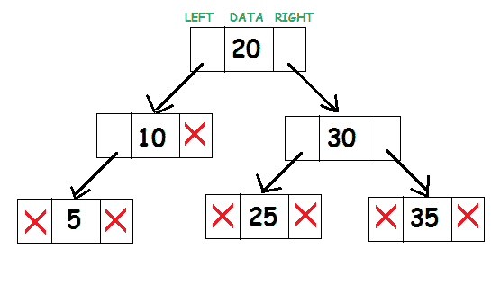
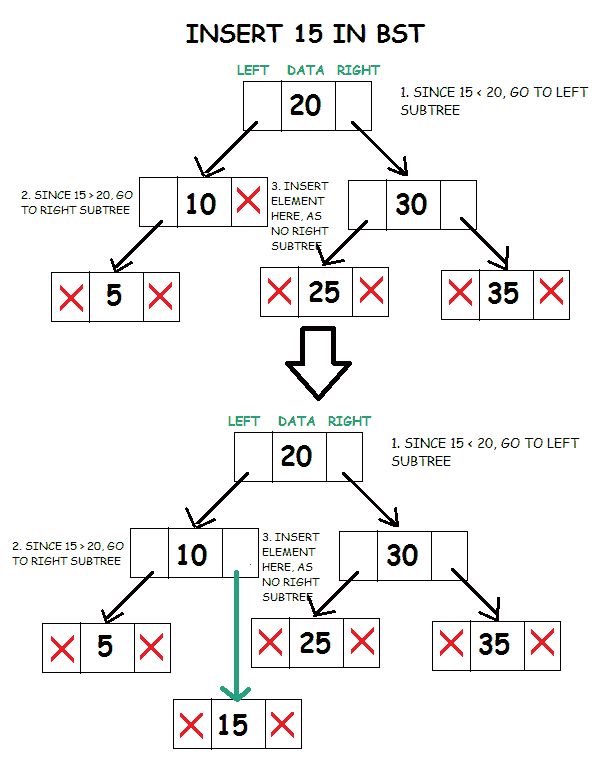
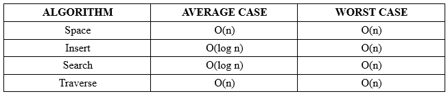
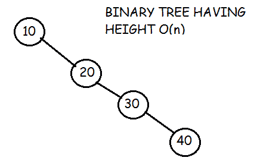

# 二叉查找树

> 原文：<https://www.studytonight.com/data-structures/binary-search-tree>

二叉查找树是一种用于快速添加和删除数据的有用数据结构。

它由存储数据的节点组成，还链接到最多两个其他子节点。正是链接到的叶子和链接叶子(也称为父节点)之间的关系，使得二叉树成为如此高效的数据结构。

对于要成为二叉查找树的二叉树，根节点的左子树中所有节点的数据应该小于根的数据。根节点右子树中所有节点的数据应该大于等于根的数据。因此，树最左边的叶子具有最低值，而树右边的叶子具有最大值。

二叉查找树的代表如下所示:



考虑根节点 20。子树(10，5)左边的所有元素都小于 20，子树(25，30，35)右边的所有元素都大于 20。

* * *

## BST 的实现

首先，定义一个结构为`tree_node`。它将存储数据和指向左右子树的指针。

```cpp
struct tree_node
{
	int data;
	tree_node *left, *right;
}; 
```

节点本身非常类似于链表中的节点。链表代码的基本知识将对理解二叉树的技术非常有帮助。

最合理的做法是创建一个二叉查找树类，将树的工作封装到一个区域中，并使其可重用。该类将包含向树中插入数据、搜索数据是否存在的函数以及遍历树的方法。

```cpp
class BST
{
	tree_node *root;
	void insert(tree_node* , int );
	bool search(int , tree_node* );
	void inorder(tree_node* );
	void preorder(tree_node* );
	void postorder(tree_node* );

	public:
	BST()
	{
		root = NULL;
	}
	void insert(int );
	bool search(int key);
    void inorder();
    void preorder();
    void postorder();
}; 
```

有必要将根初始化为空，以便后面的函数能够识别它不存在。

该类的所有公共成员都被设计为允许该类的用户使用该类，而无需处理底层设计。递归调用的函数是私有的，允许它们沿着树向下移动。

* * *

### 插入到 BST 中

将数据插入到二叉树中涉及到一个函数，该函数在树中插入键值的适当位置搜索一个未使用的节点。插入函数通常是一个递归函数，它在二叉树的层次上继续向下移动，直到某个位置有一个未使用的叶子，这个位置遵循以下放置节点的规则。

*   比较要插入的根节点和元素的数据。
*   如果根节点的数据更大，并且如果存在左子树，那么重复步骤 1，其中**根=左子树的根**。否则，
*   插入元素作为当前根的左子元素。
*   如果根节点的数据更大，并且如果存在右子树，那么重复步骤 1，其中**根=右子树的根**。
*   否则，插入元素作为当前根的右子元素。



```cpp
void BST :: insert(tree_node *node, int d)
{
	// element to be inserted is lesser than node’s data
	if(d < node->data)
	{
		// if left subtree is present
		if(node->left != NULL)
			insert(node->left, d);

		// create new node
		else
		{
			node->left = new tree_node;
			node->left->data = d;
			node->left->left = NULL;
			node->left->right = NULL;
		}
	}

	// element to be inserted is greater than node’s data
	else if(d >= node->data)
	{
		// if left subtree is present
		if(node->right != NULL)
			insert(node->right, d);

		// create new node
		else
		{
			node->right = new tree_node;
			node->right->data = d;
			node->right->left = NULL;
			node->right->right = NULL;
		}
	}

} 
```

由于根节点是私有成员，我们还编写了一个公共成员函数，该函数对类的非成员可用。它调用私有递归函数来插入元素，并处理根节点为空的情况。

```cpp
void BST::insert(int d)
{
	if(root!=NULL)
                insert(root, d);
	else
    {
        root = new tree_node;
        root->data = d;
        root->left = NULL;
        root->right = NULL;
    }
} 
```

* * *

### 在英国标准时间搜索

搜索功能的工作方式与 insert 类似。它将检查当前节点的键值是否是要搜索的值。如果不是，它应该检查要搜索的值是否小于节点的值，在这种情况下，它应该在左边的子节点上递归调用，或者如果它大于节点的值，它应该在右边的子节点上递归调用。

*   比较根节点的数据和要搜索的值。
*   如果根节点的数据更大，并且如果存在左子树，那么重复步骤 1，其中**根=左子树的根**。否则，
*   如果根节点的数据更大，并且如果存在右子树，那么重复步骤 1，其中**根=右子树的根**。否则，
*   如果要搜索的值等于根节点的数据，则返回 true。
*   否则，返回 false。

```cpp
bool BST::search(int d, tree_node *node)
{
	bool ans = false;

	// node is not present
  	if(node == NULL)
 		return false;

	// Node’s data is equal to value searched
    if(d == node->data)
      	return true;

	// Node’s data is greater than value searched
    else if(d < node->data)
       	ans = search(d, node->left);

	// Node’s data is lesser than value searched
    else
       	ans = search(d, node->right);

    return ans;
} 
```

由于根节点是私有成员，我们还编写了一个公共成员函数，该函数对类的非成员可用。它调用私有递归函数来搜索元素，并处理根节点为空的情况。

```cpp
bool BST::search(int d)
{
	if(root ==  NULL)
		return false;
	else	
		return  search(d, root);
} 
```

* * *

### 在基站中穿越

主要有三种类型的树遍历:

#### 1.有序遍历:

在这种技术中，我们执行以下操作:

*   处理根节点的数据。
*   首先，完全遍历左子树。
*   然后，遍历右子树。

```cpp
void BST :: preorder(tree_node *node)
{
	if(node !=  NULL)
    {
		cout<<node->data<<endl;
       	preorder(node->left);
       	preorder(node->right);
    }
} 
```

#### 2.后序遍历

在这个遍历技术中，我们执行以下操作:

*   首先完全遍历左子树。
*   然后，完全遍历右子树。
*   然后，处理节点的数据。

```cpp
void BST :: postorder(tree_node *node)
{
	if(node !=  NULL)
   	{
        postorder(node->left);
        postorder(node->right);
	    cout<<node->data<<endl;
   	}
} 
```

#### 3.有序遍历

在有序遍历中，我们执行以下操作:

*   第一个进程左子树。
*   然后，处理当前根节点。
*   然后，处理右子树。

```cpp
void BST :: inorder(tree_node *node)
{
	if(node !=  NULL)
   	{
        inorder(node->left);
	    cout<<node->data<<endl;
        inorder(node->right);
   	}
} 
```

二叉查找树的有序遍历给出了二叉查找树中存在的数据元素的排序。这是二叉查找树的重要财产。

因为根节点是私有成员，所以我们还编写了公共成员函数，非类成员也可以使用。它调用私有递归函数遍历树，并处理根节点为空的情况。

```cpp
void BST :: preorder()
{
	if(root ==  NULL)
		cout<<"TREE IS  EMPTY\n";
	else
       	preorder(root);
}

void BST :: postorder()
{
	if(root ==  NULL)
		cout<<"TREE IS  EMPTY\n";
	else
	    postorder(root);
}

void BST :: inorder()
{
	if(root == NULL)
		cout<<"TREE IS EMPTY\n";
	else
		inorder(root);
} 
```

* * *

### 复杂性分析



搜索和插入的时间复杂度取决于树的高度。平均来说，有 n 个节点的二分搜索树有 **O(log n)** 的高度。然而，在最坏的情况下，当不平衡的树类似于链表时，树的高度可以是**0(n)**。例如，在这种情况下:



遍历需要 **O(n)** 时间，因为每个节点都必须被访问。

* * *

* * *