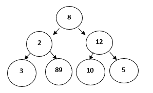

# 贪婪的方法或技巧

> 原文：<https://www.studytonight.com/data-structures/greedy-algorithm>

顾名思义，这是一种简单的方法，试图在每一步找到**最佳**解。因此，它的目标是在每一步找到局部最优解，从而找到整个问题的全局最优解。

考虑有一个**目标函数**需要优化(最大化/最小化)。这种方法在每一步都做出贪婪的选择，并确保目标函数得到优化。

贪婪算法只有一次机会来计算最优解，因此，不能回头查看其他替代解决方案。然而，在许多问题中，这种策略不能产生全局最优解。让我们考虑下面的二叉树来理解基本的贪婪算法是如何工作的:



对于上述问题，目标函数是:

**寻找和最大的路径。**

因为我们需要最大化目标函数，所以可以使用贪婪方法。遵循以下步骤找到解决方案:

**步骤 1** :初始化**总和= 0**

**第二步**:选择根节点，将其值加到`sum`，**总和= 0+8 = 8**

**第三步**:算法比较下一级节点，选择最大的节点为 **12** ，使得**之和= 20** 。

**第 4 步**:算法比较下一级节点，选择最大的节点为 **10** ，使**之和= 30** 。

因此，使用贪婪算法，我们得到 **8-12-10** 作为路径。但这不是最优解，因为路径 **8-2-89** 的总和最大，即 **99** 。

出现这种情况是因为算法基于每一步可用的信息做出决策，而不考虑整体问题。

* * *

## 什么时候使用贪婪算法？

对于具有以下属性的问题，我们可以使用贪婪技术:

*   **贪婪选择属性**:表示通过局部最优选择可以得到全局最优解。

*   **最优子问题**:该属性表示问题的最优解包含子问题的最优解。因此，全局最优解可以由局部最优子解构造。

一般来说，**优化问题**，或者是我们必须找到某个事物的最大值或最小值或者我们必须找到某个最优解的问题，都是使用贪婪技术。

优化问题有两种解决方案:

*   **可行解**:这可以被称为满足目标函数的近似解(解的子集)，它可以或不可以建立到最优解。

*   **最优解**:这可以定义为目标函数最大化或最小化的可行解。

* * *

### 贪婪算法中使用的关键术语

*   **目标函数**:这个可以定义为需要最大化或者最小化的函数。

*   **候选集**:从这个集合中创建全局最优解。

*   **选择功能**:确定最佳候选，并将其包含在解集中。

*   **可行性功能**:判断一个候选人是否可行，是否能够为解决方案做出贡献。

* * *

## 标准贪婪算法

该算法一步一步地进行，每一步考虑一个输入，比如`x`。

*   如果`x`给出了一个局部最优解(`x`是可行的)，那么它就包含在部分解集中，否则就被丢弃。
*   然后算法进入下一步，不再考虑`x`。
*   这一直持续到输入集完成或找到最优解。

上述算法可以翻译成以下伪代码:

```cpp
Algorithm Greedy(a, n)   // n defines the input set
{
    solution= NULL;		// initialize solution set
	for i=1 to n do
	{
		x = Select(a);	// Selection Function
		if Feasible(solution, x) then 	// Feasibility solution
			solution = Union (solution, x);   // Include x in the solution set
	}
	return solution;
}

```

* * *

### 贪婪方法/技术的优势

*   这种技术易于制定和实施。
*   它在许多场景下都能高效工作。
*   这种方法最大限度地减少了生成解决方案所需的时间。

现在，让我们也看看一些缺点，

### 贪婪方法/技术的缺点

*   这种方法不能保证全局最优解，因为它从不回顾为寻找局部最优解所做的选择。

虽然我们已经讨论了一般情况下哪种类型的问题可以使用贪婪方法来解决，但是下面是一些使用贪婪技术的常见问题:

1.  背包问题
2.  活动选择问题
3.  迪克斯特拉问题
4.  寻找最小生成树的 Prim 算法
5.  克鲁斯卡尔最小生成树算法
6.  霍夫曼编码
7.  旅行推销员问题

* * *

### 结论

贪婪技术最适合以下应用:

*   需要实时解决方案。
*   近似解就足够了。

* * *

* * *