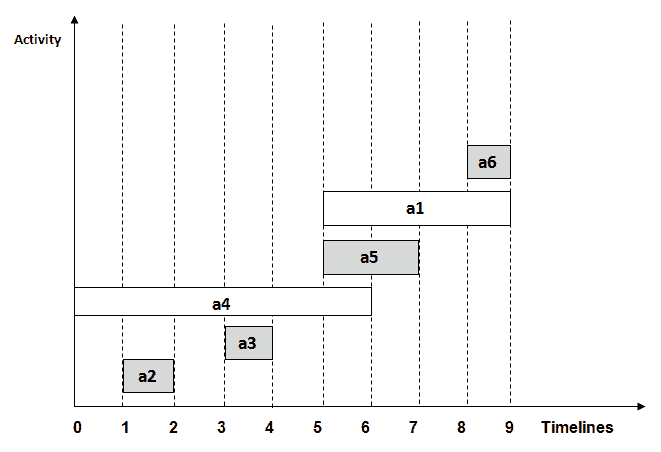
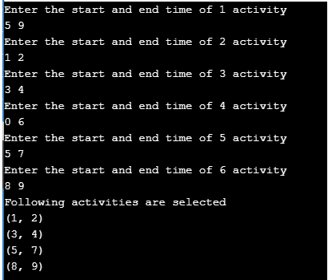

# 活动选择问题

> 原文：<https://www.studytonight.com/data-structures/activity-selection-problem>

活动选择问题是一个优化问题，它处理需要由一个人或一台机器在给定时间范围内执行的非冲突活动的选择。

每个活动都标有开始和结束时间。贪心技术被用于寻找解决方案，因为这是一个优化问题。

### 什么是活动选择问题？

让我们考虑您有`n`活动及其开始和结束时间，目标是找到在单个时间范围内可以执行的具有**最大数量的非冲突活动**的解决方案集，假设只有一个人或一台机器可以执行。

这里有些**点要注意**:

*   可能无法完成所有活动，因为它们的时间可能会崩溃。
*   两个活动，如 **i** 和 **j** ，如果`si >= fj`或`sj >= fi`其中`si`和`sj`分别表示活动 **i** 和 **j** 的开始时间，`fi`和`fj`分别表示活动 **i** 和 **j** 的结束时间，则称为不冲突。
*   **贪心方法**可以用来寻找解决方案，因为我们想要最大化可以执行的活动的数量。这种方法会贪心地选择每一步完成时间最早的活动，从而产生最优解。

**算法的输入数据**:

*   `act[]`包含所有活动的数组。
*   `s[]`包含所有活动开始时间的数组。
*   `f[]`包含所有活动结束时间的数组。

**从算法输出数据**:

*   `sol[]`指包含最大数量的非冲突活动的解决方案集的数组。

* * *

### 活动选择问题的步骤

下面是我们将遵循的解决活动选择问题的步骤，

**第一步**:根据给定活动的完成时间，按升序对其进行排序。

**第二步**:从排序后的数组`act[]`中选择第一个活动，添加到`sol[]`数组中。

**第 3 步**:对`act[]`中剩余的活动重复第 4 步和第 5 步。

**第四步**:如果当前选中活动的开始时间大于等于之前选中活动的结束时间，则将其加入`sol[]`数组。

**第五步**:选择`act[]`阵中的下一个活动。

**第六步**:打印`sol[]`数组。

* * *

### 活动选择问题示例

让我们用一个例子来追踪上述算法的步骤:

在下表中，我们有 6 个具有相应开始和结束时间的活动，目标是计算具有最大数量非冲突活动的执行计划:

| 开始时间 | 完成时间(f) | 活动名称 |
| five | nine | 第一等的 |
| one | Two | 主动脉第二声 |
| three | four | a3 |
| Zero | six | a4 |
| five | seven | a5 |
| eight | nine | a6 |

一个可能的解决方案是:

**第一步**:根据给定活动的完成时间，按升序对其进行排序。

我们整理好表格后:

| 开始时间 | 完成时间(f) | 活动名称 |
| one | Two | 主动脉第二声 |
| three | four | a3 |
| Zero | six | a4 |
| five | seven | a5 |
| five | nine | 第一等的 |
| eight | nine | a6 |

**第二步**:从排序后的数组`act[]`中选择第一个活动，添加到`sol[]`数组中，这样 **sol = {a2}** 。

**第 3 步**:对`act[]`中剩余的活动重复第 4 步和第 5 步。

**第四步**:如果当前选择的活动开始时间大于等于之前选择的活动结束时间，则添加到`sol[]`。

**第五步**:选择`act[]`中的下一个活动

对于上表中给出的数据，

1.  选择活动 **a3** 。由于 **a3** 的开始时间大于 **a2** (即`s(a3) > f(a2)`)的结束时间，我们将 **a3** 添加到解决方案集中。因此 **sol = {a2，a3}** 。
2.  选择 **a4** 。自`s(a4) < f(a3)`起，不添加到解集。
3.  选择 **a5** 。由于`s(a5) > f(a3)`， **a5** 被添加到解决方案集中。因此 **sol = {a2，a3，a5}**
4.  选择 **a1** 。由于`s(a1) < f(a5)`， **a1** 没有被添加到解集中。
5.  选择 **a6** 。 **a6** 从`s(a6) > f(a5)`开始添加到解决方案集中。因此 **sol = {a2，a3，a5，a6}** 。

**第六步**:最后打印数组`sol[]`

因此，最大数量的非冲突活动的执行计划将是:

(1,2) (3,4) (5,7) (8,9)



在上图中，所选活动以灰色突出显示。

* * *

## 活动选择问题算法的实现

现在我们已经对活动选择问题有了一个全面的了解，因为我们已经通过一个例子讨论了算法及其工作细节，下面是相同的 C++ 实现。

**注**:算法可以用任何编程语言轻松编写。

```cpp
#include <bits/stdc++.h>

using namespace std; 
#define N 6		// defines the number of activities

// Structure represents an activity having start time and finish time. 
struct Activity 
{ 
    int start, finish; 
}; 

// This function is used for sorting activities according to finish time 
bool Sort_activity(Activity s1, Activity s2) 
{ 
    return (s1.finish< s2.finish); 
} 

/* 	Prints maximum number of activities that can
	be done by a single person or single machine at a time. 
*/
void print_Max_Activities(Activity arr[], int n) 
{ 
    // Sort activities according to finish time 
	sort(arr, arr+n, Sort_activity); 

	cout<< "Following activities are selected \n"; 

    // Select the first activity
    int i = 0; 
	cout<< "(" <<arr[i].start<< ", " <<arr[i].finish << ")\n"; 

    // Consider the remaining activities from 1 to n-1 
    for (int j = 1; j < n; j++) 
    { 
    	// Select this activity if it has start time greater than or equal
    	// to the finish time of previously selected activity
      	if (arr[j].start>= arr[i].finish) 
      	{	 
			cout<< "(" <<arr[j].start<< ", "<<arr[j].finish << ") \n"; 
			i = j; 
      	} 
    } 
} 

// Driver program 
int main() 
{ 
    Activity arr[N];
	for(int i=0; i<=N-1; i++)
	{
		cout<<"Enter the start and end time of "<<i+1<<" activity \n";
		cin>>arr[i].start>>arr[i].finish;
    }

	print_Max_Activities(arr, N); 
    return 0; 
}

```

使用与上述示例相同的输入来执行程序。这将有助于用实际输出来验证结果解集。



* * *

### 时间复杂度分析

以下是计算活动选择算法时间复杂度的场景:

*   **案例 1** :当给定的一组活动已经按照完成时间排序，那么就不涉及排序机制，在这种情况下算法的复杂度会是`O(n)`
*   **案例 2** :当给定的一组活动未排序时，我们将不得不使用 **bits/stdc++** 头文件中定义的`sort()`方法对活动列表进行排序。该方法的时间复杂度将为`O(nlogn)`，这也定义了算法的复杂度。

* * *

### 活动选择问题的现实应用

以下是这个问题的一些实际应用:

*   在一个房间里安排多个比赛项目，这样每个项目都有自己的开始和结束时间。
*   在同一台机器上安排多个产品的生产，使每个产品都有自己的生产时间表。
*   活动选择是运筹学中用于处理实际业务问题的最著名的通用问题之一。

* * *

* * *