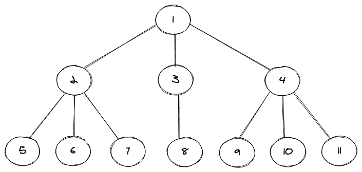
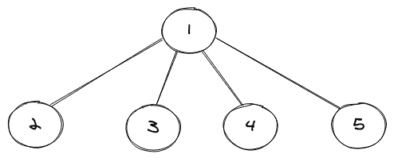
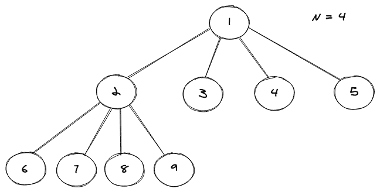
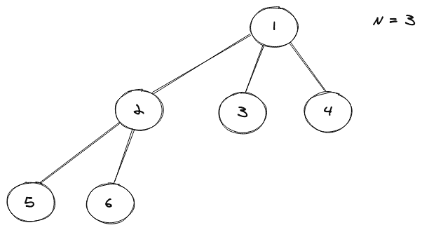
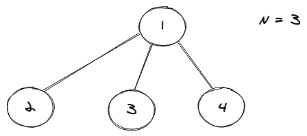

# 多维树数据结构

> 原文：<https://www.studytonight.com/advanced-data-structures/nary-tree>

N 元树是一种允许我们拥有特定节点的`n`个子节点的树，因此得名 **N 元**，这使得它**比非常常见的二叉树**稍微复杂一些，后者允许我们最多拥有一个特定节点的 2 个子节点。

N 元树的图示如下所示:



在上面显示的 N 元树中，我们可以注意到总共有 **11 个节点**和**有些节点有三个子节点**，有些只有一个。在二叉树的情况下，更容易存储这些子节点，因为我们可以将两个节点(即左节点和右节点)分配给一个特定的节点来标记它的子节点，但这里并没有那么简单。为了存储任何树节点的子节点，我们使用了另一种数据结构，主要是 C++中的 vector 和 Java 中的 LinkedList。

## 多维树的实现

当我们处理非线性数据结构时，首先要做的是为它们创建我们自己的结构(Java 中的构造函数)。就像在二叉树的情况下，我们使用一个类`TreeNode`，在这个类中，我们创建我们的构造函数并拥有我们的类级变量。

考虑下面的代码片段:

```cpp
public static class TreeNode{
        int val;
        List<TreeNode> children = new LinkedList<>();

        TreeNode(int data){
            val = data;
        }

        TreeNode(int data,List<TreeNode> child){
            val = data;
            children = child;
        }
}
```

在上面的代码片段中，我们有一个名为`TreeNode`的类，该类又包含两个同名的构造函数，但它们本质上是重载的(方法名相同但参数不同)。我们还有两个标识符，其中一个是存储任何特定节点的值的 val，然后我们有一个 List 来存储树的任何节点的子节点。

上面的片段包含了我们的树的基本结构，现在只剩下制作一个，然后稍后我们将看到如何使用级别顺序遍历来打印树。为了构建一棵树，我们将使用我们在上面的类中定义的构造函数。

考虑下面的代码片段:

```cpp
public static void main(String[] args) {
        // creating an exact replica of the above pictorial N-ary Tree
        TreeNode root = new TreeNode(1);
        root.children.add(new TreeNode(2));
        root.children.add(new TreeNode(3));
        root.children.add(new TreeNode(4));
        root.children.get(0).children.add(new TreeNode(5));
        root.children.get(0).children.add(new TreeNode(6));
        root.children.get(0).children.add(new TreeNode(7));
        root.children.get(1).children.add(new TreeNode(8));
        root.children.get(2).children.add(new TreeNode(9));
        root.children.get(2).children.add(new TreeNode(10));
        root.children.get(2).children.add(new TreeNode(11));
        printNAryTree(root);
}
```

首先，我们创建了我们的 N 元树的**根节点，然后我们必须给这个根节点分配一些子节点，我们通过使用点(`.`)操作符和访问根节点的子属性来实现这一点，然后使用`List`接口提供的添加方法向根节点添加不同的子节点。一旦我们添加了根节点的所有子节点，就到了添加每个新级别节点的子节点的时候了，我们首先使用列表接口提供的 get 方法访问该节点，然后将相应的子节点添加到该节点。**

最后，我们打印这个 N 元树，我们通过调用`printNAryTree`方法来完成。

现在，由于打印一棵树并不像遍历一组项目那么简单，我们有不同的技术(精确地说是算法)可以使用。这些主要是:

*   **有序遍历**

*   **前序遍历**

*   **后序遍历**

*   **层级顺序遍历**

出于本教程的目的，我们将使用级别顺序遍历方法，因为它更容易理解，前提是您之前已经看过它在二叉树上的工作方式。

### 层级顺序遍历(打印 N 元树)

任何树的级别顺序遍历都考虑到这样一个事实，即我们希望首先在根级别打印节点，然后前进到下一个级别，并不断重复这个过程，直到我们到达最后一个级别。我们利用队列数据结构来存储特定级别的节点。

考虑一个简单的 N 元树，如下所示:



上述树的级别顺序遍历如下所示:

```cpp
1
2 3 4 5
```

考虑下面的代码片段:

```cpp
private static void printNAryTree(TreeNode root){
        if(root == null) return;
        Queue<TreeNode> queue = new LinkedList<>();
        queue.offer(root);
        while(!queue.isEmpty()) {
            int len = queue.size();
            for(int i=0;i<len;i++) { // so that we can reach each level
                TreeNode node = queue.poll();
                System.out.print(node.val + " ");
                for (TreeNode item : node.children) { // for-Each loop to iterate over all childrens
                    queue.offer(item);
                }
            }
            System.out.println();
        }
}
```

整个代码如下所示:

```cpp
import java.util.LinkedList;
import java.util.List;
import java.util.Queue;

public class NAryTree {
    public static class TreeNode{
        int val;
        List<TreeNode> children = new LinkedList<>();

        TreeNode(int data){
            val = data;
        }

        TreeNode(int data,List<TreeNode> child){
            val = data;
            children = child;
        }
    }

    private static void printNAryTree(TreeNode root){
        if(root == null) return;
        Queue<TreeNode> queue = new LinkedList<>();
        queue.offer(root);
        while(!queue.isEmpty()) {
            int len = queue.size();
            for(int i=0;i<len;i++) {
                TreeNode node = queue.poll();
                assert node != null;
                System.out.print(node.val + " ");
                for (TreeNode item : node.children) {
                    queue.offer(item);
                }
            }
            System.out.println();
        }
    }

    public static void main(String[] args) {
        TreeNode root = new TreeNode(1);
        root.children.add(new TreeNode(2));
        root.children.add(new TreeNode(3));
        root.children.add(new TreeNode(4));
        root.children.get(0).children.add(new TreeNode(5));
        root.children.get(0).children.add(new TreeNode(6));
        root.children.get(0).children.add(new TreeNode(7));
        root.children.get(1).children.add(new TreeNode(8));
        root.children.get(2).children.add(new TreeNode(9));
        root.children.get(2).children.add(new TreeNode(10));
        root.children.get(2).children.add(new TreeNode(11));
        printNAryTree(root);
    }
} 
```

上面代码的输出是:

1
2 3 4
5 6 7 8 9 10 11

我们可以将这个输出与开始时 N 元树的图形表示进行比较，每个级别节点都包含相同的值。

## 二叉树的类型

以下是二叉树的类型:

### 1\. 全 N 和树

全 N 元树是一种 N 元树，它允许每个节点有 0 或 N 个子节点。

考虑如下所示的完整 N 元树的图示:



请注意，上述 N 元的所有节点都有 4 个子节点或 0 个子节点，因此满足该属性。

### 2.完全 N 元树

一个完整的 N 元树是一个 N 元树，在这个树中，除了最后一级节点之外，树的每一级节点都应该是完整的(应该正好有 **N 个子节点**)，如果最后一级节点不完整，那么这些节点必须是“尽可能左边的”。

考虑如下所示的完整 N 元树的图形表示:



### 3.完美 N 元树

一个完美的 N 元树是一个完整的 N 元树，但是叶节点的级别必须相同。

考虑如下所示的完美 N 元树的图形表示:



## 结论

*   我们了解了什么是二叉树。
*   我们还学习了如何在 Java 中实现 N 元树(通过级别顺序遍历)。
*   然后我们了解了总共有哪些不同类型的 N 元树。

* * *

* * *