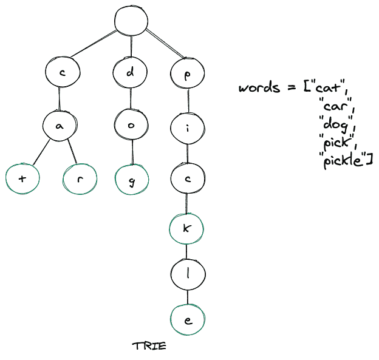

# 数据结构-用例子解释

> 原文：<https://www.studytonight.com/advanced-data-structures/trie-data-structure-explained-with-examples>

A **Trie 是一种高级数据结构**，有时也被称为**前缀树或数字树**。它是以有序和高效的方式存储数据的树。我们通常使用“T4”来存储字符串。trie 的每个节点可以有多达 26 个引用(指针)。

trie 的每个节点由两件事组成:

*   一个角色

*   布尔值用于实现该字符是否代表单词的结尾。

一般来说，try 用于存储英文字符，因此每个字符可以有 26 个引用。trie 中的节点不存储整个键，而是存储键的一部分(通常是字符串的一个字符)。当我们从根节点向下遍历到叶节点时，我们可以从密钥的这些小部分构建密钥。

让我们通过插入一些单词来建立一个 trie。下面是同样的图示，我们有 5 个单词，然后我们把这些单词一个接一个地插入我们的 trie。



如上图所示，当我们从根节点向下遍历到叶节点时，可以形成关键字(单词)。可以注意到，绿色突出显示的节点代表单词的`endOfWord`布尔值，这又意味着该特定单词在该节点完成。此外，trie 的根节点是空的，因此它可以引用 trie 用来存储的字母表的所有成员，并且 trie 的任何节点的子节点最多可以有 26 个引用。尝试在本质上是不平衡的，不像 AVL 树。

## 为什么要使用 Trie 数据结构？

当我们谈论从数据结构中检索值的最快方法时，**散列表通常会出现在我们的脑海中**。虽然本质上非常高效，但与散列表相比，仍然很少被提及， **trie 比散列表**高效得多，而且它们还具有几个优势。主要是:

*   不会有任何冲突，从而使最差的性能优于没有正确实现的哈希表。

*   不需要散列函数。

*   trie 中字符串的查找时间为`O(k)`，其中 **k =单词**的长度。

*   当单词不在一个 trie 中时，它可能需要更少的时间。

## 实施尝试:

我们将用 [Java 语言](https://www.studytonight.com/java/)实现 Trie 数据结构。

### 三节点声明:

```cpp
class TrieNode {
    boolean isEndOfWord;
    TrieNode children[];

    public TrieNode(){
        isEndOfWord = false;
        children = new TrieNode[26];
    }
}
```

请注意，我们在上面的 **TrieNode** 类中有两个字段，如前所述，布尔 isEndOfWord 关键字和一个名为 children 的 Trie 节点数组。现在让我们初始化 trie 类的根节点。

```cpp
TrieNode root;

public Trie() {
    root = new TrieNode();
}
```

trie 数据结构中有两个关键功能，它们是:

*   **搜索**

*   **插入**

### 在三中插入:

当我们在 trie 中插入一个字符(键的一部分)时，我们从根节点开始，然后搜索一个引用，该引用对应于我们试图在 trie 中插入其字符的字符串的第一个键字符。两种情况是可能的:

*   如果存在一个引用，那么我们沿着树向下遍历引用到下一个子级。

*   引用不存在，然后我们创建一个新节点，并使用与当前关键字符匹配的父引用来引用它。我们重复这个步骤，直到我们到达密钥的最后一个字符，然后我们将当前节点标记为结束节点，算法完成。

考虑下面的代码片段:

```cpp
public void insert(String word) {
    TrieNode node = root;

    for (char c : word.toCharArray()) {
        if (node.children[c-'a'] == null) {
            node.children[c-'a'] = new TrieNode();
        }
        node = node.children[c-'a'];
    }
    node.isEndOfWord = true;
}
```

### 在 trie 中搜索:

trie 中的一个键被存储为从根节点开始的路径，它可能一直到叶节点或某个中间节点。如果我们想在 trie 中搜索一个关键字，我们从根节点开始，然后向下遍历。如果我们找到了要搜索的关键字的下一个字符的引用匹配，那么有两种情况:

1.  存在下一个字符的引用，因此我们沿着这个链接向下移动，并继续搜索下一个关键字符。

2.  下一个字符不存在引用。如果钥匙没有其他字符存在，并且该字符被标记为`isEndOfWord = true`，那么我们返回 **true** ，这意味着我们找到了钥匙。否则，还有两种情况是可能的，在每种情况下，我们都返回 **false** 。这些是:

    1.  键中还有一些关键字符，但是由于路径终止，我们无法向下遍历，因此键不存在。

    2.  键中没有剩余字符，但最后一个字符没有标记为`isEndOfWord = false`。因此，搜索关键字只是我们试图在 trie 中搜索的关键字的前缀。

考虑下面的代码片段:

```cpp
public boolean search(String word) {
    return isMatch(word, root, 0, true);
}

public boolean startsWith(String prefix) {
    return isMatch(prefix, root, 0, false);
}

public boolean isMatch( String s, TrieNode node, int index, boolean isFullMatch) {
    if (node == null)
        return false;

    if (index == s.length())
        return !isFullMatch || node.isEndOfWord;

    return isMatch(s, node.children[s.charAt(index) - 'a'], index + 1, isFullMatch);      
}
```

方法`startsWith()`用于查找 trie 中是否存在所需的密钥前缀。还有，无论是`search()`还是`startsWith()` 的方法都利用了`isMatch()` 的方法。

### 整个代码:

```cpp
class Trie {
    class TrieNode {
        boolean isEndOfWord;
        TrieNode children[];

        public TrieNode(){
            isEndOfWord = false;
            children = new TrieNode[26];
        }
    }

    TrieNode root;

    public Trie() {
        root = new TrieNode();
    }

    public void insert(String word) {
        TrieNode node = root;

        for (char c : word.toCharArray()) {
            if (node.children[c-'a'] == null) {
                node.children[c-'a'] = new TrieNode();
            }
            node = node.children[c-'a'];
        }
        node.isEndOfWord = true;
    }

    public boolean search(String word) {
        return isMatch(word, root, 0, true);
    }

    public boolean startsWith(String prefix) {
        return isMatch(prefix, root, 0, false);
    }

    public boolean isMatch( String s, TrieNode node, int index, boolean isFullMatch) {
        if (node == null)
            return false;

        if (index == s.length())
            return !isFullMatch || node.isEndOfWord;

        return isMatch(s, node.children[s.charAt(index) - 'a'], index + 1, isFullMatch);      
    }    

    public static void main(String[] args){
        Trie trie = new Trie();
        trie.insert("cat");
        trie.insert("car");
        trie.insert("dog");
        trie.insert("pick");
        trie.insert("pickle");
        boolean isPresent = trie.search("cat");
        System.out.println(isPresent);
        isPresent = trie.search("picky");
        System.out.println(isPresent);
        isPresent = trie.startsWith("ca");
        System.out.println(isPresent);
        isPresent = trie.startsWith("pen");
        System.out.println(isPresent);

    }
}
```

上面的输出如下所示:

真

错误的

真实的

错误的

## 排序应用程序

*   现实世界中最常见的尝试是我们在搜索引擎上获得的**自动完成功能**(现在其他地方也是)。在搜索栏中键入内容后，我们可能输入的潜在单词的树会大大减少，这反过来又允许程序为我们键入的单词列举可能的字符串类型。

*   Trie 在我们想要存储一个词的附加信息的情况下也有帮助，比如这个词的流行度，这使得它如此强大。你可能已经看到了，当你在搜索栏上输入**【脚】**时，你会在说**【步道】**之前得到**【足球】**。因为**“足球”**是一个非常流行的词。

*   Trie 还帮助检查一个单词的正确拼写，因为一个稍微拼错的单词的路径是相似的。

*   **字符串匹配**是另一种尝试大量超越的情况。

## 要点

*   创建 trie 的时间复杂度是`O(m*n)` ，其中 m = trie 中的字数，n =每个单词的平均长度。

*   在 trie 中插入节点的时间复杂度为`O(n)` ，其中 n =我们试图插入的单词的长度。

*   在 trie 中插入节点的空间复杂度为`O(n)` ，其中 n =我们试图插入的单词的长度。

*   在 trie 中搜索关键字(单词)的时间复杂度是`O(n)` ，其中 n =我们正在搜索的单词的长度。

*   在 trie 中搜索关键字(词)的空间复杂度是`O(1)`。

*   搜索一个关键字(词)的前缀也有`O(n)` 的时间复杂度和`O(1)`的空间复杂度。

## 结论

*   我们了解了什么是特里，为什么我们需要特里。

*   我们还在 Java 中实现了 trie，其中插入和搜索是实现的主要方法。

*   然后我们讨论了 trie 数据结构在现实世界中的应用，接下来是我们还应该记住的关于 Trie 的几个关键点。

* * *

* * *