# B+树数据结构

> 原文：<https://www.studytonight.com/advanced-data-structures/b-plus-trees-data-structure>

A **B+树**是 B 树的扩展，使得搜索、插入和删除操作更加高效。我们知道 B 树允许内部节点和叶节点中的数据指针和键值，这当然成为 B 树的缺点，因为在特定级别插入节点的能力降低，从而增加了节点级别，这当然是没有好处的。B+树通过简单地**在叶节点级**存储数据指针并且只在内部节点存储键值来减少这个缺点。还应该注意的是，叶级的节点是相互链接的，因此使得数据指针的遍历更加容易和高效。

当我们想要在主存中存储**大量数据**时，B+树就派上了用场。因为我们知道主内存的大小没有那么大，所以利用 B+树，它的内部存储密钥的节点(访问记录)存储在主内存中，而包含数据指针的叶节点实际上存储在辅助内存中。

B+树的图示如下:

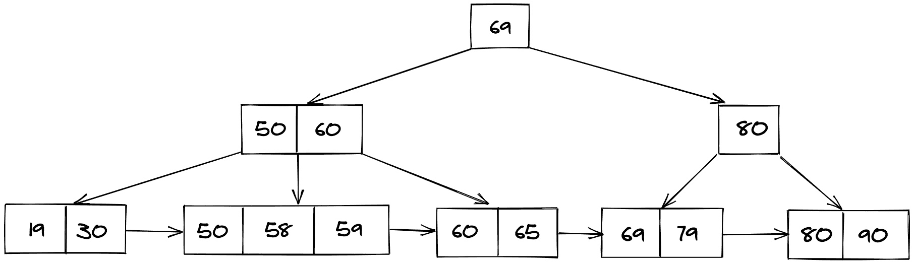

## 为什么是 B+树？

*   B+树存储记录，这些记录以后可以在相同次数的磁盘访问中获取。

*   B+树的高度**保持平衡**，并且与 B 树相比非常小，即使存储在 B 树中的记录数量相同。

*   拥有更少的级别数使得访问记录变得非常容易。

*   由于叶节点像链表一样相互连接**，我们可以很容易地按顺序搜索元素。**

## 在 B+树中插入

*   在 B+树中执行搜索操作，以检查这个新节点应该到达的**理想铲斗位置**。

*   如果存储桶未满(不违反 B+树属性)，则将该节点添加到该存储桶中。

*   否则，将节点拆分为两个节点，并将中间节点(准确地说是中间节点)推到父节点，然后插入新节点。

*   如果父节点在那里，并且当前节点不断变满，请重复上述步骤。

考虑下面显示的图示，以理解 B+树中的插入操作:

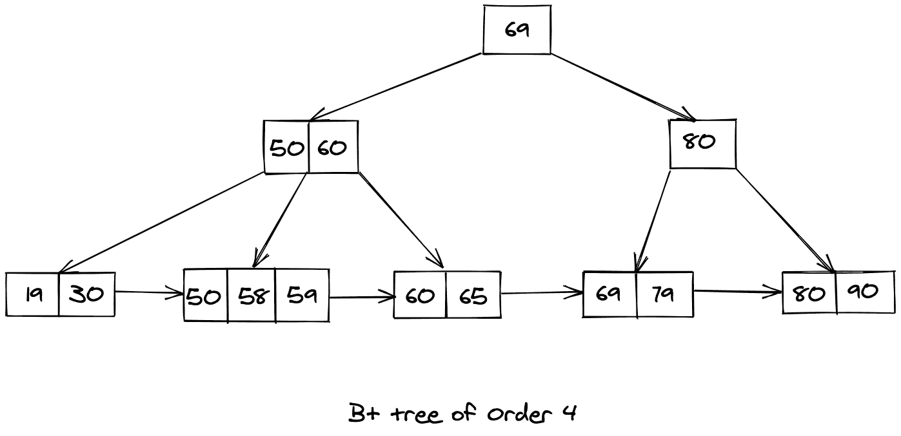

让我们尝试在上面显示的 B+树中插入 57，得到的 B+树将如下所示:

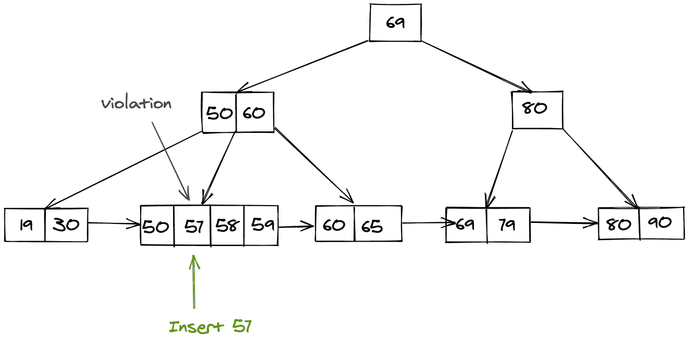

我们知道，我们插入值为 57 的键的桶(节点)现在违反了 B+树的属性，因此我们需要按照上面的步骤分割这个节点。拆分后，我们将中间节点推送到父节点，生成的 B+树如下所示:

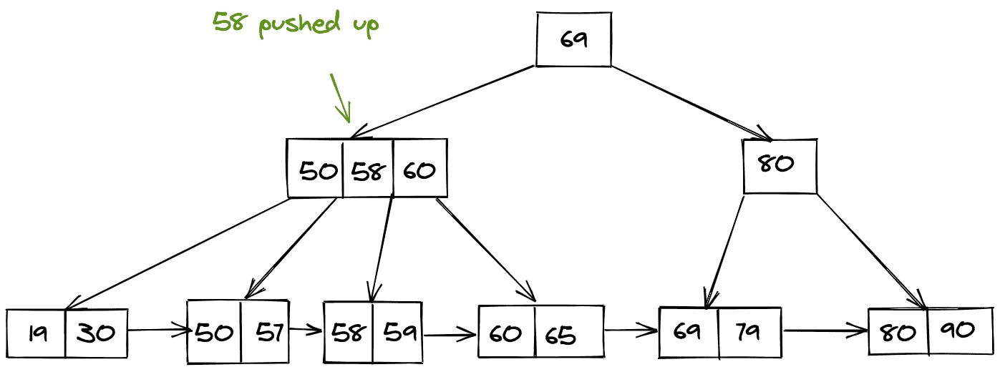

## 在 B+树中搜索:

在 B+树中搜索类似于在 BST 中搜索。如果当前值小于搜索关键字，则遍历左侧子树，如果大于，则首先遍历当前桶(节点)，然后检查理想位置在哪里。

考虑下面 B+树的表示来理解搜索过程。假设我们想在下面给定的 B+树中搜索一个值等于 59 的键。

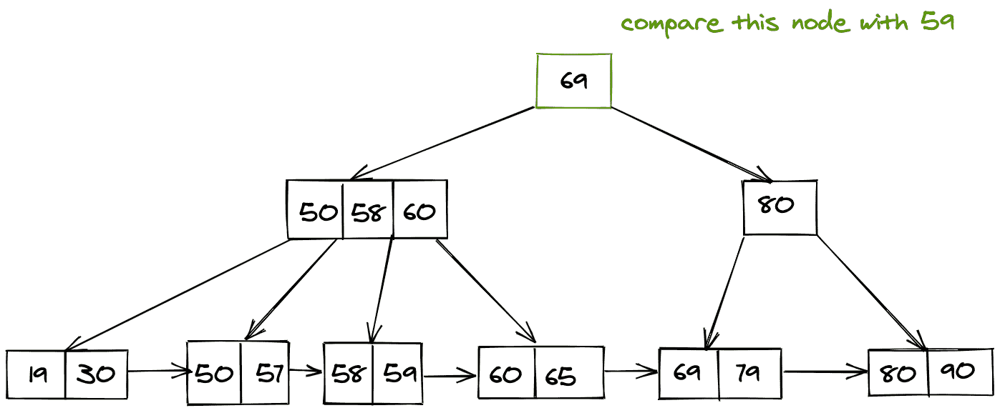

现在我们知道 59 < 69，因此我们遍历左边的子树。

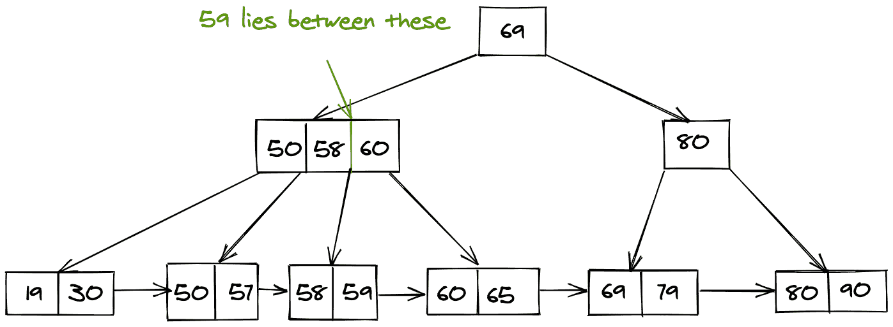

现在我们已经找到了内部指针，它将指向我们需要的搜索值。

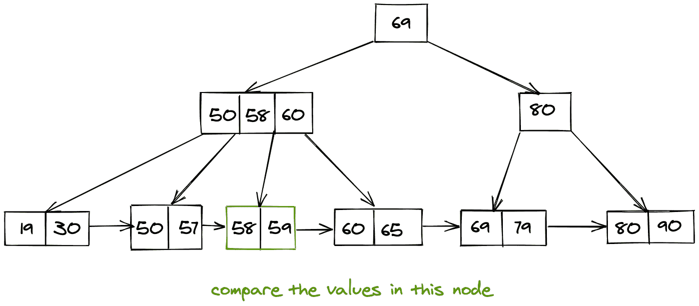

最后，我们以线性方式遍历这个桶，以获得所需的搜索值。

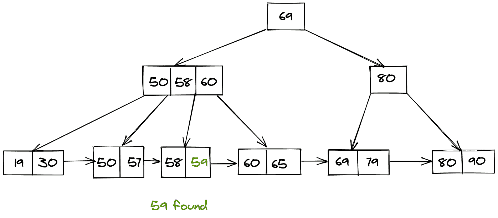

## B+树中的删除:

删除是一个有点复杂的过程，出现了两种情况:

*   它只存在于**叶级**

*   或者，它还包含一个来自内部节点的指针。

### 仅删除叶节点:

如果它只是作为**叶节点位置**出现，那么我们可以简单地删除它，为此我们首先进行搜索操作，然后删除它。

考虑如下所示的图示:

删除 79 后，剩下的是下面的 B+树。

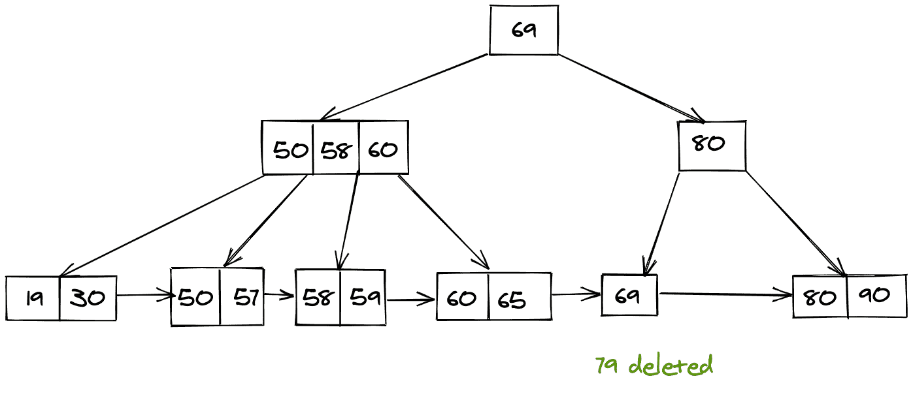

### 如果存在指向叶节点的指针，则删除:

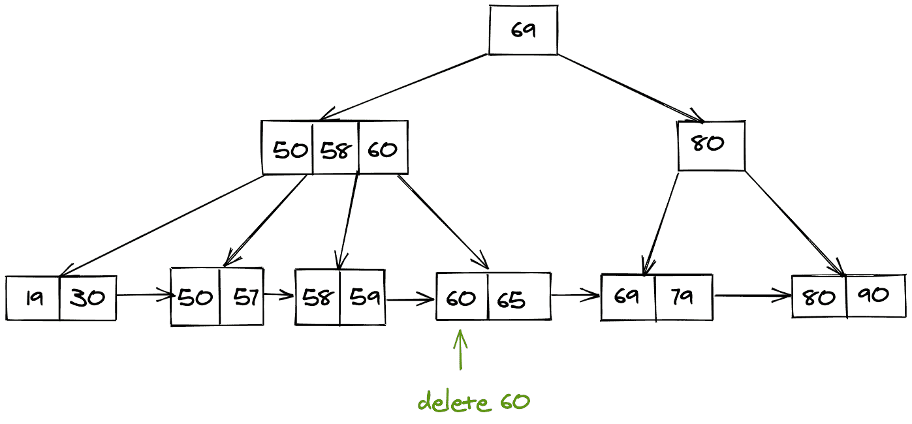

找到要删除的节点后，我们还必须删除指向该节点的内部指针，然后我们最终需要移动下一个节点指针以移动到父节点。

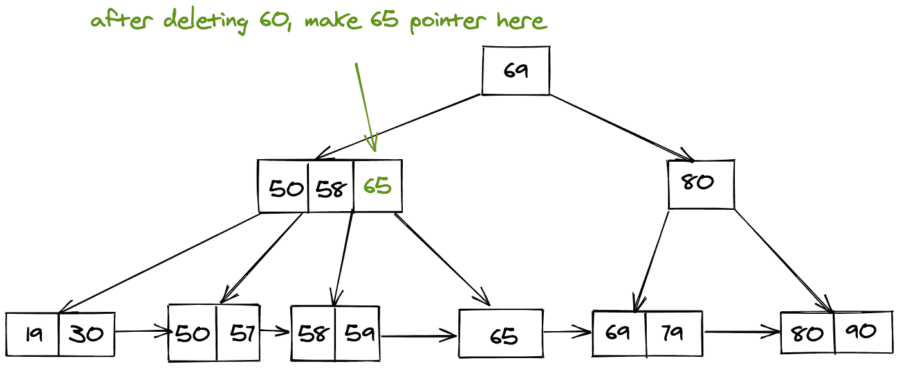

## 结论:

*   我们了解了什么是 B+树，以及它与 B 树的区别。

*   然后我们了解了为什么我们需要 B+树。

*   最后，我们学习了对 B+树型搜索、插入和删除记录(键)的不同操作。

* * *

* * *