> 原文:[https://www . study south . com/advanced-data-structures/introduction-to-graph](https://www.studytonight.com/advanced-data-structures/introduction-to-graphs)

# 图形介绍

**图是一种高级数据结构**，用于组织**互联网络**中的项目。图中的每一项都称为一个**节点**(或**顶点**，这些节点通过**边**连接。

在下图中，我们有一个简单的图，其中总共有五个节点和六条边。

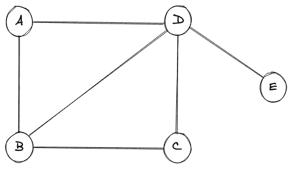

任何图中的节点都可以称为**实体**，连接不同节点的边定义了这些实体之间的**关系。在上图中，我们有一组节点 **{V} = {A，B，C，D，E}** 和一组边， **{E} = {A-B，A-D，B-C，B-D，C-D，D-E}** 。**

## 真实世界的例子

图表的一个很好的例子是一个由社会上有联系的人组成的网络，他们通过一个简单的联系联系在一起，这个联系就是他们是否认识对方。

考虑下图，其中显示了一个社交网络的图示，总共有五个人。

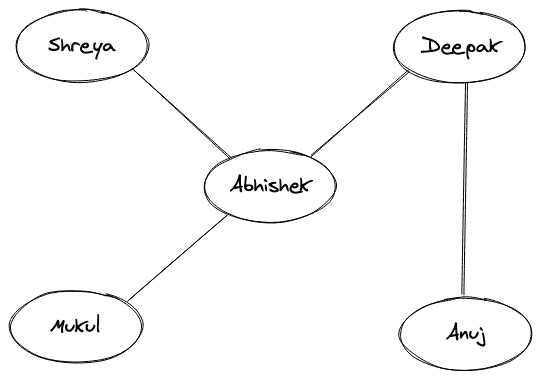

上面两个人之间的一条线表示他们彼此认识。如果名字之间没有界线，那么他们就根本不认识对方。这里的名字相当于一个图的节点，定义“相知”关系的线简单来说相当于一个图的边。还应该注意的是，相互了解的关系是双向的，就像“Abhishek”了解“Mukul”一样，“Mukul”了解“Abhishek”。

上面描述的社交网络只不过是一张图表。

## 图的类型

让我们涵盖各种不同类型的图表。

### 1.空图

如果图中没有边，则称该图为空。

空图的图示如下:

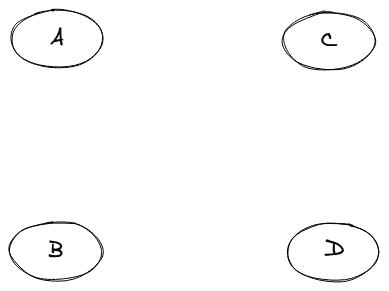

### 2.无向图

如果我们看一下我们在上面的真实世界例子中的图形表示，我们可以清楚地看到不同的节点通过一个链接(即边)连接在一起，而这个边没有任何与之相关的方向。比如“Anuj”和“Deepak”之间的边缘是双向的，因此两者之间的关系是双向的，原来是“Anuj”知道“Deepak”，而“Deepak”也知道“Anuj”。这种类型的图，其中的关系是双向的或没有一个方向，被称为无向图。

另一个无向图的图示如下:

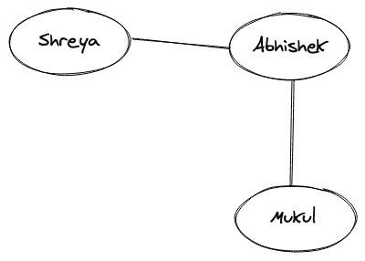

### 3.有向图

如果两个人的关系是这样的呢，“Shreya”认识“Abhishek”，但是“Abhishek”不认识“Shreya”。这种类型的关系是单向的，它确实包括一个方向。带有箭头的边基本上表示关系的方向，这样的图称为有向图。

该图的图示如下:

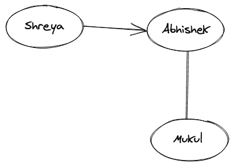

还可以注意到，从“Shreya”到“Abhishek”的边是“Shreya”的输出边和“Abhishek”的输入边。

### 4.循环图

一个包含至少一个来回遍历的节点的图称为循环图。简单地说，一个图应该至少有一个循环形成，才能被称为循环图。

循环图的图示如下:

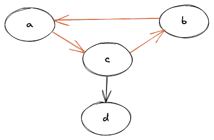

很容易看出，节点(a，b，c)之间存在一个循环，因此它是一个循环图。

### 5.无圈图

一个我们无法从一个节点开始，又无法遍历回同一个节点，或者根本没有一个循环的图被称为非循环图。

非循环图的图示如下:

### 6.加权图

当一个图的边有一些相关的权重时，我们称这个图为加权图。权重通常是一个可以表示任何东西的数字，完全取决于图中节点之间的关系。

加权图的图示如下:

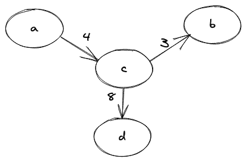

还可以注意到，如果任何图形没有任何与之相关的权重，我们简单地称之为未加权图形。

### 7.连通图

在图的每两个节点之间有一条路径的图称为连通图。这里的路径意味着我们能够从一个节点“A”遍历到任意一个节点“B”。简而言之，我们可以说，如果我们从图的一个节点开始，我们将总是能够从该节点遍历到图的所有其他节点，从而获得连通性。

下图给出了连通图的图示:

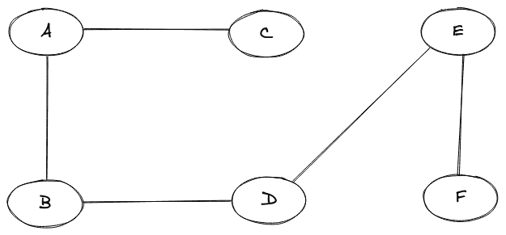

### 8.不连通图

不连通的图简称为不连通图。在断开的图中，我们将无法从图的每两个节点之间找到路径。

断开图的图示如下:

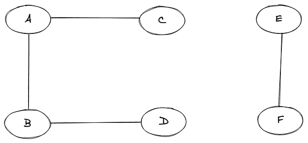

### 9.完全图

如果一个图的每一对顶点(节点)都有一条边，那么这个图就是一个完整的图。

完整图形的图示如下:

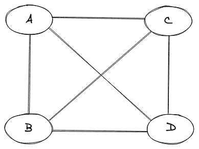

### 10.多重图

如果图中任意一对节点之间有两条或两条以上的边，则称该图为多重图。

多重图形的图示如下:

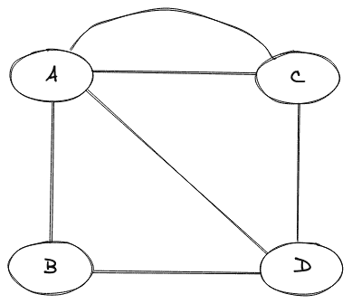

## 常用图形术语

*   **路径** -一系列交替的节点和边，使得每个连续的节点通过边连接。

*   **循环** -起始节点和结束节点相同的路径。

*   **简单路径** -一条我们不会再遇到顶点的路径。

*   **桥** -一条边，它的移除只会使图断开。

*   **森林** -森林是没有周期的图形。

*   **树** -没有任何循环的连通图。

*   **度** -图中的度是入射到特定节点上的边的数量。

*   **邻居** -如果顶点“A”和“B”之间存在边，我们称它们为邻居。

## 结论

*   借助不同人之间的无向图，我们了解了什么是图。
*   我们了解了总共有多少种类型的图形。
*   我们了解了在谈论图形及其子图形时使用的常用术语。

* * *

* * *