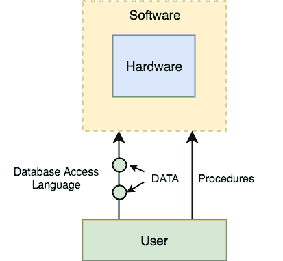

# DBMS 的组件

> 原文：<https://www.studytonight.com/dbms/components-of-dbms.php>

DBMS 可以分为五大部分，它们是:

1.  五金器具
2.  软件
3.  数据
4.  程序
5.  数据库访问语言

让我们有一个简单的图表来看看它们如何组合在一起形成一个 DBMS。

* * *

### DBMS 组件:硬件

当我们说硬件时，我们指的是计算机、硬盘、数据的输入/输出通道，以及在任何数据成功存储到内存之前涉及的任何其他物理组件。

当我们在个人电脑上运行甲骨文或 MySQL 时，我们电脑的硬盘、我们用来输入所有命令的键盘、我们电脑的内存、只读存储器都变成了 DBMS 硬件的一部分。

* * *

### DBMS 组件:软件

这是主要组件，因为这是控制一切的程序。DBMS 软件更像是物理数据库的包装器，它为我们提供了一个易于使用的接口来存储、访问和更新数据。

DBMS 软件能够理解数据库访问语言，并将其解释为实际的数据库命令，以便在数据库上执行。

* * *

### DBMS 组件:数据

数据是 DBMS 设计的资源。创建 DBMS 的动机是存储和利用数据。

在典型的数据库中，用户保存的数据存在并且**元数据**被存储。

**元数据**是关于数据的数据。这是由 DBMS 存储的信息，以便更好地理解存储在其中的数据。

**例如:**当我把我的**名字**存储在数据库中时，DBMS 会存储这个名字什么时候存储在数据库中，这个名字的大小是多少，是作为相关数据存储到其他一些数据中，还是独立的，所有这些信息都是元数据。

* * *

### DBMS 组件:过程

过程是指使用 DBMS 的一般说明。这包括设置和安装 DBMS、登录和注销 DBMS 软件、管理数据库、进行备份、生成报告等过程。

* * *

### DBMS 组件:数据库访问语言

数据库访问语言是一种简单的语言，旨在编写命令来访问、插入、更新和删除存储在任何数据库中的数据。

用户可以用数据库访问语言编写命令，并将其提交给 DBMS 执行，然后由 DBMS 翻译和执行。

用户可以使用访问语言创建新的数据库、表、插入数据、获取存储的数据、更新数据和删除数据。

* * *

## 用户

*   **数据库管理员:**数据库管理员或 DBA 是管理完整 DBMS 的人。数据库管理员负责 DBMS 的安全性、可用性、管理许可证密钥、管理用户帐户和访问等。
*   **应用程序员或软件开发人员:**该用户组参与开发和设计 DBMS 的各个部分。
*   **最终用户:**如今，所有的现代应用程序，无论是网络还是移动，都存储用户数据。你觉得他们是怎么做到的？是的，应用程序的编程方式是收集用户数据，并将数据存储在服务器上运行的 DBMS 中。最终用户是存储、检索、更新和删除数据的人。

* * *

* * *