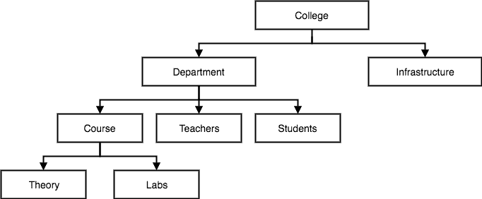
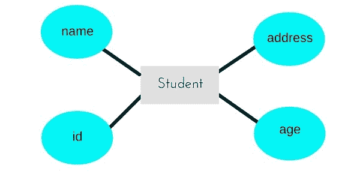
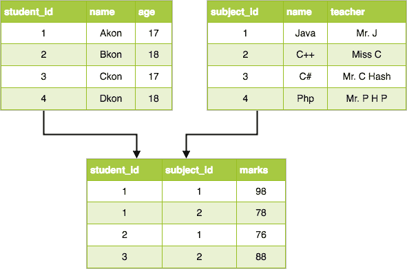

# 数据库管理系统数据库模型

> 原文：<https://www.studytonight.com/dbms/database-model.php>

数据库模型定义了数据库的逻辑设计和结构，并定义了如何在数据库管理系统中存储、访问和更新数据。虽然**关系模型**是使用最广泛的数据库模型，但也有其他模型:

*   层次模型
*   网络模型
*   [实体关系模型](er-model-concepts.php)
*   [关系模型](rdbms-concept.php)

* * *

## 层次模型

这个数据库模型将数据组织成树状结构，只有一个根，所有其他数据都链接到这个根。层级结构从**根**数据开始，像树一样展开，将子节点添加到父节点。

在这个模型中，子节点只有一个父节点。

这个模型有效地描述了许多现实世界的关系，比如一本书的索引，食谱等等。

在层次模型中，数据被组织成树状结构，两种不同类型的数据之间有一对多的关系，例如，一个部门可以有许多课程，许多教授，当然还有许多学生。

* * *

## 网络模型

这是层次模型的扩展。在这个模型中，数据被组织得更像一个图，并且允许有多个父节点。

在这个数据库模型中，随着更多的关系在这个数据库模型中建立，数据更加相关。此外，由于数据更加相关，因此访问数据也更加容易和快速。该数据库模型用于映射多对多数据关系。

在引入关系模型之前，这是最广泛使用的数据库模型。

* * *

## 实体关系模型

在这个数据库模型中，关系是通过将感兴趣的对象划分为实体并将其特征划分为属性来创建的。

不同的实体使用关系进行关联。

E-R 模型被定义为将关系表示为图形形式，以使不同的利益相关者更容易理解。

这个模型很适合设计数据库，然后可以将数据库转换成关系模型中的表(解释如下)。

举个例子，如果我们要设计一个学校数据库，那么**学生**将是一个**实体**，具有**属性**姓名、年龄、地址等。由于**地址**一般比较复杂，可以是另一个**实体**，带有**属性**街道名称、密码、城市等，它们之间会有关系。

关系也可以是不同的类型。详细了解 [E-R 图](er-diagram.php)，点击链接。

* * *

## 关系模型

在该模型中，数据被组织在二维**表**中，并且通过存储公共字段来维护关系。

该模型由 E . F Codd 于 1970 年引入，此后一直是应用最广泛的数据库模型，事实上，我们可以说是全世界唯一使用的数据库模型。

关系模型中数据的基本结构是表。与特定类型相关的所有信息都存储在该表的行中。

因此，表在关系模型中也被称为**关系**。

在接下来的教程中，我们将学习如何设计表，[将它们规范化](database-normalization.php)以减少数据冗余，以及如何使用[结构化查询语言](introduction-to-sql.php)从表中访问数据。

* * *

* * *