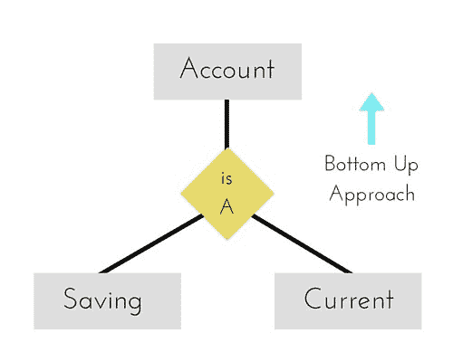
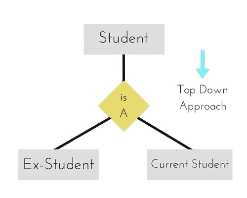
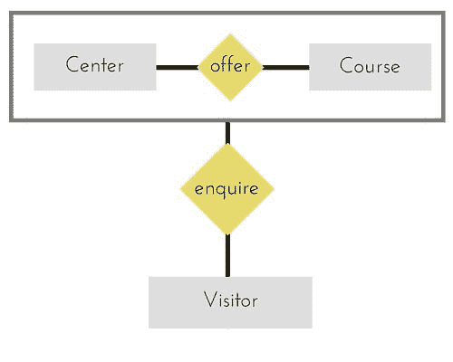

# 增强型 ER 模型

> 原文：<https://www.studytonight.com/dbms/generalization-and-specialization.php>

随着 20 世纪 80 年代后期数据复杂性的增加，使用传统的 ER 模型进行数据库建模变得越来越困难。因此，对现有的 ER 模型进行了一些改进或增强，使其能够更好地处理复杂的应用程序。

因此，作为**增强 er 模型**的一部分，与其他改进一起，三个新概念被添加到现有的 ER 模型中，它们是:

1.  一般化
2.  专门化
3.  聚合

让我们了解它们是什么，以及它们为什么被添加到现有的 ER 模型中。

* * *

## 一般化

**泛化**是一种自下而上的方法，其中两个较低级别的实体组合在一起形成一个较高级别的实体。概括地说，较高层次的实体也可以与其他较低层次的实体相结合，形成更高层次的实体。

它更像超类和子类系统，但唯一的区别是方法，这是自下而上的。因此，实体被组合以形成更一般化的实体，换句话说，子类被组合以形成超类。

例如**保存**和**当前**账户类型实体可以泛化，可以创建一个名称为**账户**的实体，涵盖两者。

* * *

## 专门化

**特殊化**与泛化相反。这是一种自上而下的方法，其中一个较高级别的实体可以分解为两个较低级别的实体。在专门化中，一个更高层次的实体可能没有任何更低层次的实体集，这是可能的。

* * *

## 聚合

聚合是将两个实体之间的关系视为一个**单个实体**的过程。

在上图中，**中心**和**球场**的关系在一起，是作为一个实体，与另一个实体**访客**有关系。现在在现实世界中，如果访问者或学生访问辅导中心，他/她永远不会只询问中心或课程，而是会询问两者。

* * *

* * *